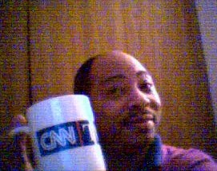

Perhaps you’ve seen me. I’m the guy who stood in the coffee aisle, just standing there, hands in my pockets and my nose in the air smelling the different brands and smells of that part of the store. No, I’m NOT nuts and I have never been anywhere near an insane asylum. I don’t smoke anything, and I’m a very light social drinker. I’m just addicted to coffee…my only vice in this life.

Since the age of ten, I have been drinking coffee. I started out by drinking my mom’s coffee after filling the cup with sugar and milk to create some kind of mocha chocolate milk drink. Later as I got older, I developed a taste for coffee with Coffeemate and sugar. Or with maple syrup. Or with Pet condensed milk.

Since then, I have sampled coffees from several points around the world and have come to the conclusion that “there’s no such thing as strong coffee, only weak people.”

Coffee has been my “Linus blanket” for me all through life; like the Peanuts character, I cannot go anywhere or do almost anything without having a container of coffee close by. This means that I bring a mug or cup of coffee to the bathroom with me; it waits patiently while I shower and shave before it is consumed. If a book or binder has a coffee stain on it, it probably belonged to me, for that’s my “mark.”

I used to go through something to the effect of four pots of coffee a day. I cut back after my cardiologist said that my poor body has taken all of the caffeine it can take for a grown man – at 38 years of age. I resisted his plea for me to stop drinking coffee altogether, though. I still drink my fair share – and probably yours too – on a given day.

Not four pots, though. Those days are over and done with. I’m down to two and a half now.

I will drink coffee on the hottest of days and in the coldest of nights. I will drink it cold, with ice cubes, or steaming hot. Cold coffee “icks” people out normally, but not me; and I’ve had my share of small critters swimming around in my coffee cup or mug…the victims of the sweet smell and the hot liquid. I accidentally swallowed an ant that didn’t survive. There were two in my cup…I thought they were coffee grounds at first until I looked closely. It was too late… One, along with the swallow of coffee was already down into my tummy. I did find a fly once in my coffee…that’s when I said it’s time to toss it – fly and all – wash the mug and start over.

I love “starting over”, for that usually means that I must make a new pot of coffee and have that great coffee scent waft through the house, campground, or kitchen.

My favorite containers to drink coffee out of or through are stainless steel or aluminum mugs or cups. Next to that come the plastic containers normally used for cola drinks. Next to that comes two special glasses – glass mugs. A Boy Scouting leader and scientist sent me two beakers with handles. There are some 70 or so coffee mugs with various designs and logos — mostly scouting related — which adorn my “coffee cabinet”. I have two favorite coffee mugs: one of them I won during a contest sponsored by the Cable News Network (CNN) in which I needed to talk with Lou and Bobbie about the day’s news in order to win. The other is a large Kentucky Colonel coffee mug with my name on it. Of course, there are other coffee mugs sitting around, waiting their turn to be carried and used…but those two get the most “workouts.”

  
*Mike with his CNN coffee mug.*

Someone suggested that I own stock in the companies owning Folgers and Maxwell House. I do now.

So, if you see someone carting around a large coffee mug during a sporting event, or just out for a walk, you’ll know that’s me. Or if there’s a new flavor of coffee in the shop and there’s someone already in line to try it out, that’s me. Or if someone is aimlessly walking down the coffee aisle, not really looking for something, but just standing around with his hands in his pockets…that’s me.

And remember…there’s no such thing as strong coffee. Only weak people.