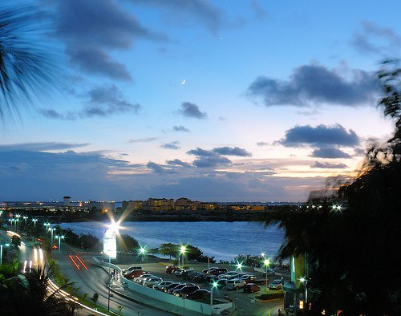

“Spanish coffee” is essentially a mix of hard liquor, coffee, and heavy whipped cream. The preparation and presentation can be simple or an entertaining show of fire. In Austin, Texas, several bars serve a simple form of Spanish coffee composed of a shot of brandy on the bottom, black coffee in the middle, and whipped cream on the top.

The best presentation of “Spanish coffee” I have seen was at a resort in Cancun. Its sometimes referred to as “Mayan coffee” or “Flaming coffee”. The ingredient list consisted of the following:

-   A shot of Rum
-   A shot of Brandy
-   Coffee
-   A dash of cinnamon and nutmeg
-   Sugar
-   Heavy cream
-   Tablespoon of Kaluha
-   Lime wedge
-   Whole orange for pouring Brandy

  
*[Cancun at Sunset](http://www.flickr.com/photos/flem007_uk/2935138064/in/photostream/) by Mike Fleming*

Some preparation is necessary. An un-ripened orange is peeled in a corkscrew fashion. Glass mugs are used for the coffee, and prepared by being dipped first in lime wedges, and then in sugar, to coat the rims. An ounce of Rum is added to each mug.

An ounce of Brandy is added to each glass next, but not without a show. The Brandy is added to one of two stainless-steel pouring containers. The Brandy is then lit on fire, and the flaming alcohol is poured back and forth several times, and then it is distributed in equal amounts to each of the coffee mugs. The other half of the flaming Brandy is saved for later. A mixture of cinnamon and nutmeg is then shaken into each container, which causes sparks to fly from the still-flaming brandy. Coffee is then poured into each mug, which should extinguish the flames. A spoonful of heavy cream is then added to each container.

The remaining Brandy goes on last, but not without another fiery show. The remaining flaming Brandy is now poured down and around the corkscrew of the orange that was peeled in the first stage. Cut-up lime wedges are then placed on each serving plate.

The mugs are then placed on the serving plates with the lime wedges. A flaming tablespoon of Kahlua is set on top of each drink. Finally, the lime wedge is squeezed onto the flame just before serving, aggravating and then extinguishing the final flame just before consumption.

It’s a magnificent presentation!

[Spanish Coffee in Cancun, Mexico](https://www.youtube.com/watch?v=8_uwtHpOWEc) (YouTube 3 minutes)

Spanish coffee is not the only popular liquor-and-caffeine drink. Liquor and caffeine go especially well together at ski resorts everywhere. After a cold and wet day of skiing, many people crave coffee with a shot of Kahlua. Another popular drink is the “hot toddy.” There are many variations, but the best one I’ve seen and tasted is a mix of hot black tea, one tablespoon of honey, a wedge of lemon, and a shot of whiskey.

French liquor is a great way to go for high-end caffeine and alcohol mixtures. “Blueberry tea” is a pleasant mixture of black tea and one-ounce shots of both Amaretto and Grand Marnier. For a more soothing drink, try a mix of chamomile tea and Chartreuse.
