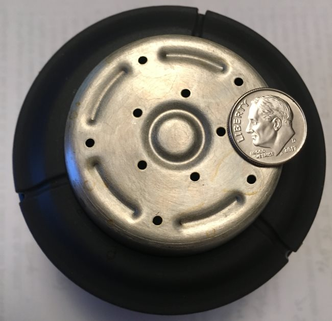
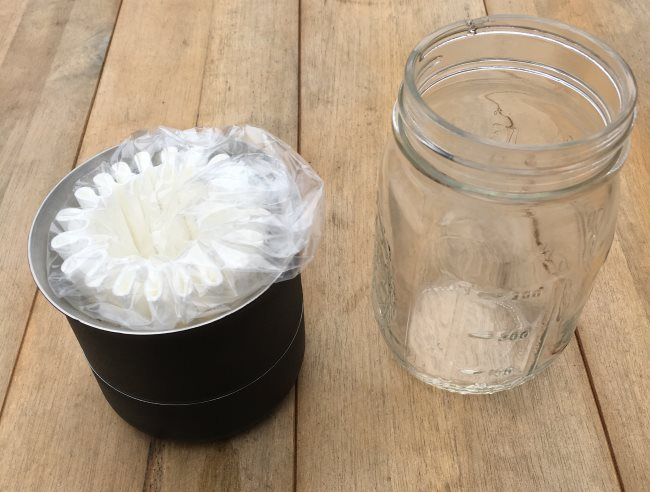
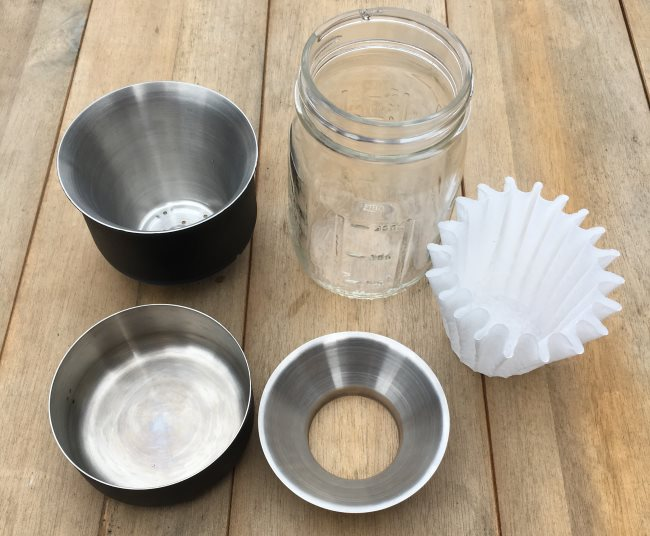
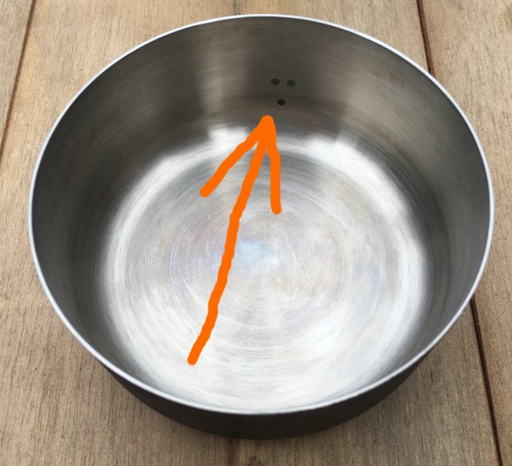
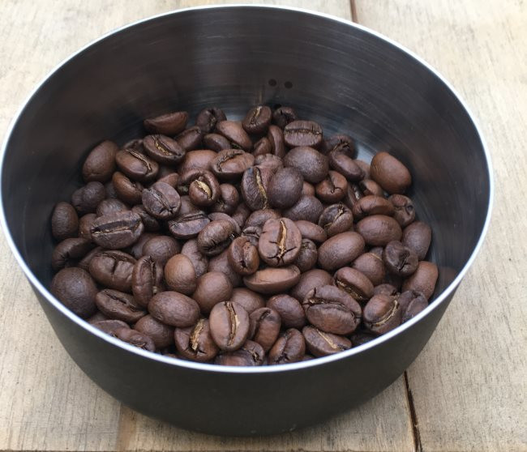
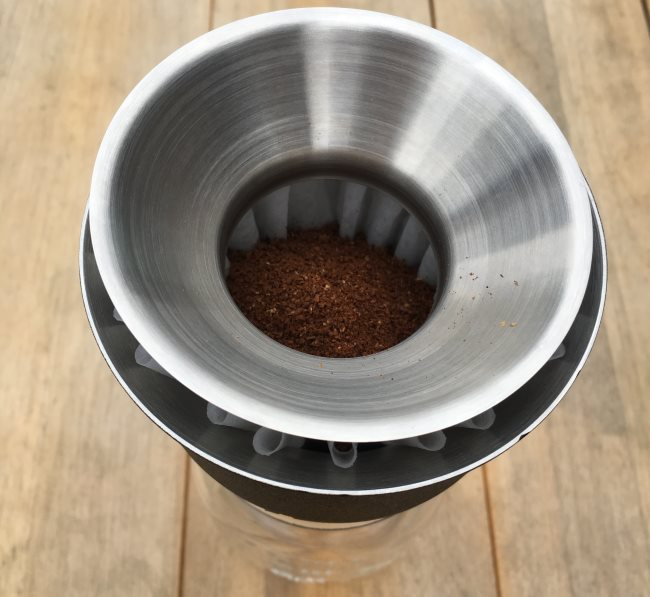
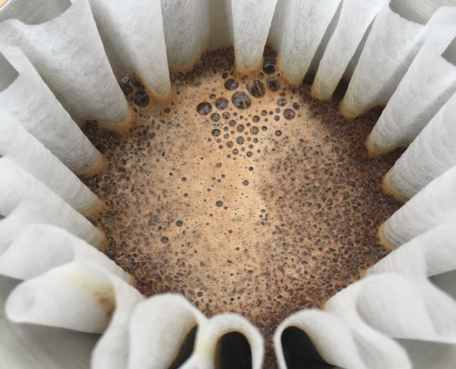
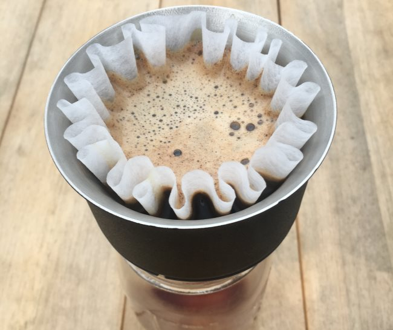

This month, I had the opportunity to try out another coffee brewer. The Stagg \[X\] Pour-Over Coffee Dripper by Fellow is a flat-bottom coffee brewer with custom filters. There is a larger model called the \[XF\]. When you go to purchase a Stagg, you can buy the Dripper Set, which includes a clear 10-ounce tasting glass. The coffee will brew directly into the glass.

For this review and tutorial, I used the \[X\]. There are things I liked and didn’t like about the Stagg. Before I render a verdict, let’s make some coffee.

*The Stagg Dripper is a flat-bottom pour-over with 10 tiny holes. In this photo, you are looking upside-down at the bottom of the dripper. I’ve added a US dime for scale.* 

### The Equipment

The photo below shows that the Stagg Dripper collapses into a small space, which is pretty sweet, especially if you wish to travel with it. I don’t have their 10-ounce tasting glass or carafe, so I found a small glass jar with markings on the side to let me see how much coffee has been brewed.

At first, I tried brewing directly into a short drinking glass, but I found the Stagg dropped too far into the cup. Also, I wanted an easy way to measure the volume of brewed coffee. Thankfully, I found a small jar that tracked milliliters on the side. If you purchase the Kit version of the Stagg, you won’t need to deal with this as the glass fits the Stagg precisely and is the perfect volume.

Once you open the brewer, these are the parts you will have.

*Clockwise from the top left: the Stagg Coffee Dripper, glass jar (not included), Stagg \[X\] filter, funnel, and the bean measuring tray.* 

### Measuring the Coffee

Fellow designed the Stagg brewer to make coffee without needing to weigh anything. In the photo below, you will see a single dot and a double dot. When you fill coffee beans or grounds to the single dot line, you will have approximately 20 grams of coffee. The double dot is used to make larger batches.

### Grinding the Coffee

According to Fellow, the Stagg Coffee Dripper uses a [Medium Grind](/coffee-grind-chart/). I found the grind size to be quite sensitive. My first brew was a little too fine, and the extraction took over five minutes. Then, I made the grind a little more coarse, and it brewed in under a minute, which was too fast.

I advise using older coffee for the first few brews while discovering the ideal grind size.

Brewing the Coffee
------------------

### #1 Place the Stagg Dripper over a container

If you purchase the set, you will already have a perfectly sized vessel for the coffee to brew into. However, you will need to find an alternative if you don’t. The ideal container for the \[X\] model will be glass so you can see when to stop pouring. You could periodically lift the brewer to verify you aren’t overfilling. I just used a glass jar with measuring markers on the side for this tutorial.

If you purchase the \[XF\], this is less of a concern because the chamber size is large enough to hold all the water needed for the brew cycle at once. With the \[X\], you must add water gradually during the brew cycle.

### #2 Add Filter and Rinse

The Stagg Dripper uses a custom filter. There are two sizes: one for the \[X\] and a taller one for the \[XF\]. Place the filter in the brewer, rinse with hot water, and throw out the rinse water.

### #3 Use the Funnel to Add Ground Coffee

The Stagg Dripper includes a funnel. Place it over the coffee filter. This is optional, but it will make guiding all the coffee grounds into the filter easier.

*Using the included funnel makes adding coffee grounds much easier.*

### #4 Pour Hot Water

Heat water to 200°F. Pour enough hot water to cover all the coffee grounds. Then, wait 30 seconds. This is the bloom.

The next step will depend on whether you have an \[X\] or \[XF\] model. If you have an \[XF\], fill the chamber to the top with hot water and wait for your coffee to complete brewing. If you have an \[X\], you will need to keep track of how much water you add so that you do not under or overpour. You are aiming for 10 ounces of brewed coffee.

It should take about 2 minutes for the coffee to brew in the second phase of the pour. If it brews too slowly, use a more coarse grind size. If it is too fast, use a finer grind size.

### #5 Remove and Enjoy

Once all water has passed through the filter, remove the Stagg and enjoy. You can even place the Stagg onto the bean tray to catch drips. Cleanup is as simple as it gets. Put the coffee grounds into compost and rinse everything else.

### Is the Stagg Dripper Worth Buying?

At the time of this review, the Fellow Stagg \[X\] Dripper Set is $70 USD. That is a bit pricey for a pour-over device. The Stagg is well-built and does an excellent job holding heat. If you want something you can take camping, check it out.

I don’t go camping, so I need to compare it against other indoor pour-over methods. Although the coffee tasted great once I got the grind perfect, it wasn’t any better than a Kalita Wave, another flat-bottom pour-over brewer. And the Kalita is more affordable at $25 USD.

I thought I wouldn’t like the single dot, but it is a clever solution for measuring coffee without carrying a scale or spoons. If I were to redesign this part, I’d probably make it a bit more visible so it stood out more in low-light situations.

The Stagg Brewer kit ships with 15 filters. Afterward, you will need to buy the custom filters on their website. Forty-five filters cost $5 for the \[X\] and $8 for the \[XF\] plus shipping. That works out to 11 cents per filter for the \[X\] and 18 cents for the \[XF\] before shipping costs. With the Kalita Wave, you can get filters for 6 or 7 cents each in bulk on Amazon or eBay.

Should you get a Stagg Pour Over? If you need something extremely well-built that does an excellent job holding heat and you don’t mind paying more for the brewer and the filters, consider the Stagg. However, if you want a flat-bottom kitchen pour-over device and don’t want to spend as much money, check out the Kalita Wave.

### Resources

[Kalita Wave Coffee Brewing Tutorial](/kalita-wave-coffee-brewing-tutorial/) – INeedCoffee brewing tutorial

[Coffee Brewing Guide](/coffee-brewing-guide/) – Our guide includes several different pour-over tutorials.
