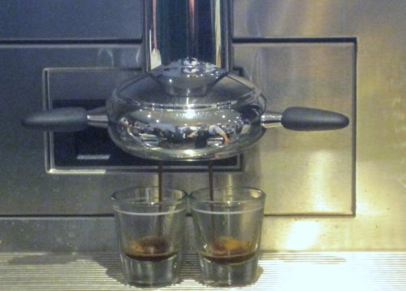
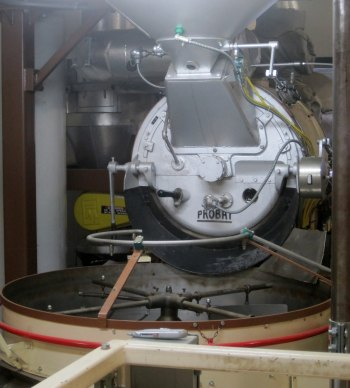

*This post was originally written in May 2010.*

One of the perks of running a coffee website is that I will occasionally get invited to coffee-related events. Being in Seattle helps, too. Most are for new coffee offerings and product launches. This spring, I received the most interesting invitation to date: Starbucks was inviting me to attend a two-day Coffee College.

I am not exactly known for being a Starbucks fan, but I am also not a hater. My position on Starbucks is that it was part of my coffee journey years ago, but I’ve moved on to better quality. I prefer espresso to regular coffee and prefer lighter roasters over darker ones. That is why I only visit Starbucks when [far away](/sleepy-starbucks-and-caffeinated-sins-in-phuket-thailand/) from Seattle.

Although several friends encouraged me to wear my Charbucks shirt, I was respectful of my host and kept it at home. When I accepted the offer to attend *Starbucks Coffee College*, I decided I would not let my past Starbucks experiences cloud my judgment. It was time to listen and learn. I was going back to college.

  
*I decided not to wear my Charbucks shirt at Starbucks Coffee College.*

### Day 1 – Pike Place Market and First and Pike

Nine web-based writers from the United States, Guatemala, and South Korea attended Coffee College. I was the only student from the Seattle area. Our first class was visiting the “original” Starbucks store in the Pike Place Market. Here, we learned about the Pike Place Special Reserve Blend, which is only available at this location. If you thought the Pike Place Blend was over-roasted, stay away from the Special Reserve. It is even darker.

  
*This is the “original” Starbucks, located at 1912 Pike Place. I put “original” in quotes because this store was relocated from 2000 Western Ave. So, depending on how you score things, this is either the “original” or sixth Starbucks location.*

We walked to the new Starbucks Heritage store at 1st and Pike. The Pike Place location was described as the past, and the Heritage was described as the future. Our class learned that the store was LEED-certified and that many of the building materials were recycled. This was good stuff, but what I really cared about was the Clover Coffee machine.

The $11,000 Clover Coffee machine is a fancy single-cup coffee brewer that makes a super clean and rich cup of coffee. It uses vacuum-pot technology combined with a 70-micron filter. The brewing temperature is set to 202 degrees, and the brewing time varies between 35 and 45 seconds. It takes 50 grams of coffee grounds to make a 16-ounce coffee.

  
*Two Clover Coffee machines at the Starbucks Heritage Store on 1st and Pike.*

I’ve had Clover Coffee many times before from Seattle and [Vancouver](https://criticalmas.org/2012/06/vancouver-espresso-vacation/) independent coffee shops. It makes a good cup of coffee. Could Starbucks make me a cup of coffee that equaled or exceeded my prior experiences? I weakly lobbied for them to make the Ethiopian Sun-Dried Yirgacheffe, as I thought their offering would best shine in a Clover machine, but they picked the Pike Place Special Reserve and 100% Kona.

The Pike Place Special Reserve had no flavor. Bland. The Clover cleaned up the bitterness in the regular Pike Place Blend. The 100% Kona was a letdown as well. Island coffees should be full of flavor. Nothing was shining through on this coffee. Recently, I home-roasted some Kona from INeedCoffee contributor Gary Strawn’s Kona Earth farm, which was way better than this. Coffee College was getting off to a rough start.

### Day 1 – Starbucks Headquarters

From downtown, we went to the Starbucks HQ. There, we did some coffee cupping. The five coffees on the table were:

1.  Guatemala Casi Cielo
2.  Ethiopian Sidamo
3.  Ethiopian Sun-Dried Yirgacheffe
4.  Sumatra
5.  Gold Coast Blend

The coffee used in cuppings tends to be from smaller batch roasts and is roasted lighter. The class learned that the flavor is more pronounced with lighter roasts. The cuppers taste the lighter roasts, and the public gets the dark stuff. Now their idea of lighter roasted is still dark by Stumptown standards, however, I did find both the Yirgacheffe and Sumatra to be decent coffees. The Guatemala and Sidamo were bland. Because INeedCoffee is family-friendly, I won’t tell you how bad I thought the Gold Coast Blend was.

  
*Starbucks Coffee cupping room*

So far, I have just been discussing the quality of coffee, of which I am not a fan. I want to pause to say that while Starbucks could learn to make espresso from the third-wave coffee shops, *some* indie coffee shops could learn how to be nicer to new customers from Starbucks. **Throughout the 2 days, I met many great people in the Starbucks organization. Extremely nice and passionate about coffee.** On a wall at the headquarters building, there were a bunch of hand-written goals from several store managers. One jumped out at me. It said:

> To make a new customer feel like a regular during peak.

I think Starbucks excels at this. They are excellent at recruiting first-time coffee drinkers and those new to espresso-based drinks. They are patient with their customers and really believe in their products. Burning coffee didn’t make Starbucks successful; customer service did.

### Day 1 – Farming Presentation, Blending and a Coffee Celebrity

After lunch, we received an excellent overview of coffee from the agriculture side. Peter Torrebiarte started with where coffee is grown and how it is processed. Also covered was how Starbucks helps farmers by facilitating trading best practices information through Farmer Support Centers and Coffee and Farmer Equity (C.A.F.E.) Practices. Over 80% of the coffee Starbucks purchases comes from Latin America. They pay, on average, between $1.47 and $1.50 per pound of green coffee (freight on board).

After the Coffee Basics class, we did a coffee cupping lab focused on blending. During the discussion, the door to the room opened, and in walked Starbucks CEO Howard Shultz. He chatted with us for a few minutes, and we learned his favorite coffee is Aged Sumatra. It isn’t every day that you meet a billionaire.

### Day 1 – Coffee Pairing Dinner

The highlight of Coffee College was being taken to a special room at Tom Douglas’ Palace Kitchen for a five-course meal. Tom Douglas is a top chef in Seattle and even won on the TV show Iron Chef. The focus of the meal was matching coffee flavors with different courses. Each course was served with a distinct coffee. Palace Kitchen built a custom menu from the coffee cupping notes.

This is where I confess that I never drink coffee with food and that I am highly skeptical that a coffee pairing could bring out more flavors than if both were consumed separately. It may work for wine, but coffee? Here are the four courses and the coffee that was paired with them.

1.  Guatemala Casi Cielo – Slow-braised Oregon rabbit with guajillo peppers, orange-scented corn cake, and wood-grilled peppers.
2.  Ethiopia Sidamo and Ethiopia Yirgacheffe – Seared Hudson Valley foie gras with Theo’s cocoa nibs and sour grape jelly.
3.  Sumatra – Wood grilled bavette steak with fried jojos and bearnaise.
4.  Gold Coast – Irish stout cake with black and tan ice cream and chocolate ganache.

The Guatemala and both Ethiopians did nothing to help the delicious food served beside them. In fact, they took away from the food. The Sumatra surprised me. It did compliment the steak. Many of my fellow students felt the same way. You already know what I think of the Gold Coast Blend.

### Day 2 – Headquarters

We began the day with the Barista Basics class. Inside Starbucks Headquarters is a cafe replica used for training and educational films. Although an amazing feat of engineering, the fully automatic espresso machine does not make a decent espresso. With a good grinder, I could get a more flavorful shot of coffee using a $25 Aeropress and my home-roasted coffee. The milk frothing on the machine was impressive, but I rarely drink milk.

  
*Behind the espresso machine at the Starbucks training room.*

### Day 2 – Coffee Roasting Facility

Inside headquarters, there is a *small* roasting operation. Their *small* roaster can roast 80-100 pounds of coffee at once. This is a lot compared to artisan micro-roasters, but nothing compared to their 1,000+ pound roaster in Kent, Washington. We got a roasting demonstration at the roasting facility.

  
*Starbucks Pilot roaster at corporate headquarters*

The day before, one of our instructors said that a coffee roast takes between 9 and 12 minutes. Now, I am certainly no expert when it comes to roasting, but I do have 12 years of experience in home roasting. To me, this seems fast, especially given the darker nature of the beans. Two of my favorite local roasters have longer roast times and lighter beans. The flavors are much more pronounced.

The coffee roast demonstration we got was for a Guatemalan, taken a *little darker*. **Make it stop. How about a little lighter?** I’d like to actually taste the coffee. The roaster was a super nice guy with 18 years of experience. I won’t say the Starbucks roasting style is wrong; it is just not what I like.

### Day 2 – Headquarters

Before breaking for lunch, we received a presentation on the VIA Ready Brew coffee. They don’t like to use the term instant coffee, but it is instant coffee. Last year, I tried the Colombia VIA and was impressed. It would make a decent cup of coffee while traveling. Unfortunately, they shared the Italian Roast VIA with us, which is charcoal-flavored hot water.

### Day 2 – Roy Street Coffee and Commencement

In 2009, Starbucks opened two concept stores in Seattle. I had been to [15th Avenue Coffee and Tea](https://criticalmas.org/2009/08/15th-avenue-coffee-and-tea-first-impressions/) but had yet to visit Roy Street. Roy Street is a great-looking coffee shop, and its manager is a highly personable and great host. They served us lunch from a menu they designed, which is unavailable at any other store. It was much better food than is typically served in a normal Starbucks. But, honestly, all I care about is espresso. **If I were to have a positive coffee experience during my Starbucks Coffee College, it would have to be from Roy Street.**

  
*Roy Street Coffee is at 700 Broadway East, Seattle, WA*

I ordered a single-origin espresso that used their Mexican Shade Grown coffee. Unlike other Starbucks stores, this drink would not be made using a super-automatic machine. The shot would be pulled from a Synesso espresso machine. My shot was ground at the time I ordered. The barista dialed in the shot, and I was handed an espresso in a ceramic cup (not paper). It was excellent. It has tons of flavor and is every bit equal to other single-origin espresso shots I’ve had from independent coffee shops in Seattle. Roy Street delivered. **If you want to see Starbucks at its best, visit Roy Street Coffee and Tea.**

  
*My espresso from Roy Street Coffee.*

Starbucks Coffee College concluded with a graduation ceremony. My fellow students and I each received a green Starbucks apron and a diploma. It was a great experience, and although I am not their ideal customer, I am thankful they invited me to participate.

### Sources

[The History of Instant Coffee](/the-history-of-instant-coffee/) – INeedCoffee article covering the origins of instant coffee.

[Fearing Starbucks VIA Instant Coffee and My Solution](/fearing-starbucks-via-instant-coffee-and-my-solution/) – INeedCoffee article on the Starbucks VIA.

[Photo Gallery](http://www.flickr.com/photos/digitalcolony/sets/72157624150826566/) – Full photo gallery for Starbucks Coffee College

[The Coffee Fix: Can the $11,000 Clover Coffee Machine Save Starbucks](https://web.archive.org/web/20160304190346/http://archive.wired.com/gadgets/miscellaneous/magazine/16-08/mf_clover?currentPage=all) – 2008 Wired article on the Clover Coffee machine.

Roy Street Coffee and Tea – 700 Broadway East, Seattle, WA

*15th Avenue Coffee and Tea were later rebranded as Starbucks, and then, after a few years, that location closed.  
*
