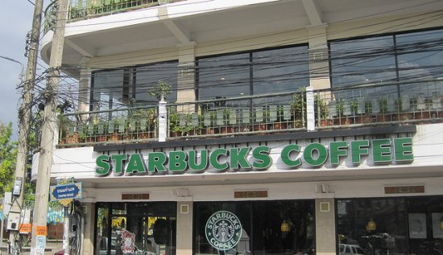

*Starbucks is definitely going to take over the world*. This joke is becoming increasingly popular throughout the country, and with good reason. Although it may be a slight exaggeration of the truth, it has an eerie sense of foreshadowing to it. It is pretty unlikely that we will one day be living in the United States of Starbucks, but with the enormous amount of growth and the corporation’s rise in popularity, I think it’s important that we step back and ask ourselves, “why do we love it so much?” Starbucks offers a solution to a serious and growing need that is found throughout the world, and no, that need is not caffeine addiction, it is simply the need to relax.

All Starbucks locations are the same. They offer the same drinks, but more importantly, there is always a calm, almost religious happiness that surrounds the industrial coffee makers and earthy-toned pictures that make up the interior decor. There is bound to be at least one couple talking and giggling and one or two men in business suits sitting by themselves with their eyes closed wishing they didn’t have to leave and return to their five-by-six cubicles. This escape is what makes Starbucks so popular. In fact, it is so popular that during 2004 three new locations were opened every day.

  
*Starbucks – Chiang Mai, Thailand by INeedCoffee*

A Starbucks is a place where people of all walks of life can come together on equal terms. They strive to create a haven against stereotypes and racism. This is evident when you look at the company’s own mission statement. The mission statement (if a major corporation can have one other than “we want money”) is based on six principles. Out of these six principles, only one is related to coffee. The other five deal with things like “embracing diversity” and “treat each other with respect.” This reaffirms the conscious attempt to connect with their customers on an emotional (even quazi-spiritual) level.

Some may argue that they are devoted only to the great coffee, but that is not likely. Take for example the most hardcore of coffee addicts, the group that is willing to spend $4.50 three times a day on some exotic triple shot of espresso. Why? They may think they need the caffeine, but they are mistaken. Research shows that the darker the roast (espresso being the darkest), the less caffeine it contains. In other words, a shot of espresso can have as little as half the amount of caffeine in it as a cheap $0.79 cup from Hardees. It’s not the coffee (nor the caffeine) that brings customers running back– it’s the atmosphere.

Starbucks could very well operate without even selling coffee. They could charge an entrance fee and offer nothing else but a room and mellow Bob Marley music softly playing in the background and people would still come. They recognize the niche they fill and exploit it fully. If only we could find our own ways of escape we would all be a lot richer, and probably a lot thinner.
