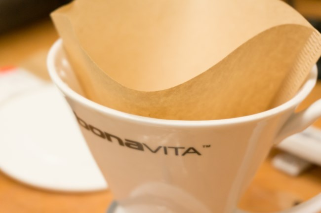
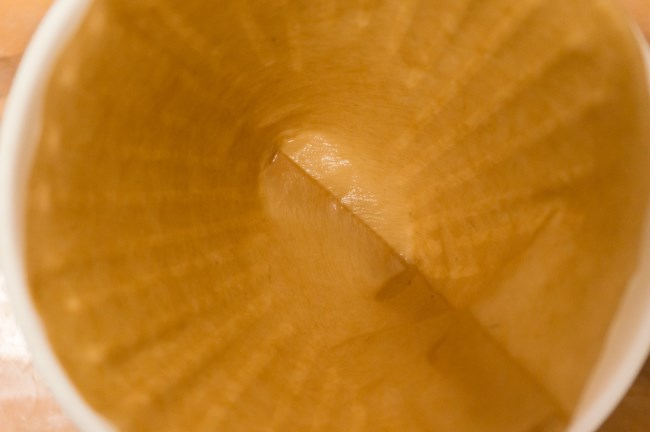
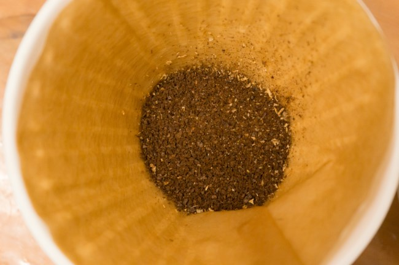
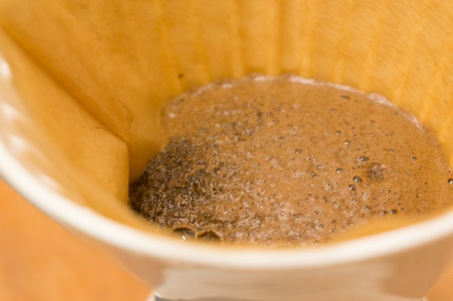
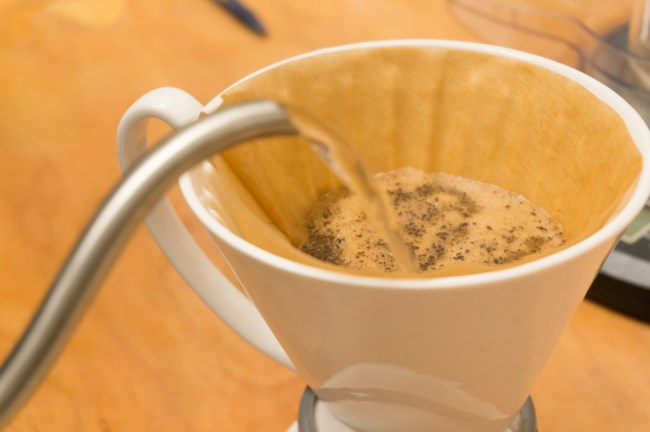
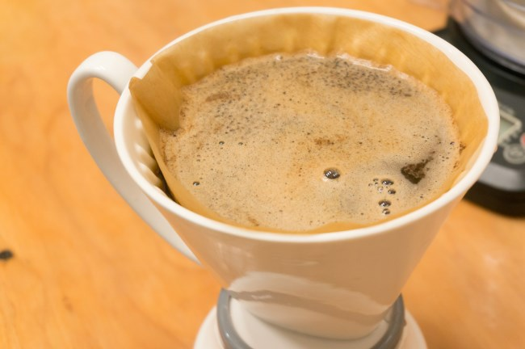
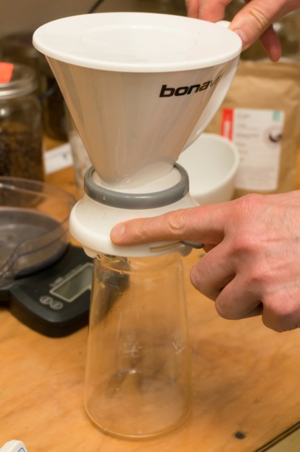
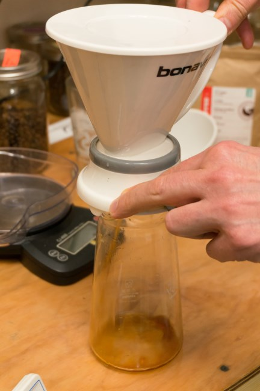
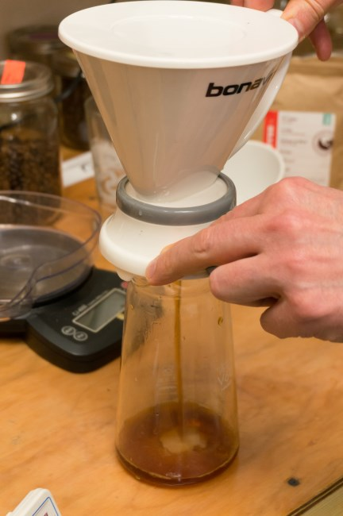
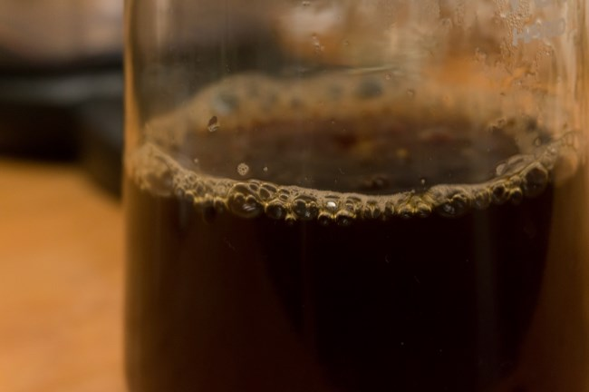

The French Press makes rich, delicious coffee. However, it has two drawbacks.

The first is the sediment. To minimize the sediment, I practiced not pouring all the coffee in the mug and never drinking the last few sips. But occasionally, I’d forget, and my last sip of the coffee would be bitter and gritty—not a good way to finish your coffee.

The second problem with the French Press is the cleanup. Knocking grounds into a compost bin followed by a few rinses to remove all the loose grounds before you can brew again gets old. The Bonavita Immersion Coffee Dripper solves both problems.

The Bonavita Dripper makes a rich, clean cup of coffee with easy cleanup. It is very similar to the Clever Coffee Dripper. Both coffee brewers use immersion with a catch that opens on the bottom of the brewer. Both use a paper filter to capture the grounds, which makes getting rid of the used grounds simple and mess-free.

The difference is that the Bonavita is made of porcelain, whereas the Clever is made of plastic. So the Bonavita is dishwasher safe, but the Clever is not. Also, the Clever opens by placing the brewer over a container, which sends the coffee through the bottom of the brewer. With the Bonavita, there is a manual valve.

As for the quality of the brew, I believe the Bonavita Immersion Coffee Dripper to be the same as the Clever Coffee Dripper.

### #1 Add Filter

Place a #4 coffee filter into the Bonavita.

### #2 Rinse Filter

Rinse the paper filter with warm water. This will remove paper residue from going into and interfering with the taste of the coffee.

### #3 Add Coffee

Add 30 grams (or 4 Tablespoons) of ground coffee. Coffee will be ground for drip coffee.

### #4 Add Hot Water and Bloom

Heat water to 200°F or boil water and let it sit for 30 seconds. Pour enough water to cover the ground coffee. Let it bloom. Wait for 30 seconds.

### #5 Continue Adding Hot Water

Fill the rest of the brewer with water. For those using a scale, the total weight of the ground coffee plus water will be between 500 and 510 grams (just under 18 ounces). This works out to a brew ratio of 17 parts water to 1 part coffee, which is a good starting point for brewed coffee. Adjust the ratio up or down based on your taste.

### #6 Stir Coffee, Cover, and Wait

Stirring the coffee and placing the cover back on the brewer are optional steps. I typically only stir if the coffee is super fresh, and I never put the lid back on.

Wait 2.5-3 minutes.

### #7 Release Coffee

Release coffee over the carafe using the manual switch. Ensure the carafe you put the coffee into holds 18 ounces.

### #8 Serve

Remove Bonavita and serve coffee.

### Last Words

There are many tutorials online for the Bonavita Immersion Coffee Dripper, and each one is slightly different. This speaks to how forgiving this brewing method is. I’ve made excellent coffee using different brew times and different grinds. I may or may not stir the coffee. You can also bypass the blooming step and just fill and stir. It all works.

For over a decade, I was loyal to the French Press brewing method. These days, I prefer the Immersion Coffee Drippers. They are cleaner tasting, easier to clean, and just as rich.

### Resources

[Coffee Brewing Guide](http://ineedcoffee.com/coffee-brewing-guide/) – The INeedCoffee collection of coffee brewing tutorials.

*Brewing photos by Joseph Robertson of Extracted Magazine, a digital coffee magazine published for iOS and Android.  
*