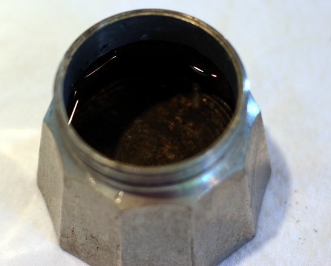
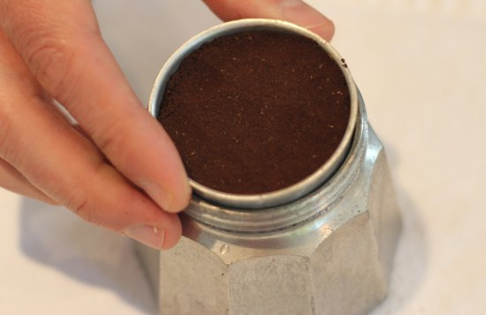
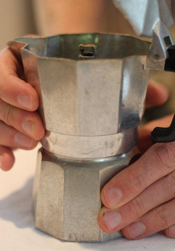
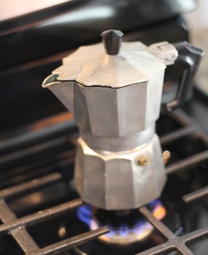
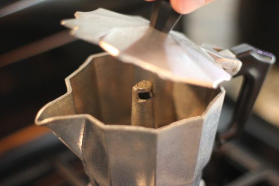
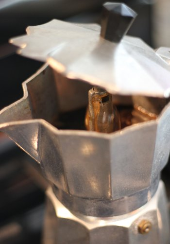
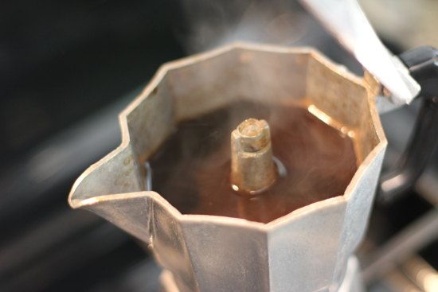

This is a quick tutorial on the stovetop espresso maker, also known as a Moka Pot and sold under the name *Bialetti*. Let’s get started.

### #1 Fill the Bottom Chamber with Water

Fill the bottom chamber with cold water. Stumptown Coffee advises pre-heating the water, so the coffee doesn’t cook on the stove. It may be a good idea to use the large 6-cup Bialetti, but I found that with the 3-cup maker, it made no difference to the taste and was more of a hassle. Try both ways and do whatever works best for you.

  
*Fill the lower chamber of the Bialetti with water.*

### #2 Add Ground Coffee to Filter

Add ground coffee to the filter. There is some debate on how fine the grind should be. I use a grind that is finer than drip but a little coarser than an espresso grind. Do not pack the filter. Like regular espresso, I level the grinds with my finger and wipe off any loose grounds. Once the coffee is loaded into the filter, place it into the bottom chamber. You could load the filter first and then add the ground coffee. Either way is fine.

If you make Stovetop Espresso regularly, consider getting a [Moka Pot Coffee Dispenser](http://ineedcoffee.com/moka-pot-coffee-dispenser-review/).

  
*Add ground coffee to the filter.*

### #3 Secure the Top and Bottom Chambers Together

Twist the top and bottom chambers together until a tight seal is made. Failure to secure the two chambers fully could result in a failed brew and potentially having to clean up a mess.

  
*Seal the top and bottom chambers together.*

### #4 Place Coffee Maker onto Stove

Place the stovetop maker onto the stove and turn on the heat. A low flame is enough to do the job. You could also take it outdoors with you and use a campfire.

  
*Heat the Stovetop Espresso Maker*

### #5 When the Coffee Finishes Brewing, Remove it From Heat and Serve

When the coffee has completed the brew cycle and is in the top chamber, turn off the heat and serve it. Below are some photos showing a brew cycle in progress. Ideally, you would want to keep the lid down during brewing.

  
*Before Extraction*

  
*During Extraction*

  
*After Extraction*

### #6 Cool Before You Clean

Allow your stovetop espresso maker time to cool before you break it down for cleaning. You don’t want to burn yourself.

### Resources

[How to Brew Espresso in a Moka Pot](http://ineedcoffee.com/brewing-espresso-in-a-moka/) – INeedCoffee tutorial that uses sugar.

[Cafe Cubano](http://ineedcoffee.com/cafe-cubano-cuban-coffee/) – Learn how to use the Bialetti Stovetop Espresso Maker to make this classic Cuban-style coffee drink.

[The Story of the Bialetti Moka Express](http://ineedcoffee.com/the-story-of-the-bialetti-moka-express/) – The interesting history of the stovetop espresso maker.