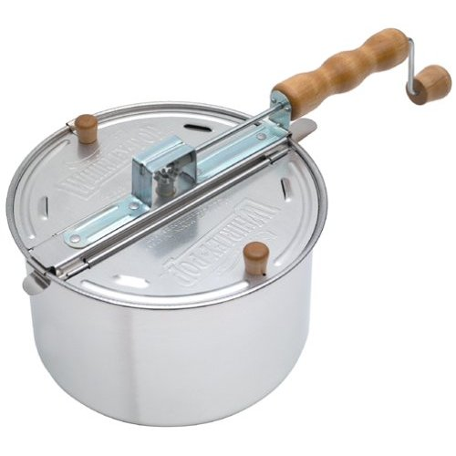
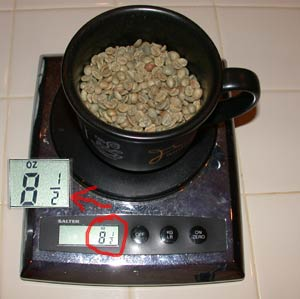
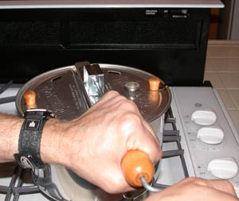
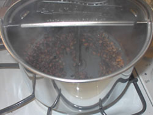
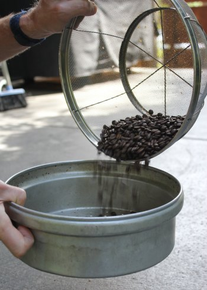

Other home roasting articles on INeedCoffee focus on roasting with electrical roasters, such as the [West Bend Poppery](http://ineedcoffee.com/roasting-coffee-in-a-popcorn-popper/) or the [iRoast 2](http://ineedcoffee.com/roasting-coffee-in-a-popcorn-popper/). You can easily start roasting at home with one of these roasters. But there are other, older methods of home roasting. This article explores using a stovetop popcorn popper, enabling you to roast coffee on your gas stove. It’s not nearly as easy as roasting with an electrical popcorn popper, but the advantages of this method are that you have 100% control over the roasting profile and can roast greater quantities at one time.

  
*Whirley-Pop Stovetop Popcorn Popper  
*

### Is Stovetop Roasting Wrong For You?

Let’s start with a basic truth. Home-roasting coffee is easy. That is up till now. Whether you are using a popcorn popper, a Hearthware, Fresh Roast, or even an [oven](http://ineedcoffee.com/home-roasting-coffee-in-an-oven/), it doesn’t take much time before you are making excellent coffee. A big reason for the ease is that the roasting device handles your roasting temperature. Even the oven remembers where to roast once you’ve set the dial. And some roasters even handle the cooling. With stovetop roasting, it’s the roaster’s responsibility to keep the coffee in a temperature profile that will roast it not too fast or slow. That requires some practice and constant attention.

During the roast, you, as the roaster, will need to monitor rising and falling temperatures and make adjustments, all while hand-cranking the Whirley-Pop. This is rodeo-style roasting. Too much heat and the beans will burn, too little and they’ll bake. **If you are a hands-off roaster, you can stop reading now. This isn’t for you.** The next requirement is excellent ventilation. Roasting coffee produces smoke, and the Whirley-Pop can roast 3 times as much as other roasters. This means 3 times the amount of smoke.

The last caveat is the electric stove. I have a gas stove and could not imagine roasting on an electric stovetop. The reason is that during the roasting portion, the temps will fluctuate, dropping fast at first and then rising gradually. While this is happening, the roaster is increasing and decreasing the temperature. Electric stovetops do not respond as quickly as gas stoves. Is it possible to use an electric stove? I’m sure it is, and I’m sure someone is doing it, but it will add another level of difficulty for the beginner.

### Is Stovetop Roasting Right For You?

There are a few things that stovetop roasting can provide that other roasting methods can’t. The first is quantity. Most home coffee roasting machines, including popcorn poppers, roast around 2.5 ozs (by weight). The Whirley-Pop can handle 8.5 ozs with no problem. The next thing stovetop roasting provides is complete control of the roast temperature profile. With complete control, you have more freedom to create different-tasting coffee roasts. The last difference is that it uses conduction heat.

  
*The Whirley-Pop can roast 8.5 ozs of coffee at once.*

To get started, you will need a stovetop roaster with a temperature gauge that goes to 500 F. Without a temperature reading, you are roasting blind and will have no idea if you’re burning or baking the beans.

### Equipment Checklist

-   Stovetop popcorn popper. The most popular brand is the Whirley-Pop (aka Felknor Theatre).
-   Gas stove with good ventilation.
-   Flashlight or good overhead lighting.
-   Pot holders or oven mitts are used to open the popper. This will get hot.
-   Metal colanders.
-   Green coffee (practice with a cheap, evenly sized bean that can handle darker roasts like Brazil or Colombia).
-   An assistant (optional, but helpful).

### Before You Roast

-   Open the windows, turn on the ventilation, warn your family, move your pets, and, if necessary, disable your smoke detector. You will see smoke!
-   Measure out ~ 8.5 ozs of green coffee. Experiment with volume.
-   Set the metal colanders either in the kitchen sink or just outside.

### Setting the Stove Temperature

The most challenging part of stovetop roasting is controlling the temperature. Before adding the beans, set the roaster on the stove and turn on the flame. Your aim is to get the inside temperature up to 500 F, so ensure the lid is closed. The temperature will fall initially, and then as the roast progresses, it will climb again. The more you peek inside the roaster, the more heat will escape. Once the temperature has stabilized around 500 F, you can pour in the green coffee beans.

### Start Cranking

Unlike roasters that push the beans around with fans, you are responsible for moving the beans. To get an even roast, start cranking, and don’t stop. If you get tired of cranking, have a friend nearby to switch off with. You don’t want to stop, or you’ll burn the coffee. Sometimes, I’ll reverse the crank to mix things up. If the crank sticks, give the popper a quick shake (lid closed).

  
*Keep cranking the popper throughout the coffee roast.*

### Monitor the Temperature

The first thing you’ll notice after pouring the beans into the pre-heated popper is that the temperature will start dropping. The 500 F will plummet to between 300 and 350 F. Every stove is different, so you’ll need to experiment with the amount of flame you’ll add. The goal is not to let the temperature drop below 300 F and try to get it close to 400 F.

Remember that peeking at the roast releases heat from the popper, making it more difficult to achieve a steady temperature. It is a good idea to roast by listening. The good news is that unless the stove ventilation is loud, roasting on a gas stove is the quietest method of home roasting. You should easily be able to hear both the 1st and 2nd crack. The bad news is it takes both hands to crank the roaster and one hand to tweak the stove temperature. Having an assistant is helpful.

### Finishing the Roast

A typical roast takes between 7 and 9 minutes. Towards the end, you’ll hear the start of the 2nd crack. You can peek inside if the temperature exceeds 400 F on the roaster. This will release some of the heat and check the color and evenness of the roast. Word of warning: don’t peek immediately after you flip the lid, or you could burn your eyes on the smoke pouring out. Also, use a pot handler or oven mitt when opening the roaster. If you have an assistant, have them aim a flashlight into the open roaster. The beam of light should cut through the smoke to visually indicate the roast color.

  
*Whirley-Pop roast in progress.*

Although lighter roasts are possible, it’s much easier to go dark. Roasting color with conduction heat seems to even out over time. An additional minute or two can turn a blotchy city roast into an even Vienna roast.

Once you believe the roast is ready, turn off the burner and quickly carry the popper to your metal colanders. I like having two colanders. This allows me to pour the beans from one to another. This both cools the beans and helps remove the chaff. You can also use the spray method to cool the beans. For more information on cooling roasted coffee, read the 2nd and 3rd tips from the article [Popper Roasting Tips](http://ineedcoffee.com/popper-roasting-tips/)

  
*Cool the coffee beans using two metal colanders.*

### Conclusion

Besides being an excellent roasting method for those who wish to tweak the roasting temperature, this is also one of the cheaper volume roasters. For around $30, you can roast more than half a pound of coffee in under 10 minutes. My final word of advice is that this is not the best roasting method for beginners. Someone new to home coffee roasting would be better off starting with a roaster where they can watch the beans go from green to perfection.

UPDATE: Michael T sent in this tip. *If you put a cast iron skillet between your pot/Whirley-Pop and electric burner, not only does it distribute the heat better, but it also soaks up and holds heat really well, so temperature changes are less of a problem.*