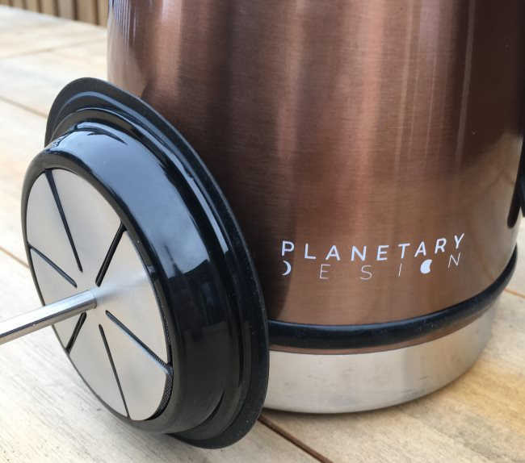
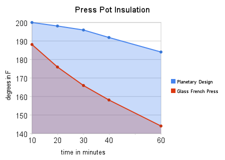
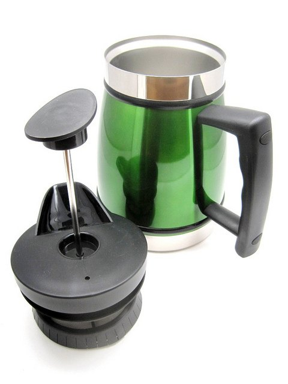
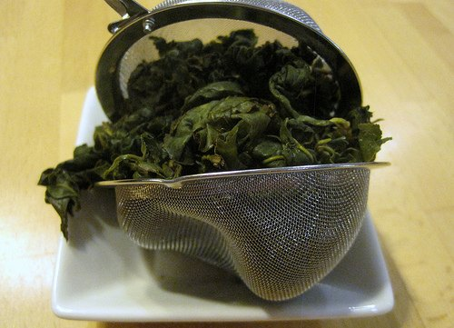
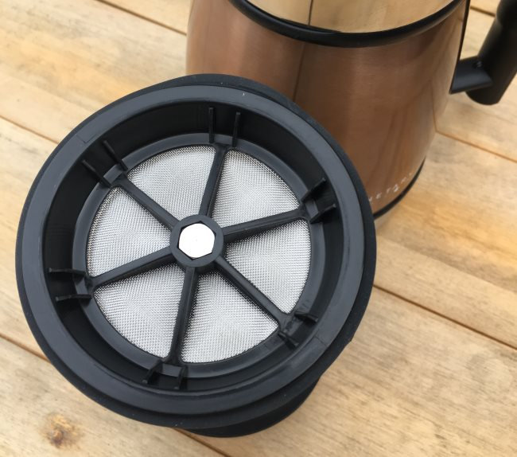
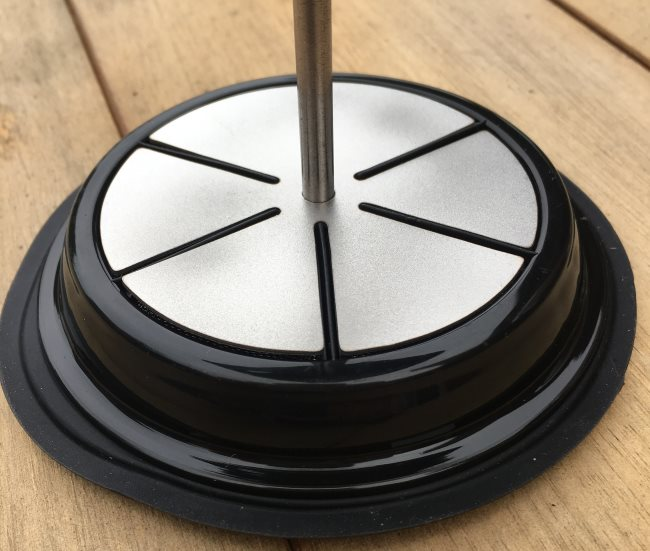

The original version of this article was published in July 2013. In November 2017, Planetary Design released an updated version of its Tabletop Coffee and Tea Maker. The new patent-pending Bru-Stop technology improves on a good product.

Bru-Stop solves the two most common French Press problems, which are:

1.  Keeping loose grounds out of the brewed coffee.
2.  Preventing the coffee from over-extracting post-brew.

The new filter added to the Tabletop does both.

*French Press Tabletop Coffee and Tea Maker*

### Insulation

When the first version of the Tabletop French Press was released, its insulating capabilities captured my attention the most. Until then, I had approached brewing French Press by only brewing enough coffee at a time for me or whoever else was around. Brew and serve immediately.

Now we had a French Press that could retain better than glass models. If you are the type that brews your French press indoors and then immediately pours out the coffee, insulation probably won’t matter. However, insulation is more important if you are in a cold garage or at a campsite. According to the Planetary Design website, the Tabletop Press Pot is insulated with *“double-walled, vacuum-insulated, 18/8 restaurant-grade stainless steel.”*

I decided to test how the Planetary Design model compared with my glass French press. My kitchen was 68 degrees. I filled both press pots with water just off a boil and then recorded 10, 20, 30, 40, and 60 minutes of temperature readings. **The Planetary Design model destroyed the glass press pot on insulation.** See the chart below.

  
*French Press Temperature Chart*

### Some Plastic

The Planetary Design Press Pot does have some plastic in the filter part that contacts the water. I contacted the company about this, and they pointed out that all their plastic is Bisphenol A (BPA) free. I attempted to use a standard press pot plunger for those determined to use zero plastic. It did not make a snug fit. You are better off using their plunger.

  
*The original Planetary Design Tabletop Press Pot*

### Brewing Quality

The Planetary Design Press Pot fits tighter than my glass press pot. It also uses an ultra-fine mesh screen filter, which results in a slightly cleaner cup of coffee than most French Press designs. I also used the pot several times to make oolong tea. Tea fans know that oolong tea is often rolled into tight balls, and it needs room to unwind and make contact with water. A typical tea filter is not ideal for oolong tea. A French press is a good solution.

  
*Not ideal. Oolong Tea Trapped inside Tea Filter*

### It’s Pretty

I thought I didn’t care about aesthetics, but the Planetary Tabletop looks nice. It comes in the following colors:

-   Black
-   Brushed Steel
-   Candy Apple
-   Green Tea
-   Mocha
-   Obsidian

### The Updated Bru-Stop Technology

Below are some photos of the updated Bru-Stop filter. According to the Planetary Design website, they will soon be selling conversion kits if you own a previous model of the Tabletop French Press.

### Last Words

I didn’t think I needed another French press until I could play with the Planetary Design Tabletop French Press. It is ideal for travel, as glass press pots tend to shatter easily. It holds temperature extremely well and makes a great cup of coffee. Now, it does a better job of keeping the grounds away from the brewed coffee, which makes the coffee taste even cleaner.

### Resources

[Buying a French Press – Picking the Right One](http://ineedcoffee.com/buying-a-french-press-picking-the-right-one/) – INeedCoffee article to help you get started on a Press Pot purchase.

[French Press Coffee Tutorial](http://ineedcoffee.com/press-pot-tutorial/) – INeedCoffee guide to making great French Press coffee.

[Troubleshooting French Press Coffee](http://ineedcoffee.com/troubleshooting-french-press-coffee/): Once you have your French press, here are some ideas for making your coffee taste great.

*Disclaimer: The author received a Tabletop from Planetary Design for this review in 2013 and 2017.*