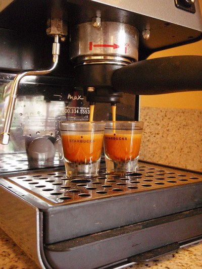

Whether you like or dislike Starbucks, we can all agree that they are quite the entrepreneurs. If they can find another way to make a nickel, they will. Coffee, ice cream, beer (Red Hook’s Double Black Stout), sugar-filled bottled pseudo coffee, and even a magazine that has nothing to do with coffee (Joe). It’s a classic corporate maneuver. Expand the empire by widening the product line. But, I feel they may have stepped on their toe in the last year by pushing home espresso machines.

Why would Starbucks sell me a machine that would give me the power to make my espresso drinks at home? I’m reminded of the old Chinese proverb.

> Give a man a fish and he will eat for a day. Teach a man to fish and he will eat for a lifetime.

### Getting the Fish

Moving from St. Petersburg, FL, to the DC Metro area was a coffee shock. The nearest quality espresso in St. Pete was either in Tampa or Clearwater. In the DC metro area, there are Starbucks stores everywhere. You can’t go more than 100 feet without running into another Starbucks.

To say I went a little overboard with espresso-based drinks after the move is an understatement. I spent $30-$50 weekly on lattes and espresso at Starbucks. I have nothing against independent shops, but there aren’t very many, and the few I’ve been to are more concerned with projecting an attitude than producing a quality beverage.

### Learning To Fish

Last winter, Starbucks started pushing their line of home espresso machines. At first, I was reluctant to consider the purchase, since I’d had a $75 piece of crap Salton machine a few years prior. The Salton made a gritty sludge resembling the robusta swill on Miami Beach. After that experience, I was convinced I’d leave making espresso to the cafes and make regular coffee at home.

However, Starbucks persisted. They captured my attention, and I pulled a few sample shots from the Barista espresso machine. The Barista was a far better machine than I had expected. The sample shots had a full crema and tasted great. Impressed, I bought the espresso machine.

  
*Starbucks Barista Espresso Machine*

It only made sense for me to buy the Barista, but what I can’t figure out is why Starbucks sold it to me. Here I am one of their best customers, spending $3-$4 every few waking hours and they send me out the door with my own machine! Why would they want to empower the customer? You don’t see *Jack Daniels* selling home distilling kits.

Sure, Starbucks will pocket a few more dollars upfront, but won’t it lose a lot of cash in the future? Perhaps Starbucks was betting I wouldn’t use the machine and’d be back shelling out $50 a week in no time. I was betting I’d be homemaking my drinks, not ordering drinks at the cafe.

### Who Won?

It’s almost one year later, and Starbucks has lost money on me. I’ve gone from buying two lattes a day to maybe one a month. I want to thank Starbucks and their short-term greed for enabling me to make my lattes at home; selling the Barista equipment has saved me far more than the machine’s price.

### The Updated Espresso Proverb

> Give a man an espresso and he will have a buzz for an hour. Give a man an espresso machine and he will be buzzed for a lifetime. – Me

### Resources

[Using the Barista Home Espresso Machine](http://ineedcoffee.com/using-the-barista-home-espresso-machine/) – Tutorial with tips on using the Starbucks Barista Espresso Machine