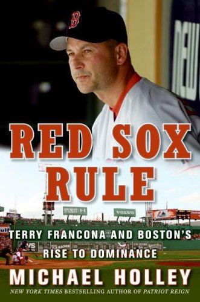
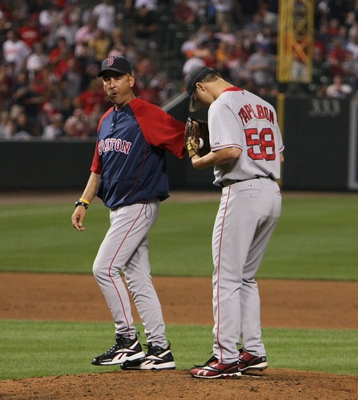

Terry Francona, apparently, is a Starbucks guy. Now in his sixth year managing the Boston Red Sox, Francona has managed the team that went 86 years without a World Series championship to two titles. Boston fans have mellowed a tiny bit since the title drought ended in 2004, but it’s still a potentially brutal place for a manager.

In *Red Sox Rule: Terry Francona and Boston’s Rise To Dominance*, author Michael Holley describes Francona adhering to his Starbucks routine during a demoralizing 2006 regular-season series against the New York Yankees, Boston’s arch-rival:

> He was going to need a similar pep talk on this Saturday morning, working on two hours’ sleep. He left the house, drove to Starbucks for the usual, egg salad sandwich and a large coffee — and headed to Fenway.

  
*Red Sox Rule: Terry Francona and Boston’s Rise to Dominance by Michael Holley*

Holley isn’t the only reporter who’s picked up on Francona’s routine. Mike Fine of the Patriot Ledger and the Boston Herald’s Rob Bradford mentions it, as does the Boston Globe’s Amalie Benjamin:

> But before he gets to that point, there are the 7 a.m. wakeups that often represent the only time he’ll see his two younger kids all day. The morning ritual at Starbucks, where he sleepwalks past the occasional autograph seekers to his tall coffee and egg salad sandwich. The matchups and reports that wait on his desk, where he left them the night before. The calls from players, detailing this injury or that problem. The trainers visits that don’t always bring good news.

Holley describes it as a “large” coffee, Benjamin says it’s “tall.” At Starbucks, that could mean any of three different sizes. Can we assume that’s a venti he drinks every day? I like to think so, at least — and if Francona refuses to order it in *StarbuckSpeak*, all the more power to him.

  
*Photo Terry Francona, Jonathan Papelbon by Keith Allison\*  
*

In any event, I love this image of Francona stopping at a Starbucks each day and adhering to a cherished daily coffee routine. (Major League Baseball managers — they’re just like us!) Part of the appeal is that Francona is the near-opposite of a Starbucks-addict stereotype. He’s laid-back and self-effacing, and when Boston fans panic (which is often), Francona is an even-keel foil to all the regional anxiety. Coffee shouldn’t only be a means of keeping wired — drinking coffee that you really enjoy is a perfect and inspiring backdrop to the beginning of a workday. From late February until October (hopefully until *late* October), that’s the way Francona is gearing up for game day.

Like [MAS](http://ineedcoffee.com/by/michael-allen-smith/), my INeedCoffee colleague, Francona is big on drinking tea as well as coffee. He is a spokesman for Bigelow Tea and starts each game by drinking green tea with pomegranate.

### Sources

Francona stands out among World Series-winning managers – by Mike Fine (article went offline in October 2021)

[Terry Francona: Steady as he goes](https://www.bostonherald.com/2008/06/09/terry-francona-steady-as-he-goes/) – by Rob Bradford / Red Sox Beat

[Demanding Routine for Francona](http://archive.boston.com/sports/baseball/redsox/articles/2008/03/23/demanding_routine_for_francona/) – by Amalie Benjamin

*Title image of baseball field by* [*Joel Dinda*](https://flic.kr/p/cnnSS)

*Keith Allison’s photo was removed from Flickr in July 2019*