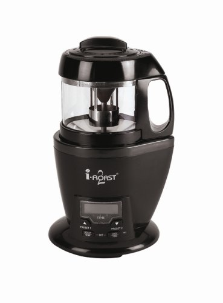

*This article was orginally posted as a 3 part series on *AboutCoffee.net*, which is no longer operating.*

I have roasted an 80 gram batch of Costa Rican Tarrazu and a 140 gram batch of Colombian Supremo, and so far, it looks as if I will have to retire my Cafe Rosto.

I have been roasting my own coffee for about five years but I am far from an expert roaster. I like to think I am an experienced amateur roaster. The only roaster I have ever used is the Cafe Rosto, and I am on my second one. Actually, I started out roasting with the Melitto Cafe Aroma, but please don’t spread it around. Using the Aroma is like riding a moped. It’s fun until your friends find out.

Unlike the Cafe Rosto, the i-Roast 2 allows you to roast at different temperatures at separate stages of the roasting cycle and I need to see if that is worth the hassle.

  
*IRoast2 40011 5-2/7-Ounce Coffee-Bean Roaster, Black*

My Rosto requires a lot of supervision to get a good, evenly roasted batch. In other words, I have to stand there and shake it every 30 seconds so the beans get agitated sufficiently. Otherwise, some burn and others aren’t roasted enough. I have wasted too much coffee because I was distracted (computer, kids, computer, wife, computer, telephone, etc.) during roasting and did not shake shake shake.

The accepted wisdom is to never leave a roaster alone. It’s not safe. I know that, but, well, *mea culpa* on getting distracted.

My first two batches on the i-Roast 2 were beautiful! I did a preset cycle on the Tarrazu and it was perfect in 10 minutes. I programmed the Colombian to roast at 450 for 13 minutes, but I shut it down at 12 and it went into its 4-minute cooling cycle. Also a beautiful batch. Very nice roaster.

### Part 2

I probably have the most unsophisticated coffee mouth of all our readers. I have attended three cupping seminars over the years and I never could taste what I was supposed to be tasting. I have found that some coffees taste better than others, but I have trouble telling you why. My roasting expertise is at about the same level as my taste. I have roasted for many years but I really don’t know what I am doing when I roast.

This i-Roast 2TM has taken the place of my Cafe RostoTM. I like the way it operates and I like the roasted coffee it produces. I recommend it to anyone who wants to get into home roasting or any home roaster whose present roasting tool isn’t working well. If you want a more detailed report on this roaster, do some research on Google Groups.

The roaster comes with two preset roasting cycles, which vary the time and temperature throughout the cycle. The cooling cycle is 4 minutes and cannot be changed. You can test any variety of temps and times, up to 5 stages. The maximum temp is 485F and the maximum time is 15 minutes. You may save up to 10 profiles.

I roasted a 142-gram batch of Sumatra Mandheling at the max temp of 485 and time of 15 minutes. I watched the temp all the way through and it never exceeded 410. You can push a button at any time and get the temp of the air coming out of the heating area. It is not the temp of the beans. I shut down the roast at 10 minutes because the beans had a nice oily sheen, just the way I like Sumatra. And, more importantly, the cup was great the next day.

I roasted another batch of 142 grams of Colombian Supremo at 450 and 13 minutes. The temp hit a high of 376 and I shut it down at 12 minutes, just ahead of any oil showing on the bean. Great cup the next day.

As you probably know, ambient temperature affects home roasters. I have always roasted in my attached garage and, while it is warmer there than outdoors in the winter, it still is cool compared to indoors. Another reason is the smoke and the smell. Roasting coffee produces smoke, especially the darker roasts. Also, it stinks. Many people think roasting coffee must smell good, since coffee smells so good when brewing. Not so. My washing machine is also in my garage and my wife is always fussing about my roasting making her clothes smell. (She doesn’t fuss the next morning while she sips her delicious coffee, though.)

This i-Roast 2TM comes with a duct adapter that fits on top and allows a dryer duct to be attached so you can send the smoke out a window or hole in your roof. I thought, “wow, now I can roast in the kitchen without having to (1) deal with ambient temp, and (2) wade through my junked-up garage.”

I picked a day when my wife was out of town, bought some flexible dryer ducts, and set everything up on my kitchen stove. I loaded the roaster with 145 grams of Sumatra and started the roast on the Preset 2 setting. That setting roasts in 3 stages, the first stage for 6 minutes at 455, the second for 4 minutes at 400, and the third for 1.5 minutes at 435.

I turned the stove exhaust on and watched it roast. At about halfway through the smoke detector just outside the kitchen went off. I put it into another room and thought I was home free until the smoke started. Lots of smoke. My idea didn’t work. Maybe my exhaust isn’t powerful enough, but I will not be able to roast coffee in the kitchen. Oh well, back to the garage.

I stopped the roast with 2 minutes to go since the beans looked right. The temp never exceeded 405. The roaster gives very good visibility so you can keep a close watch, especially toward the end, and shut it down by pushing the “Cool” button if needed. Since it continues to roast for a little while, hit the button ahead of when you want to stop the roast. You’ll learn with experience. You may set up the third stage to allow for changes in roasting time as it roasts.

I have not yet played with different profiles for roasting. You can record up to 10 roasting profiles, each with up to 5 stages. I intend to do some more testing on profiles. Hopefully, my unsophisticated mouth will be able to tell the difference. I suspect that most users will pick a time and temp that produces a good batch and roast away with that one profile.

This is a great roaster for anyone. It is programmable, it’s easy to use, and it’s priced reasonably at around $179. I recommend it.

### Negatives:

-   The instruction manual could be easier to understand.
-   LCD is hard to see since you need to bend down to eye level with the bottom of the roaster to see it. A 45-degree angle would be better.
-   The operation is too loud. It was difficult for my old ears to hear the cracks.

### Positives:

-   Good price.
-   Affected by ambient temperature, as are all air roasters.
-   Sufficient agitation ensures even roasts.
-   The batch size is approximately 145 grams or one cup of green beans. Comes with a 1/2 cup measuring cup.
-   Very little chaff escapes.
-   Easy to clean. Comes with a handy cleaning brush.
-   Efficient cooling cycle. Cools beans and allows safe handling of components.
-   Programmable roasting profiles. Allows hours and hours of tinkering and tweaking.

### Part 3

I am having fun with this new roaster. I said in my last post that I didn’t think many home roasters would bother with the programming, and “that most users will pick a time and temp that produces a good batch and roast away with that one profile.” Well, I get smarter as I get older, and the ability to change a roasting profile does make a better-roasted coffee.

Different coffees need to be roasted differently to maximize their potential. And I’m not just referring to their degree of roast, such as “full city” or “Vienna.” The ability to change the temp at various time periods does affect the taste of the cup. Every coffee is different and the difference is due to the exact place it is grown.

I have lots of roasting to do before I have determined the proper roasting profiles for all the coffee I drink. I intend to try many different profiles for each coffee to see what works best in the cup. It’s tough work but somebody’s gotta do it.

I tried venting the roaster in my kitchen with the dryer tube placed at the range hood exhaust fan. It didn’t work, since the exhaust wasn’t strong enough to get rid of the smoke, so I tried it again the proper way, by putting the hose out a window. I used duct tape to secure the flexible dryer vent hose to the roaster’s collar connector. I saw that there was still a small gap between the collar and the roaster so I re-wrapped it and allowed about 1/8″ of the duct tape to extend past the bottom edge of the collar. That was enough to almost completely seal the connection. I roasted a batch of Sumatra, with a profile of 3 minutes at 350, 3 minutes at 400, and 5 minutes at 450. It reached a very nice Vienna Roast about 30 seconds before completion so I hit the “Cool” button and finished.

It worked beautifully! There was plenty of smoke going out the hose but absolutely none in the house. When I roast to a Vienna in my garage you can barely see the walls because of the smoke. Now I can roast on a cold winter night and get consistent results. What a deal.