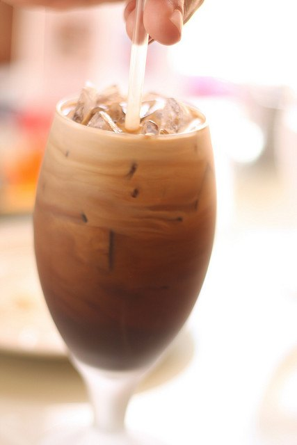

The best way to approach the Thai Won On—Thai Iced Coffee recipe is to pull lots of espresso shots and place them in the refrigerator to cool. If you do not have an espresso machine, you can brew double-strength coffee.

-   Fill a glass 1/3 of the way with crushed ice.
-   Fill a separate glass with 2 oz sweetened condensed milk.
-   Pour 2-3 oz of coffee (depending upon the strength you like) over the sweetened condensed milk (you’ll notice the coffee will sit on top as its own layer).
-   Stir rapidly with a spoon until well blended.
-   Pour over the ice in the other glass.

  
*[Thai iced coffee](http://www.flickr.com/photos/moominmolly/2372132791/) by Molly*

This is a great dessert unto itself and is awesome after a spicy Asian meal. You can garnish with either a sprinkle of cinnamon, although a drop of vanilla and/or anise makes for paradise in a cup.

### Resources

[11 Crazy Coffee Drinks You Won’t Find on a Starbucks Menu](/11-crazy-coffee-drinks-you-wont-find-on-a-starbucks-menu/) – More drink recipe ideas.

[The Coffee Avocado Shake Recipe](/the-coffee-avocado-shake/) – Another iced coffee drink recipe with an Asian influence.
