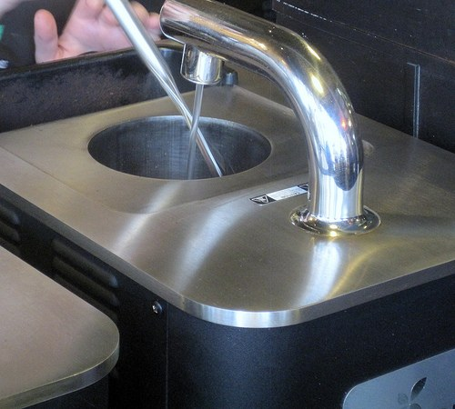
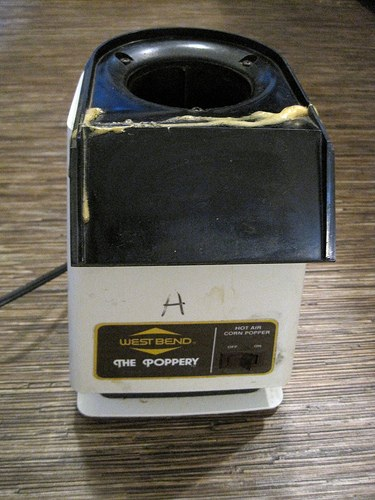

I’ve been thinking a lot about the correlation between quality and pricing regarding coffee. I got some negative feedback when I did a few posts about coffee pricing. One of the issues raised was that coffee quality is improving and it, therefore, demands a higher price. One comment I received suggested that not accepting the higher price was an endorsement of lower quality coffee. Correct me if I am wrong, but wine drinkers openly discuss price and quality – and don’t accept claims that more expensive wine is always better.

Is it taboo to be honest about seeking certain flavor profiles at different price points? I don’t believe there is always a direct correlation between price and quality. To illustrate this point, I’d like to describe the two best cups of coffee I’ve ever had.

On September 27, 2007, I had my best cup of coffee. It was the grand opening of Trabant’s Pioneer Square location, and for the event, they brewed the award-winning Panama Esmeralda in their Clover machine. This is what I wrote about the coffee the next day.

> *What can I say? The legends are true. This was the best cup of coffee I have ever had. The coffee had so many unique characteristics, many unique to Central American beans as well as some qualities that I’ve only tasted in East African beans. It was amazing. Imagine a jam band of rock superstars making the best song on the best sound system. That’s a perfect cup of coffee.*

The Esmeralda was $130/lb unroasted and $200/lb roasted. It was roasted by 49th Parallel in British Columbia, Canada. Other cafes charge between $9 and $15 for a single cup of this special coffee when brewed in a Clover.

  
*Clover Coffee Machine*

The second-best cup of coffee I’ve ever had was a Kenyan Peaberry that I home-roasted in 2004. I don’t recall the exact lot. I had been home roasting different regions of Kenyan coffee for years, and I just kept improving my roast profile. Then, everything clicked. The cool California mornings and optimal resting periods made for a superb cup of coffee. I took it to work, and all my co-workers lined up to receive some of the coffee brewed in my press pot. We had been working together for two years at this point, and they all agreed that this coffee was their favorite.

  
*Westbend Poppery*

The Kenya Peaberry was ordered from Sweet Maria’s. With shipping, it cost me about $5 a pound. It was roasted using a Westbend Poppery, which I purchased on eBay for $40. My French press cost me about $20.

Let us review the two coffees.

Panama Esmeralda

Kenya Peaberry

Green Coffee Price per lb

$130.00

$5.00

Roaster

49th Parallel

Me

Roasted Coffee Price per lb

$200.00

$6.25 (20% weight loss)

Roasting Cost per lb

$70.00

My Time

Additional Roasting Costs

–

$40 Popcorn Popper

Brewing Method

$11,000 Clover

$20 French Press

Cost per Brewed Cup

$9 – $15 + tip

**14 cents**

*\* I didn’t include the electricity used to run the home roaster, but I didn’t include the fuel charges to get to and from the coffee house*.

Was the Panama Esmeralda brewed through a Clover better than my home-roasted Kenya? Absolutely. Was it 50 or 100 times better? No, it wasn’t. There isn’t always a direct correlation between price and quality. Although I love the award-winning expensive coffees, it is nice to know that you can still get a stellar cup of coffee on a budget.

### Resources

Trabant Coffee – Seattle-based coffee shop with 2 locations.

[Best Cup of Coffee Ever](https://criticalmas.org/2007/09/best-cup-of-coffee-ever/) – Blog post written after tasting the Panama Esmeralda.

[Panama Hacienda La Esmeralda Coffee](http://web.archive.org/web/20140807035723/http://www.urbanmixer.com/index.php/2007/08/16/panama-hacienda-la-esmeralda-coffee/) – Urbanmixer post that documents a $15 price per cup for the 2007 Panama Esmeralda.

[Answers](https://www.answers.com/cooking-techniques/How_many_cups_of_coffee_will_a_pound_of_coffee_make) – How many cups of coffee will a single pound make?