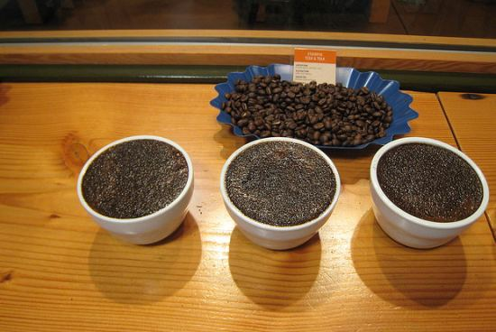

What does your favorite coffee taste like? Would you consider it bold or delicate, acidic or smooth? Is your coffee heavily fruited, with distinct mango and tamarind scents? Spicy with a honey-dipped fruit character, fresh ginger, and clove? Spiced apricot tea and peach preserve finishing with a spicy cinnamon note? Wow, where do they come up with that stuff? It’s all in the “Coffee Cupping” process, and quite a lengthy and interesting process it is.

First, let me say a little bit about our taste buds. Do you taste the same thing as I do if we are both enjoying a meal, or maybe a grapefruit? The scientists tell us no. Not only do the density and responsiveness of taste buds vary from person to person, but it depends on our genes as to the intensity that we can taste bitterness. On average one in four people have both recessive genes and therefore “respond to all types of bitterness less intensely” and this is “a general indicator of their overall taste capacity.” And as we all know, bitterness is usually an important factor in determining if a coffee is poor.

  
*Coffee Cupping at Stumptown*

Due to the differences in our tasting capacities, the opinions of coffee flavors can vary greatly, but how do the experts come up with flavor reviews? The process of cupping is a scientific method that tries to keep all of the variables the same so they can equally compare the coffees. First, start with lightly roasted coffee. As a coffee bean is roasted, it loses some of its sweetness, aroma, and more delicate flavors as it picks up more of the common roasting flavors, usually described as caramel, chocolate, smoky, or even charred.

Next, take the lightly roasted coffee, ground to a drip or coarse grind, and put two tablespoons in a 6 oz. cup. While the filtered water is coming to a boil, evaluate the aroma or fragrance. Now the fun begins. According to the Specialty Coffee Association of America’s coffee taster’s flavor wheel, the first three categories are flowery, fruity, and herby.

-   Flowery can then further be narrowed down to florals, such as lavender, jasmine, or wintergreen; or fragrant, such as cinnamon, cardamom, caraway, sweet basil, or anise.
-   Fruity can be citrus or berry-like, such as lemon, tangerine, raspberry, or blackberry.
-   Herby might have flavors like onion, garlic, cabbage, or alfalfa. All this and we haven’t even added the water yet.

So take the boiling water off of the stove (195-205 F) and fill the cup; let it sit for 1-2 minutes and then “break the crust,” putting your nose over the top of the cup use a spoon to push the floating grounds down and take a deep breath of the aroma. Now you might pick up more scents that are nutty, such as peanut, almond, corn, or barley; caramelly, like toffee, licorice, pralines, honey, or molasses; chocolate; or vanilla. Stir the cup and let the grounds settle to the bottom, removing the remaining floating ones with a spoon.

Now it’s time to taste the coffee. Do we just take a sip? Of course not! Take a spoonful of the coffee and slurp it. Yup, with a strong breath, almost inhale the coffee, this should spray it evenly across the tongue and mist it into the nasal passages. Then, it is time to analyze the taste, body, acidity, and aftertaste. The taste is generally in the four categories of our taste buds: sweet, sour, salty, and bitter. Some descriptions are tart, tangy, nippy, mild, delicate, soft, rough, astringent, harsh, and pungent.

-   The body is an indication of the oil content, from thin to light to heavy, determined by its mouthfeel.
-   The acidity is the dry, bright taste that diminishes as the bean is roasted darker; too much acidity would be described as sour.
-   The aftertaste is, of course, the lingering remnant of the coffee’s characteristics. It is also important to note that as the coffee cools the flavors can change, so it is necessary to taste it a few more times as it cools to room temperature to understand the fullness of its flavor spectrum.

Some coffees have been reviewed and given descriptions that tend to turn me away: swamp vegetation, algae, must and mildew, mud, wet cardboard, rotted wood, paper, and burlap. Hmmm. I think I’ll stick to the apricot tea, peach preserves finishing with a spicy cinnamon.

Now, do you know what your coffee tastes like? I am still not sure. However, it is a fun experience to slurp and ponder and speculate. Happy tasting!

### Resources

[Coffee Cupping: A Basic Introduction](http://ineedcoffee.com/coffee-cupping-a-basic-introduction/) – Article by Steve Leighton

[Cupping: The Elements of Quality Coffee](http://ineedcoffee.com/cupping-the-elements-of-quality-coffee/) – by Christopher Schaefer

[Coffee and Tea Tasting Notes For Beginners](http://ineedcoffee.com/coffee-and-tea-tasting-notes-for-beginners/) – An alternate approach to coffee tasting.