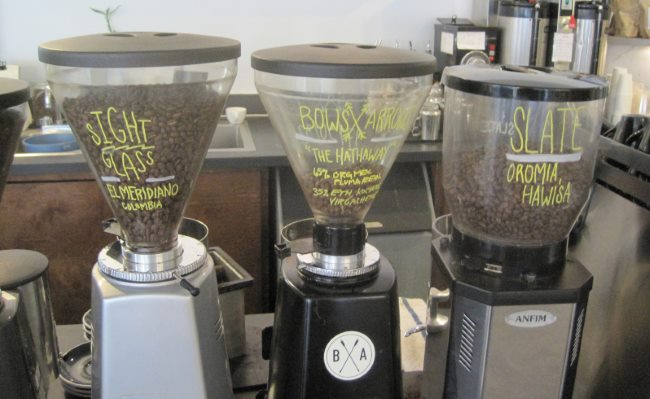
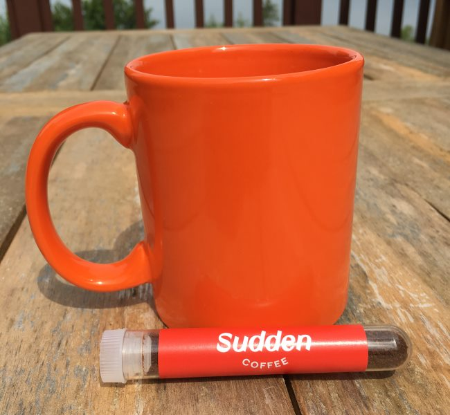

Last year, I wrote a list of complaints about specialty coffee. You can read those at [Things I Would Like to See Improved in Specialty Coffee (2017)](http://ineedcoffee.com/improving-specialty-coffee/). Unfortunately, with the exception of #2 (Bus Trays) and #4 (Mugs without Handles), most of those issues are still a problem.

However, there are lots of great things happening in specialty coffee. In this article, I want to celebrate those changes.

Before I start the list, let me discuss my background. I am not in the industry. I am a coffee enthusiast who has visited hundreds of different coffee shops in the last decade. Most have been in the Pacific Northwest. In Seattle, I help organize a Meetup group that does nothing but explore the coffee scene.

Here are some of the best trends I see in specialty coffee.

### #1 The Rise of the Multi-Roaster and/or Multi-Espresso Offering Cafe

Around 10 years ago, a few cafes in Portland and Seattle began offering espresso options from multiple roasters. At the time, it was a revolutionary idea. Then, the idea of serving multiple espressos started to take off. Today, there are numerous cafes that offer more than one espresso, often from different roasters, and sometimes, those roasters rotate.

As an espresso fan, I love this trend and hope it continues. I wish the cafes would better communicate that they have a 2nd espresso option ([see #1](http://ineedcoffee.com/improving-specialty-coffee/)).

*Coffee shop with three different (and rotating) espresso choices.* 

### #2 Tipping Included

Several cafes here in Seattle have removed the tip jars from the counter. They are adding the tip directly to the price of the drink in the form of a service charge. I’ve heard numerous reasons for replacing the tip with a service charge, most of which are outlined in the article [WHY NO TIPPING?](https://web.archive.org/web/20191225043801/https://optimismbrewing.com/no-tipping) by Optimism Brewing.

I’ve seen service charges between 10% and 20%, which is in line with normal tipping rates.

I have heard mixed reviews from baristas, but as a customer, I like it because it is one less thing to think about at the register. And it is one less thing for every customer ahead of me to think about. Also, unlike a restaurant where the tip is given after service, coffee is one of the rare services where the tip is given before service, which can be awkward for the customer.

### #3 Apple Pay and Android Pay

I love paying for coffee with Apple Pay. I hold my phone next to the point-of-sale system, hear a ding, and the drink is paid for. There is no cash, no change, and I don’t even need to hand over a credit card. It used to be that half of the total transaction time was for payment, and half went to making the drink. Now, it is probably 25% transaction and 75% for making the drink.

I’d like to encourage my fellow customers to set up a credit card to use Apple or Android Pay. This will get these lines moving faster and let our baristas focus on making great drinks instead of making change.

### #4 Digital Reward Cards

I still have six paper reward cards in my wallet (see photo below). Whenever I visit one of these coffee shops, I rush to have it out and ready at the time of purchase to collect my stamp. Other people don’t seem to rush. They don’t know where their card is, so they hold up the line digging through their purse or wallet looking for their card. Or even worse, they rifle through one of those community cardholders trying to find their card among several hundred.

Digital Rewards solves all that. Pay with your phone (see #3) and earn a stamp. After 8 or 10 digital stamps, you receive a text with a code you can use to claim your free drink. SO MUCH BETTER!

*I look forward to all these cards being replaced with bytes on a cloud server.* 

### #5 Whole Bean Coffee From Independent Coffee Roasters at the Grocery Store

For as long as I can recall, the grocery store’s coffee shelves were filled with low-grade canned coffee or big corporate brands like Starbucks or Peets. That is slowly changing. I’m seeing more and more independent coffee roasters getting shelf space at higher-end grocery stores.

The whole beans at the grocery store are less expensive than at the cafe or on the roaster’s website. I typically pay $3 to $6 less per 12-ounce bag at the grocery store than at the cafe. Also, roasters that sell smaller bags of 8, 9, or 10 ounces in their cafes will usually offer the full 12-ounce bag in the grocery store—and for less money.

My one warning is to look for the roasted date on the bag. Fresh bags are often placed behind stale bags. If you can not find a roasted date, assume it is stale. Any bag that uses a “best before” date is not to be trusted, as it does not disclose the roasted date.

### #6 Honey Processed Coffee

This topic probably deserves its article, so I’ll keep it brief. There are different ways to process coffee, with washed and natural being the most popular. Now we are starting to see something called honey style.

Honey style doesn’t use honey; instead, it can be viewed as the middle ground between washed and natural. There are even different forms of honey-processed coffee. Read [Yellow, Red, & Black Honey Processed Coffees: What’s The Difference?](https://perfectdailygrind.com/2017/02/yellow-red-black-honey-processed-coffees-whats-the-difference/) from *Perfect Daily Grind* for a good primer on this topic.

They are discovering that different degrees of honey processing accent different attributes of a coffee. Depending upon the level of honey processing the beans receive, the same crop can be made to taste clean, floral, sweet, or syrupy. Costa Rica is taking the lead in honey processing. It will be interesting to see if this form of processing spreads to other countries.

### #7 Quieter Grinders

If you hadn’t paid attention over the past few years, you may have missed this, but cafes have gradually replaced those old-school super loud grinders with newer precision grinders that have less waste and are probably half as loud.

### #8 Much Better Decaf

Most decaf coffee drinkers don’t know this, but over the last decade or so, the good folks at Swiss Water have drastically improved the decaffeination process. I had a tour of their Vancouver facility a few years ago and was impressed. By measuring the moisture levels of beans before and after decaffeination, they can now get decaf to taste almost identical to the caffeinated version.

Most roasters still don’t care, and many decaf consumers do not, so most decaf coffee is still unnecessarily roasted too dark. The good news is this is changing. As coffee drinkers become more aware of how delicious decaf coffee can be, they will begin to expect more, and we will see more widespread adoption across the industry.

The best decaf coffee I have found tends to come from independent micro-roasters less than 10 years old that focus more on single-origin coffee than blends.

### #9 Instant Coffee Innovation

All instant coffee is weak and terrible, right? Not so fast. Things have changed. In my article Next Generation Instant Coffee Reviews, I cover a few brands, such as Sudden Coffee, that have done an outstanding job of making instant coffee taste great.

### Last Words

Some exciting things are happening in specialty coffee. Innovations occur at every level of the coffee industry, from the farm to the roaster to the cafe, and ultimately to how customers pay for their drinks and whole beans.

### Resources

[Things I Would Like to See Improved in Specialty Coffee (2017)](http://ineedcoffee.com/improving-specialty-coffee/) – My list of how the coffee industry could improve.

[Next Generation Instant Coffee Reviews](http://ineedcoffee.com/next-generation-instant-coffee-reviews/) – Our article discusses how a few companies started making great instant coffee.

[Hacking Decaf – The Swiss Water Story](http://ineedcoffee.com/hacking-decaf-the-swiss-water-story/) – An in-depth article on the improvements in decaffeination.

[Coffee Club of Seattle](https://www.meetup.com/seattle-coffee-club/) – Meetup group founded in 2006.

[Yellow, Red, & Black Honey Processed Coffees: What’s The Difference?](https://perfectdailygrind.com/2017/02/yellow-red-black-honey-processed-coffees-whats-the-difference/) – An informative article explaining honey-processed coffee.