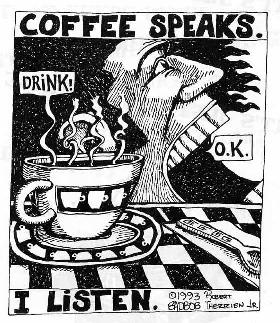
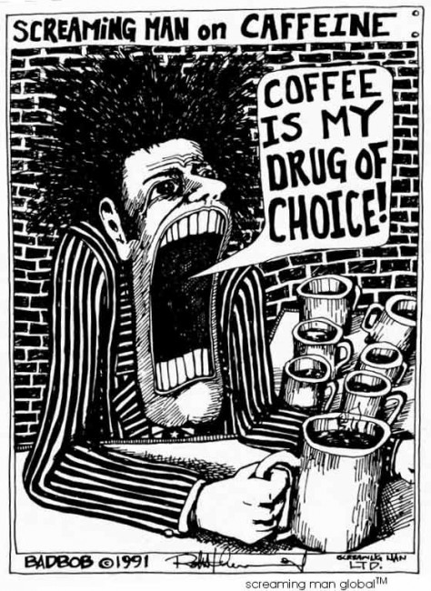

I’m on the edge, I’m on caffeine  
No conversations, only screams.  
I could cut down, but not today  
my mind is racing, miles away.

There’s just one thing that’s on my mind.  
It keeps me going all the time.  
It’s not the symptom, it’s not the cause  
that makes me drive against the law.

It’s just the caffeine and nothing more.  
It’s just the caffeine that I adore.

I try to sleep, it’s late at night.  
My eyes are closed, but I’m uptight.  
My last “cup-a-joe” was after six,  
a temptation great to serve my fix.

  
*Screaming Man – Coffee Speaks*

Who’s to blame for my demise  
that keeps me troubled til sunrise?  
It’s not outrageous, nothing queer,  
it’s not a joint or glass of beer

It’s just the caffeine and nothing more.  
It’s just the caffeine that I adore.

I’m at Joe’s Diner at quarter til dawn.  
I see a new waitress clocking on.  
It’s just my luck, she’s serving me,  
and asks me gently, “Coffee or Tea”.

Before I spoke, she jumped the gun,  
and thought she’d guess it, just for fun.  
“You’ll have the decaf, I can tell.”  
I said, “Your Satan, go to hell!”

I just want caffeine and nothing more.  
It’s just the caffeine that I adore.

I built an alter to coffee high.  
It’s from my backyard to the sky.  
Some say I’m crazy, some say I’m dumb.  
Where is this love of coffee from?

It’s from the drug inside the bean.  
It’s from the holy drug caffeine!  
It’s not the flavor, or how it looks.  
It’s not from pictures found in books.

It’s just the caffeine and nothing more.  
It’s just the caffeine that I adore.

I’d like to know who devised this trend,  
to suck the caffeine from nature’s blend.  
I’m not the mayor, not the lawyer, or judge,  
but from my convictions, I shall not budge.

  
*Screaming Man – Coffee is my drug of Choice!*

On the subject of coffee, that’s what I mean,  
and absurd removal of caffeine.  
What makes my love of coffee grow?  
What picks me up when I feel low?

It’s just the caffeine and nothing more.  
It’s just the caffeine that I adore.

Some go for decaf, they think it’s cool.  
Some say their doctor made this rule.  
Some dude in L.A. must have made this up  
because he couldn’t handle a single cup.

That’s where all the trends begin,  
just like that codependant binge.  
The world will suffer for this mistake,  
for sucking life from something great.

It’s just the caffeine and nothing more.  
It’s just the caffeine that I adore.

Coffee….. my drug of choice.  
It’s my only dominant voice.  
Inside my head and body too,  
it commands the actions that I do.

Drive to work, or drive to play,  
just remember where your loyalties lay.  
I’m ruled by coffee, I’m not ashamed,  
there’s not one person I can blame.

It’s just the caffeine and nothing more.  
It’s just the caffeine that I adore.

I drink coffee when I wake.  
It goes with every breath I take.  
I pray to coffee every day.  
My devotion to it never strays.

My love for people comes and goes.  
My love for life I’ll never know.  
There’s one thing certain, that’s for sure.  
My love of coffee will endure.

It’s just the caffeine and nothing more.  
It’s just the caffeine that I adore.

Caffeine is special, and radical too.  
It’s not confined to any rules,  
like “i before e except after c”.  
It’s got our language on it’s knees!

It rhymes with “fiend” and “feeling mean”.  
It’s friends with drugs like nicotine.  
I don’t pretend to be refined,  
and drink great coffee all the time.

It’s just the caffeine and nothing more.  
It’s just the caffeine that I adore.

It’s a ritual of a religious kind.  
An act of worship I don’t mind!  
I’ll light a candle on my knees  
if it continues to fulfill my needs.

It has its bad points, people say,  
“it’s addictive, it makes you crave.”  
But I respect that, and love it too,  
it gives my edge an attitude.

It’s just the caffeine and nothing more.  
It’s just the caffeine that I adore.

In the morning, when I rise,  
I’ve got that sleep crap in my eyes.  
I find it hard to walk or talk.  
I can’t complain, its no one’s fault.

There is one thought that keeps me up,  
the thought of having my first cup.  
Lots of coffee, make it strong.  
I drink it strong the whole day long.

It’s just the caffeine and nothing more.  
It’s just the caffeine that I adore.

After lunch my body drags,  
my inspirational spirits sags.  
I need a lift, a little edge  
to keep my mind from total vedge.

To start me up and feel brand new,  
I’ll have another cup or two.  
Its like I start another day,  
and sixty cents is all I pay.

It’s just the caffeine and nothing more.  
It’s just the caffeine that I adore.

It don’t take Einstein or Sherlock Holmes  
to figure out Im not alone.  
There are many here on Planet Earth  
who make their coffee house a church.

They might deny it and say I’m wrong,  
but we all sing the same old song.  
If the price of coffee goes sky high,  
we’ll pay that price until we die.

It’s just the caffeine and nothing more.  
It’s just the caffeine that I adore.

I could go on forever, amen.  
I could go on til there is no end.  
I could always add an extra verse,  
my love of coffee is perverse.

I’m not a poet, and I know it,  
but I’m an addict, and I show it.  
If I was silent, I’d be destroyed.  
I must scream out and make my noise.

It’s just the caffeine and nothing more.  
It’s just the caffeine that I adore.

Copyright 1995, BADBOB New Haven, CT. Reprinted with permission.

Bad Bob fans are encouraged to read our [Bad Bob Interview](http://ineedcoffee.com/bad-bob-interview/) from December 2000.