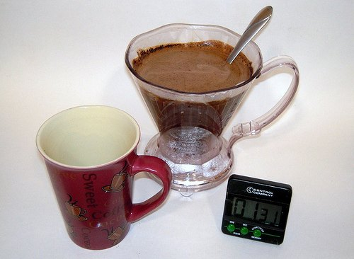
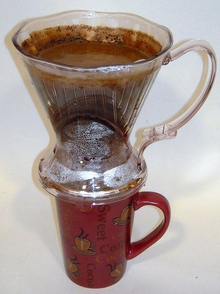
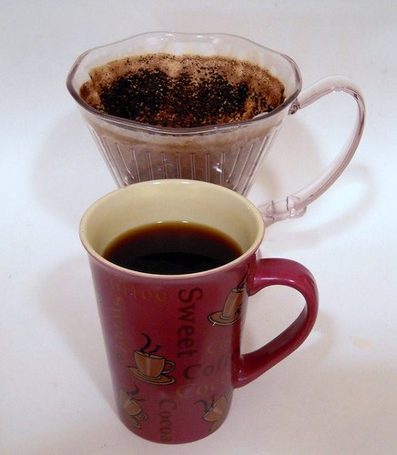

Do you like the full-bodied bold taste of a French press but not the sediment at the bottom of the cup? Do you like the grit-free, clean taste of your filter brewed coffee, but wish it had more body or that you could make one cup at a time? The Clever Dripper is for you!

The Clever Dripper is a new individual cup brewing device that uses the full immersion method of a French press and has a super clean finish due to a paper filter, or reusable cloth filter – it is the best of both worlds. It looks like a regular, single-cup filter cone, except it has a special stopper at the bottom, preventing the flow until the desired steeping time has been reached. It allows you to control everything in the brewing process, producing superior results.

  
*Clever Coffee Dripper*

To use the Clever Dripper, begin by placing a size 4 flat bottom cone filter inside and rinse with water that has cooled slightly from a boil. Place it over your coffee cup to drain and warm it up as well. Make sure you use a high-quality, fresh coffee for best results, and grind slightly finer than you would for regular drip.

### Step By Step Directions

1.  Take the Clever Dripper off of the cup and set it on the counter.
2.  Rinse the filter to reduce the paper taste in your coffee.
3.  Place 2-3 heaping teaspoons of coffee into the filter and fill with just below boiling water to 1 inch below the top.
4.  Let it steep for 3 minutes, meanwhile pour the hot water out of your cup, and then place the Clever Dripper on your coffee cup.
5.  It should drain almost completely in 1 minute, which provides the optimum brewing time of 4 minutes total.

Cleanup is incredibly easy as well. Simply pull out and throw away the paper filter, rinse in hot water, and set aside to dry – that’s it! If needed, hand wash in warm water. This is an incredibly simple device that can make an excellent cup of coffee. The Clever Dripper has become my favorite coffee maker for my morning coffee, and I hope you enjoy it, too. Remember to get the #4 size filters, too, $4.50 for a box of 100.

  
*Brewing coffee with the Clever*

*Finished Brewing*

**Hot Summer = Iced Coffee!**

I have a wonderfully refreshing drink for you on a hot summer day, and it is super easy. Do you like unsweetened iced tea? If so, you will love this just plain, otherwise, you can add sugar and cream if you chose. If you are going to purchase coffee, especially for this, choose a “fruity” coffee; the natural sweetness and fruit tones will really shine through. Begin by using the Clever Dripper, or any method you prefer to brew coffee and make an extra-strong cup, or pot, by reducing the amount of water you normally use. After brewing, place the coffee in the freezer to quickly cool off or in the refrigerator if you are not in a hurry. After it has cooled off, add cold water until it reaches the desired strength, pour over ice, and enjoy!

### Resources

[Clever Coffee Dripper Review](/clever-coffee-dripper-review/) – by Chris Arnold
