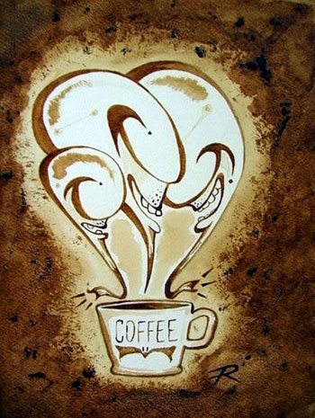
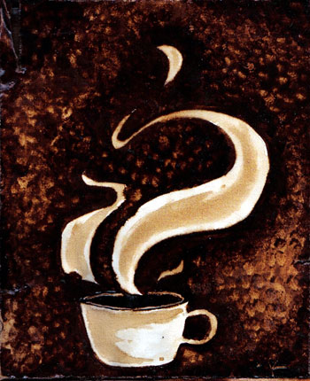
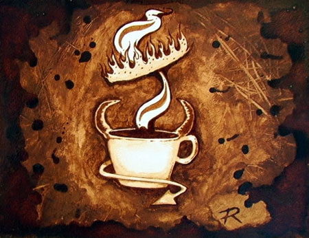
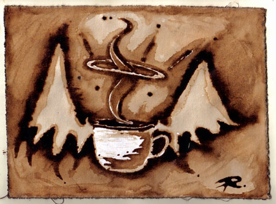
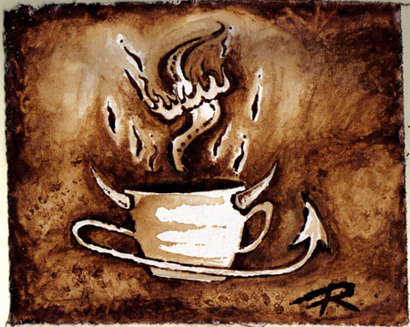

The artist Ryan L. Lewis, a native of Florida now residing in Wilmington North Carolina has branched out from his usual painting style to create an interesting style of paintings and sculpture using raw coffee as a medium.

  
*Three Cup*

  
*Swirly Cup*

  
*Teufel Cafe*

  
*Angelic Aroma*

  
*Flame-O-Cup*

### Resources

[Coffee on Canvas – Making Art With Coffee](/coffee-canvas-making-art-coffee/) – INeedCoffee contribution by Jon Norquist.

[Coffee Art – Painting With Brewed Coffee](/coffee-art/) – INeedCoffee contribution by Andy Saur and Angel Sarkela.
