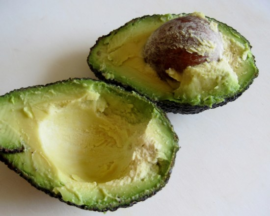
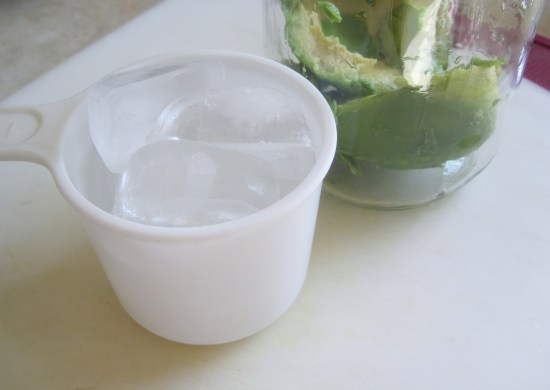
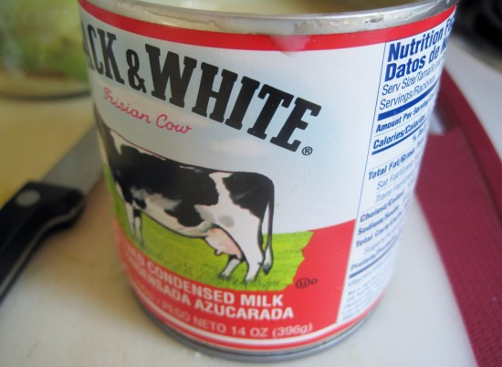
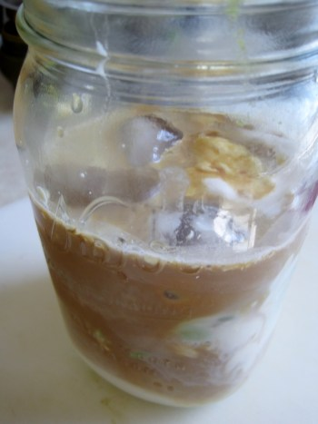
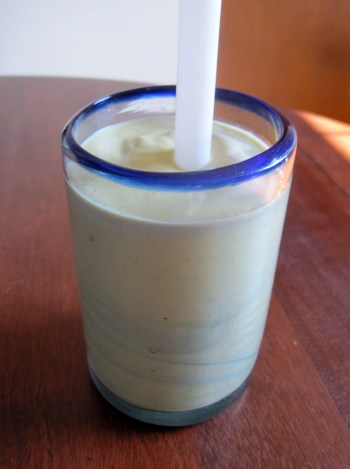

Recently, I was at a potluck, and a woman from the Philippines brought a pitcher full of “avocado shakes”. The shake was made of blended avocados with added coffee. At first, I was skeptical that the combination of avocado and coffee would taste good together. But it did. It tasted delicious. It was sweet, creamy, and bold all at the same time. In addition to the Philippines, I learned the avocado shake is popular in Vietnam, where it is called *Sinh to Bo*.

It tasted so good that I’ve been experimenting with several versions of this drink. Before I share my recipe, I want to say that most recipes that you will find online do not add coffee. Boy, are they missing out. The added coffee adds a nice boldness and a kick to the already sweet and creamy drink.

Here is how I made the Coffee Avocado Shake.

### Ingredients

-   1 medium-sized avocado (ripe)
-   1/2 cup of milk (or coconut milk)
-   1/3 cup of sweetened condensed milk
-   1/2 cup of ice cubes
-   2 shots of espresso or about 3 ounces of brewed coffee

### Directions

1.  Slice the avocado open. Remove the seed and peel.
2.  Place the avocado (minus the seeds and peel) into a jar.
3.  Add the rest of the ingredients to the jar (ice cubes, coffee, sweetened condensed milk, other milk).
4.  Blend everything. I use an immersion blender, but whatever you have will work fine.
5.  Taste and Adjust. *Do you like it, or does it need to be improved?* If the shake is too thick, add some more milk. If the shake is too sweet, add some more coffee. If the shake is not sweet enough, add more sweetened condensed milk. The Coffee Avocado Shake is more art than science.
6.  Serve. I like using a wide straw, which is used for milkshakes or Bubble Tea.

  
*Slice open a ripe avocado. Remove seed and peel.*

  
*Add 1/2 cup of ice cubes.*

  
*Add sweetened condensed milk. Other options might be regular sugar or a scoop of vanilla ice cream.*

  
*Add coffee or espresso shots.*

  
*Blended and ready to drink.*

### Last Words

This drink is super easy and quick to make. I preferred brewed coffee over espresso and used coconut milk instead of cow’s milk. Suppose you do not have sweetened condensed milk; experiment with adding sugar or a scoop of vanilla ice cream to get the sweetness. Get one if you do not have an immersion blender (aka hand blender). It will make this recipe much easier, but they work great for soups and many other recipes.

### Resources

[The Alkani Cold Brew Coffee Maker](/alkani-cold-brew-coffee-maker-review-tutorial/)—Review and Tutorial—INeedCoffee tutorial on how to make cold brew coffee, which would work great for the avocado coffee shake recipe.

[How to Brew Vietnamese Iced Coffee](/brew-vietnamese-coffee/) – The non-avocado version of this recipe.

[Homemade Coffee Ice Cream Recipe](/homemade-coffee-ice-cream-recipe/) – Here is our tutorial if you decide to use ice cream.

*Title photo by Nur Afni Setiyaningrum.*
