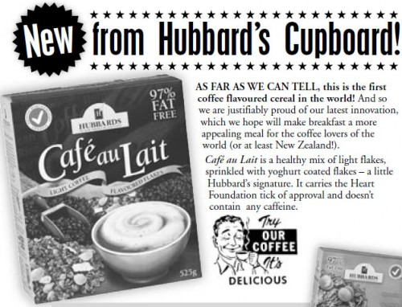
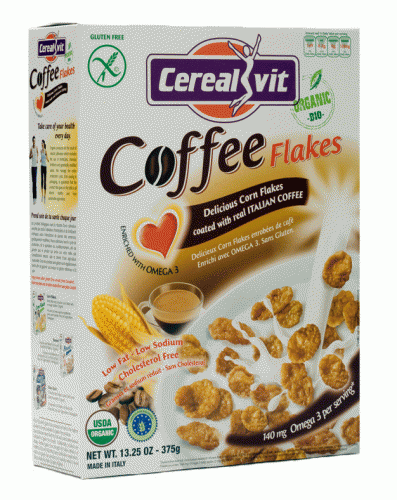

In 2003, the coffee world received word that New Zealand had developed the first coffee-flavored breakfast cereal. From the original Hubbards press release courtesy of _Badgett’s Coffee E-Journal_:

> An innovative new cereal to combine your morning coffee with breakfast. Light aromatic coffee flavoured wheat flakes combined with crisp rice flakes and yoghurt-coated cornflakes.

I went to the Hubbards website to see if this cereal was still available. It isn’t. On the FAQ, the _Cafe Au Lait Cereal_ has been added to the deleted list. I’m guessing _deleted_ is Kiwi for _discontinued_. Then I did some searching and located the original PDF with a photo of a box of the coffee-flavored cereal.

Will we get another chance at a coffee breakfast cereal? Perhaps. In June 2008, Andrew Hetzel of CoffeeStrategies.com took a photo of a possible new cereal called _Coffee Flakes_.

### Connecting With Coffee Flakes

I began an email correspondence with Reiga Foods about the coffee breakfast cereal. They were cool enough to send me two boxes of Coffee Flakes to try out. Since I normally eat eggs or oatmeal for breakfast, I wasn’t sure my opinion of the product would be as valuable as that of true breakfast cereal eaters. Plus, I wanted to get the thoughts of not just any cereal eaters but cereal eaters who are true coffee fans. After all, do we care what non-coffee drinkers think? Of course not.

  
_Coffee Flakes Cereal_

I brought a box of Coffee Flakes to the _Coffee Club of Seattle_. I was able to share the cereal with eleven of my fellow members. I had everyone cup their hands, and I went around the room pouring cereal. **They all loved the cereal.** The taste of coffee was subtle and not overpowering. When you first bite into Coffee Flakes, the corn taste is prominent, but as you chew, the coffee flavor comes through at the end.

In addition to eating it dry like a snack, I also tried it in whole-fat plain yogurt. It was really good. Although it has been years since I’ve had cereal, I was impressed by the high quality of the product.

Coffee Flakes isn’t your standard breakfast cereal. It appears to be a premium product. Here is an overview of Coffee Flakes characteristics:

- Gluten-Free
- USDA Organic
- Enriched with 140 mg of Omega 3 per serving
- Made in Italy
- Corn Flakes coated with “real Italian Coffee”

Super strict vegetarians may want to avoid Coffee Flakes since the Omega 3 enrichment comes from fish oil. The part of the nutritional profile that was most interesting to me was that they made it gluten-free.

Gluten is a water-soluble protein that gives dough its elasticity. It is found in grains such as wheat, rye, and barley. Author Mark Sisson details the problems with gluten in his book The Primal Blueprint. He states that about one-third of people are gluten-intolerant or gluten-sensitive. To this group and possibly others, gluten can create an inflammatory reaction that can manifest in numerous ways, including joint pain, acid reflux, autoimmune disorders, dermatitis, and Celiac disease.

How much caffeine is a bowl of cereal? Very little. I asked Reiga Foods, and they estimated that if you ate an entire box, it would be as much as half a shot of espresso. In other words, you’ll still need coffee to get your caffeine fix.

UPDATE (2014): It appears this product no longer exists.

### Sources

Riega Foods – Website for Coffee Flakes.

Hubbards – New Zealand food company.

[Coffee Cereal coming to a grocery store near you (maybe not)](https://www.coffeestrategies.com/2008/06/30/coffee-cereal-coming-to-a-grocery-store-near-you-maybe-not/) – Post and photo by Andrew Hetzel of Coffee Flakes cereal. Click on the image for a larger version.

New Breakfast Cereal – Cafe Au Lait – Post by Badgett’s Coffee e-Journal from December 18, 2003.

_Disclosure: Reiga Foods sent me two boxes of Coffee Flakes and two boxes of other cereals for this review._
