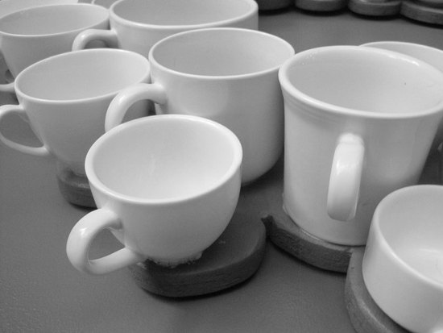

Jerry and I have known each other for 40 years. We share living quarters and enjoy our time together, but we both like freedom—each to pursue our individual quests. Our separate grown children don’t need us much, since they’re all wonderfully independent. Though retired, we tend to spend work hours apart and link up for meals here and there, or in the coffee shops around town.

Jerry and I both love coffee. We each have a favorite cup: his from his other life with his wife of 30 years, and mine from my former life with my husband of 22 years.

Jerry’s cup is small, made of white porcelain, a sort of refined mug, pentagonal in shape. My mug is shorter and wider, with wavy, brown, rust, and white vertical stripes—stoneware really. These cups look like us. Jerry is more proper and traditional than I am. I am more rustic and casual than he. Jerry’s cup has chips in the rim and the base. Mine is run through with multiple mini-cracks that look like a maze of tiny roads on a city map, but no chips.

Recently, a friend told me I should *disappear* Jerry’s cup, to save him from lead poisoning where the glaze is worn off. But, he’s so attached to it I’m not sure what the consequences would be —even the unspoken ones. Better the poison.

  
*Coffee Cups*

Our cabinets are filled with matching cups, but if our favorite—old-time—cups are available, that is if they are clean and on the shelf, we go for them. Now, why do we hang on to these last vestiges of our former lives?

I can only reason that the cups represent the years and not the former spouses. Jerry’s wife had fits of temper; tossed his clothes out the window, locked him out of the house, and changed the locks on the doors, for example. My husband usually spent our wedding anniversaries in another country, celebrating his mother’s birthday, for another example. In fact, when Jerry and I found each other again, we admired a teddy bear in a store covered in calico patches. We bought the wounded bear.

“That’s us,” we said. And ever since, the teddy bear is a symbol of our affection for each other.

I got the coffee habit during nurses training in the late 50s and early 60s, the years when I first knew Jerry, who interned at Grady Hospital in Atlanta, and trained for doctoring while I trained for nursing at another hospital. My roommates and I drank coffee from short, wide water glasses to stay awake to study, until the brew, once nasty to the tongue, began to taste good.

A hundred student nurses lived on the sixth floor of a new Piedmont Hospital, in what would become after the nurses’ dorm was built-patient rooms. We lived with three girls in a room and bath and shared a kitchen, a lounge, and a solarium with the others. The kitchen shelves held a few bread plates and a large ration of water glasses. A toaster stood on the counter. Each evening at 8:00 P.M., the hospital kitchen sent up bread, butter, coffee, and milk. None of us possessed a coffee mug—most of us were poor, otherwise, we would have attended a proper college somewhere—and the hospital didn’t provide them, so after the coffee was poured, you had to wait ’til it cooled down before you could hold onto the glass tumbler. I still have an image of that aromatic coffee, generously laced with full milk, wafting its curls of steam, waiting to be drunk. Those water glasses without handles are the other *coffee cups* I remember affectionately.

Inexplicably, about a week ago and during the time I’ve been writing this piece, as I unloaded the dishwasher my thirty-three-year-old favorite mug fell from my fingers to the stone floor in the kitchen and smashed into pieces. Is this a sign?

Will I shop for another one? That pattern of stoneware is still available. I saw it not too many years ago in Dillard’s. But no, maybe Jerry’s cup will break soon, and I’ll go out and buy a pair of glass cups—with handles—put them on the kitchen shelf, and see what happens.
