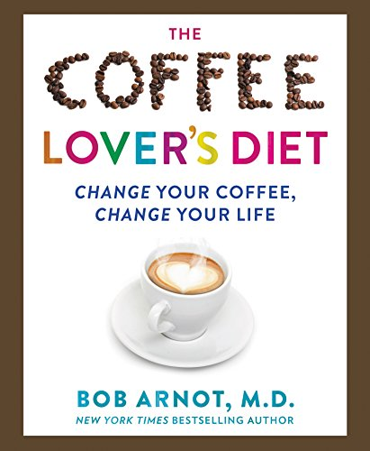

I recently read Bob Arnot’s The Coffee Lover’s Diet. I really enjoyed the first part of the book, which broke down the current state of information regarding the health benefits of coffee. The second part covered coffee brewing and roasting, and the final part covered dieting and recipes. This overview will focus mostly on the first part.

Here are the 10 things I found most interesting in the Coffee Lover’s Diet.

### #1 Reduced risk of death

Dr. Arnot mentions a 2012 National Institutes of Health study showing:

> Coffee drinkers were less likely to die from heart disease, respiratory disease, stroke, injuries and accidents, diabetes, and infections.

And this benefit was for both regular and decaffeinated coffee drinkers. He then cites a 2015 study by the New England Journal of Medicine that used 400,000 participants and found significant coffee consumption reduced the risk of death from all causes by 15% in women and 10% in men.

But how does coffee provide these benefits? Read on.

### #2 Coffee Has Polyphenols

Polyphenols are the anti-inflammatory compounds found in fruits and vegetables. Blueberries and cherries are especially high. They are also in coffee, including decaf coffee. Some coffees contain more polyphenols than others. The author refers to these coffees as high-phenol coffees.

Coffees with high-phenol counts are grown at higher altitudes and can be found with good scores on Coffee Review.

Higher altitude coffees also tend to have less caffeine. Caffeine protects the coffee plant from insects. The higher the coffee is grown, the fewer insects there are, because the air is thinner. So the plants produce a little less caffeine.

### #3 Coffee is the #1 source of antioxidants in the US Diet

The Coffee Lover’s Diet has a chart by Joe Vinson, Ph.D., showing the most common foods Americans eat with antioxidants. Coffee is the leader by far, followed by tea.

### #4 Coffee Improves Physical Performance

Dr. Arnot states three ways that coffee can help the athlete. Improving speed/power during exercise assists with fat burning and helps fight free radical oxidation.

### #5 Cholesterol’s Role in Coffee is Complicated

On one hand, the chlorogenic acids in coffee can reduce the oxidation of LDL cholesterol. On the other hand, unfiltered coffee contains cholesterol in its fat molecules. But that might not be bad, since one of those fats is cafestol, which has powerful anti-inflammatory benefits.

If cholesterol in coffee is a concern, use a filter or limit the amount of unfiltered coffee you consume. The book doesn’t say specifically, but I assume they mean a paper filter.

### #6 Green Coffee Extract for Reducing Blood Pressure

The role of coffee in blood pressure continues to be debated. Dr. Arnot briefly mentions how green coffee extract can reduce blood pressure due to its very high levels of chlorogenic acid. If caffeine is a concern, green coffee extracts are also sold in decaf form.

### #7 Meet Melanoidin

Melanoidin is an antioxidant in coffee that decreases the absorption of some fats. Dr. Arnot explains that fat peroxidation can lead to damaged cell membranes and increase the risk of coronary artery disease. It’s good to know that melanoidin can help.

Time your coffee after meals for this benefit.

### #8 “Defy Diabetes”

In a section titled “Defy Diabetes,” Dr. Arnot argues that the chlorogenic acids in high-phenol coffees help lower blood sugar and increase insulin sensitivity.

### #9 Neuroprotective

You’ve probably read news stories about coffee’s benefits for conditions such as Alzheimer’s and Parkinson’s disease. One theory explaining why this might work is that caffeine blocks the receptors of nerve cells that would have been targeted by clusters of beta-amyloid molecules.

### #10 Avoid the Dark Roasts

Dr. Arnot states:

> Very dark roasts destroy coffee’s most beneficial components and lead most people to pad their diets and waistlines with cream and sugar.

Also, roasting coffee dark at high temperatures can destroy the polyphenols and even generate acrylamide, a carcinogenic chemical. A chart on page 108 in the hardcover edition shows the complete collapse of chlorogenic acid levels as the roasting temperature is increased.

In tests, the author measured a 30% loss in chlorogenic acids in light roasts, 50% in medium roasts, and almost 90% in dark roasts. While the good chlorogenic acid levels are falling during the roast, the bad acrylamide levels are rising.

### What the Book Missed

There is no question that the book was strongly biased towards the benefits of coffee. These benefits seem mostly about high levels of antioxidants that one could get just as easily from blueberries and other “super foods.” The problem that was glossed over was sleep.

Coffee or caffeine in general can greatly reduce the quality of your sleep. And when sleep quality drops, lots of other health issues can develop. Check out the book *Why We Sleep: Unlocking the Power of Sleep and Dreams* by Matthew Walker, Ph.D., for more information on sleep. The role of caffeine is covered.

A true conversation on the health of a coffee drinker would balance the benefits (polyphenols) while addressing the role caffeine has on the different stages of sleep.

### Last Words

The Coffee Lover’s Diet contains a lot more ideas than the ones I posted. If you want to explore those ideas further, check out the book and all its references. The second half of the book includes some coffee brewing tutorials and some high-antioxidant recipes.
