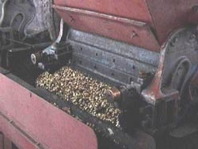
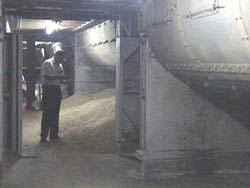
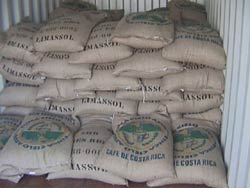
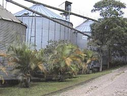
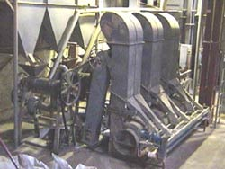

The importance of quality control in the milling of coffee cannot be understated. This is the transitional step in the life of a beautiful coffee bean, once a flower, to transform into what we know as a high-quality coffee. Inadequate milling, or allowing the beans to over dry, will destroy the beans’ opportunity to become a superior drink. Extreme care is necessary to achieve a superior bean, so that the utmost flavor is not lost in the process.

As milling is so important to producing a superior cup of coffee, so too is the type of mill process. There are two methods: the ‘wet mill’ and the ‘dry mill’. Both techniques use vastly different processes. Wet milling, the more costly of the two techniques, has been proven to produce a better quality coffee.

### The Dry Mill

Before the invention of the wet mill process, dry milling was the only method available. In this process, the whole bean is dried immediately after harvesting the crop. It is dried until it has acquired the desired humidity level. The coffee beans are spread out in the sun, or in specially designed mechanical drying machines.

This simple process is used in those regions where the climate and topographic conditions allow it. In other words, they are located on flat terrain where the drying machines can be installed properly. The process must take place at the beginning of a drought and during the maturing and harvesting stages of the coffee crop.

Typically, dry milling is used in places where the conditions (altitude, grain type, etc) do not allow for a high-quality crop. Without optimum conditions, mills typically do not invest in infrastructure. For instance, there is no selective harvesting of the beans, and a tendency to mix coffee grains (unripe beans with green coffee beans). Also, inappropriate handling of beans when drying, or heaping the coffee beans, causes fermentation and eventually mold. This results in bitter coffee. By using the dry mill method, you can conclude it will not produce high-quality coffee beans.

### The Wet Mill

This type of mill has seven different processes: recollection, pulping, fermenting, washing, drying, thrashing, classifying, and selecting.

### Harvesting and Selection

The quality of the coffee bean and the abundance of future crops rely greatly on effective management. Depending on the type of crop, the coffee enters its productive phase two to three years after it’s transplanted into its final home. The endurance of the crop in time is directly related to the established agricultural practices and climatic factors. Despite the macro climatic conditions, the producer improves the growing conditions by using organic or inorganic fertilizers to promote growth. Shade is necessary to regulate temperature and frequent pruning will benefit harvesting. But, in order to get an excellent cup of coffee, picking the coffee beans must be done properly.

The best way to pick beans is to be selective; picking only the ripe beans one by one. A ripe bean is one that has optimal coloration and that detaches easily from the plant by using only slight pressure. Coffee beans do not ripen uniformly making it necessary to pick the same crop several times.

Once the coffee bean has been picked and stored it should not be exposed to direct sunlight. The heat, over piling and poor ventilation contributes to the fermenting of the crop and therefore deteriorating the coffee’s quality.

### Pulping

The purpose of this part of the process is to separate the coffee bean exterior covering, called epicarp and mesocarp, which are commonly referred to as the pulp and the cherry.

This separation has to be done properly because it can influence the coffee quality and yielding. The pulping of the ripe coffee beans must be done the same day, within 10 hours of the picking of the beans, to avoid fermentation.

### Fermentation

When the coffee bean has been separated, it remains covered in a mucilaginous layer that ferments by itself with the help of fungi, bacteria, and yeast. Once the liquefaction process is finished the beans must be washed in order to eliminate the alcohol, acetic lactic, propionics, and brutinics acids that remain on the beans. It is very important that appropriate timing be used in order to stop the fermenting process, by washing the beans immediately.

The humidity level is key for this phase. The fermentation must be interrupted at its optimum point. Any coffee beans that have not been fermented enough must be removed, as they may later give a poor appearance and may cause fungus growth. If the beans are over fermented they lose weight, which will influence the quality of the coffee.

### Washing

The washing process eliminates the residual substances from the mucilaginous that remain on the bean. When the coffee is washed at the precise moment during the fermentation process, it will present a clean, rough, and whitish appearance without honey-like residue.

Clear clean water ensures optimal results. If the washing is not effective, a secondary fermentation may start, and as a consequence, the cherry will have a stained appearance, and it will smell bad.

To avoid contaminating rivers and streams with the residual water after washing the coffee beans, the water must be piped through purification cavities, infiltration ditches, or other technological processes for its purification.

### Drying

Immediately after the washing, the drying phase takes place. Drying the beans has to be done with extreme caution because the bean is highly hygroscopic and sensitive, easily absorbing the smells that it is exposed to. There are two different types of drying: the natural way with the sun and artificial drying.

The coffee bean that has had an optimal drying process has a humidity level of 10 to 12%. Its principal characteristic is its blue/green color.

### Storing

Storage of the coffee directly influences how long a coffee can maintain its quality. In order to achieve longevity, coffee must be stored in dry parchment, paying close attention to the humidity (10-12%). Therefore, avoiding any whitening, fermenting, or bad smell or taste. The storing must take place in a dry, clean, and well-ventilated storage.

### Thrashing

Coffee thrashing is an industrial process whereby the dried beans turn into golden coffee. This process consists of two phases: first, the outer shell (or cisco) is broken away and the almond bean is revealed. The second phase is the careful selection of the beans according to their physical characteristics (color, size, shape). A special thrashing machine is used, which enables the separation of the two parts.

### Classification and Selection

Manual and mechanical methods are used for classification and selection. In the mechanical selection process, the beans are classified according to their size. A densimeter machine is used, which works based on the principle of density or specific weight of each bean. The electronic selection method utilizes electronic machines. These separate the beans that are pigmented, black, or have any other color but the blue-green they should. At the same time, it selects or separates the rest according to their color characteristics.

Once the coffee has been selected, it is packaged in 69 kgs bags, which are pre-labeled according to the rules and specifications for each destination.
