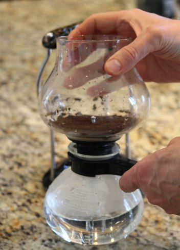

A few months ago, I received a wonderful gift: a coffee siphon. Although the siphon may appear intimidating at first glance, it is really easy to brew excellent coffee with it. There are more comprehensive guides out there, but this is a simple one to get you started with the basics.

### #1 Measure and Grind

The most common dosage recommendation for vacuum pot coffee is 8 grams of coffee for every four ounces of water. The grind will be slightly finer than that for drip coffee. See the [Coffee Grind Chart](/coffee-grind-chart/) for a visual approximation.

### #2 Pre-Heat the Water

You could apply the siphon flame directly to cold water, but it takes forever and wastes butane. I use an electric kettle to bring the water up to about 180°F. While the water is warming up, close the filter on the top chamber of the siphon by latching the chain hook to the edge of the glass tube. Once this is in place, add the ground coffee to the top chamber.

*Add ground coffee to the top chamber.*

*Make sure the filter is latched in place.*

### #3 Secure the Siphon Together

Place the top chamber securely into the bottom glass chamber.

*After adding water to the bottom chamber, connect the top chamber to the bottom.*

### #4 Light the Flame

Turn the knob on the heating element to release gas and then press the pedal to ignite the blue flame. This will provide enough heat to complete the brewing cycle.

*Turn on the burner.*

### #5 Brew and Stir

The water from the bottom chamber will rise to the top. Once there, gently stir so all the coffee grounds contact the water. Allow the brew cycle to run for 60-90 seconds and then turn off the flame.

*Water will rise from the bottom chamber to the top.*

*Turn off the flame after the coffee has brewed for 60-90 seconds in the top chamber.*

### #6 Allow Coffee to Return to the Lower Chamber and Serve

Once the flame is removed, the coffee will flood into the bottom chamber. Once the brewed coffee has completely emptied the top chamber, remove it and serve.

*Remove the top chamber once the coffee returns to the bottom chamber, and serve.*

### Resources 

[Vac Pot Brewing with the Yama Syphon](/vac-pot-brewing-with-the-yama-syphon/) – A brewing tutorial for the Yama.

[Vacuum Pot Brewing](/vacuum-pot-brewing/) – A guide to different vacuum pot brewers and a brewing tutorial are available.

[Vac Pot Primer](/vacuum-pot-brewing/) – An article on the rich history behind vacuum pot coffee brewers.

*Photos by Amanda Sparr.*
