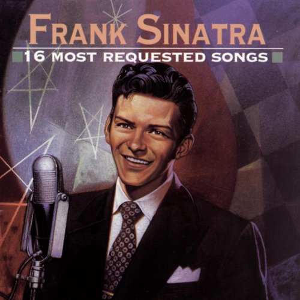

I thought I was a Frank Sinatra fan, but somehow, this tune escaped me. Back in 1946, Frank Sinatra sang *The Coffee Song*. Bob Hilliard wrote the lyrics and Dick Miles did the music.

**The Coffee Song as performed by Frank Sinatra.**

> Way down among Brazilians Coffee beans grow by the billions
> 
> So they’ve got to find those extra cups to fill
> 
> They’ve got an awful lot of coffee in Brazil
> 
> You can’t get cherry soda ’cause they’ve got to sell their quota
> 
> And the way things are I’ll bet they never will
> 
> They’ve got a zillion tons of coffee in Brazil
> 
> No tea or tomato juice You’ll see no potato juice
> 
> Cause the planters down in Santos all say no no no
> 
> A politician’s daughter was accused of drinking water
> 
> And was fined a great big fifty dollar bill
> 
> They’ve got an awful lot of coffee in Brazil
> 
> And when their ham and eggs need savor Coffee ketchup gives ’em flavor
> 
> Coffee pickles way outsell the dill
> 
> Why they put coffee in the coffee in Brazil
> 
> No tea or tomato juice You’ll see no potato juice
> 
> Cause the planters down in Santos all say no no no
> 
> So your lead to the local color
> 
> Serving coffee with a cruller
> 
> Dunking doesn’t take a lot of skill
> 
> They’ve got an awful lot of coffee in Brazil
> 
> Man, they got a gang of coffee in Brazil.

Many song lyric databases include the following lines, which were not in the Frank Sinatra version.

> You date a girl and find out later she smells just like a percolator
> 
> Her perfume was made right on the grill
> 
> Why they could percolate the ocean in Brazil
> 
> Don’t ask for hot cocoa there
> 
> They’ll say you’ve gone loco there
> 
> But say caffeine or coffee bean and they’ll say ay ay ay

This song appears on several Frank Sinatra releases.

### Sources

[Bob Hilliard](https://en.wikipedia.org/wiki/Bob_Hilliard) – Wikipedia page.

[The Coffee Song lyrics](https://www.rosemaryclooney.com/LyricPages/thecoffeesong.htm) – The version performed by Rosemary Clooney.