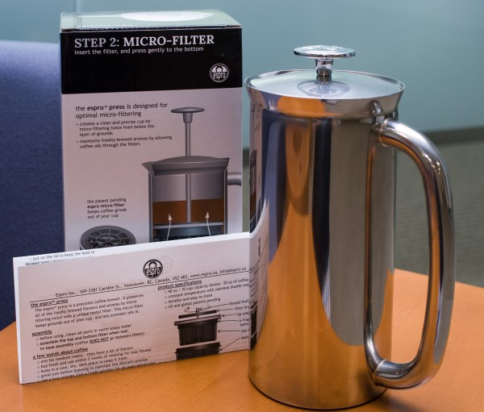
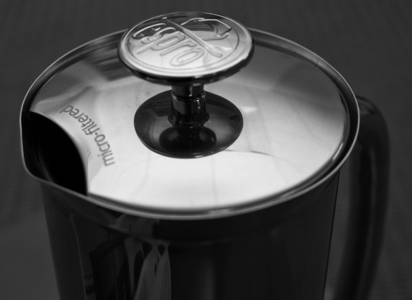
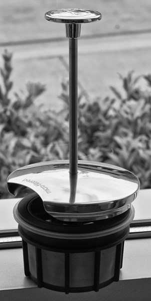
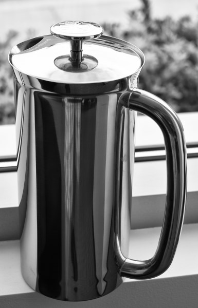

The Espro Press is a beautiful piece of coffee gear to be sure, but what about the actual coffee that comes out of the thing? Espro claims the Espro Press is “Arguably the first major breakthrough in coffee press design in over 30 years!” While that is certainly debatable, the Espro brings a few things to the table.

At first glance, it is very similar to a traditional French Press, with some key differences:

1.  Insulated Stainless Steel Double-Walled Vacuum vessel, which, unlike a Glass French Press, keeps your coffee hot for a lot longer and is much more rugged.
2.  Double fine filters, that promise to keep more fines out of your cup, unlike a traditional French press.

### Body

Although I like the flavor of French Press coffee, I generally avoid it because the additional oils tend to give me heartburn and jitters. So I had to break out one of my dusty Bodum French press pots for comparison to the 32-ounce Espro version I was using.

I followed the recommendations of Espro to [grind coarse](/coffee-grind-chart/), and I chose 205F degree water. I went with stirring halfway through and about 4-minute extraction.

The resulting cup was on par with the Bodum in terms of taste and oil content. And sure enough, the amount of “fines” or mud at the bottom was about half that of the Bodum; but there was still a fair bit of mud. And though I tried a couple more times using their troubleshooting tips, it didn’t really change this aspect much. Still, half the mud is a good thing.

15 Minutes after steeping, I poured more coffee out, and it was still quite hot, which was a nice difference from a non-insulated French press. This is great when you are enjoying your coffee over a long breakfast or multiple drinkers getting their coffee over an extended period of time. After about 30 minutes, it started to cool below what I would call drinkable. Also, I preheat the vessel with boiling water for a few minutes before starting to brew, which I think helps with heat retention, especially with metal vessels.

I did notice a small difference in flavor between the Espro and the Bodum, and I favored the Bodum slightly. I am guessing this is because of metal vs glass, and perhaps the Espro metal imparted something that changed the flavor, though I suspect the metal is probably coated to prevent this. I have yet to meet a metal coffee vessel that didn’t impart some additional flavor that I didn’t care for.

Cleanup of the Espro was slightly more involved than the Bodum but only took a few extra seconds, mainly to brush the filters with a soft brush.

### Conclusion

The Espro is an ample performer and comes in an 18-ounce size and a 32-ounce size. While the price is a step up, the Espro will appeal to those looking for not just a very good coffee press that delivers less coffee sediment in the cup but also a beautiful, rugged work of art suitable to take on your next camping trip, or as the centerpiece of your breakfast table.

**Pros**

-   Beautiful, rugged design
-   Keeps coffee hotter much longer than a traditional glass French Press
-   Fewer coffee fines in your cup
-   It can be used for tea, though it was not tested.
-   Filters are BPA, BPS, and phthalate-free.

**Cons**

-   Step-up in price.
-   The metal interior may be a turn-off for those who prefer the neutral taste of glass.
-   Cleanup is a little longer than a traditional French press.

### Resources

[French Press Tutorial](/press-pot-tutorial/) – INeedCoffee tutorial on French press coffee.

*Disclosure: INeedCoffee was sent this product at no cost, which did not affect its review.*
