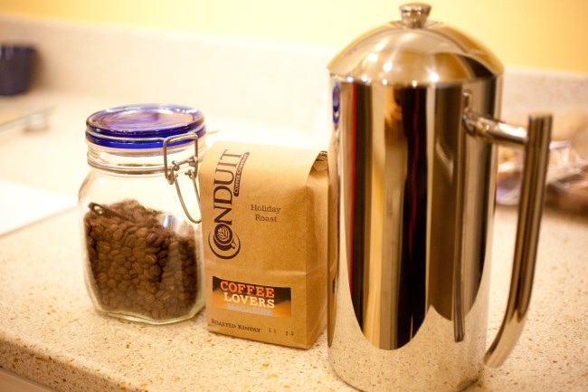
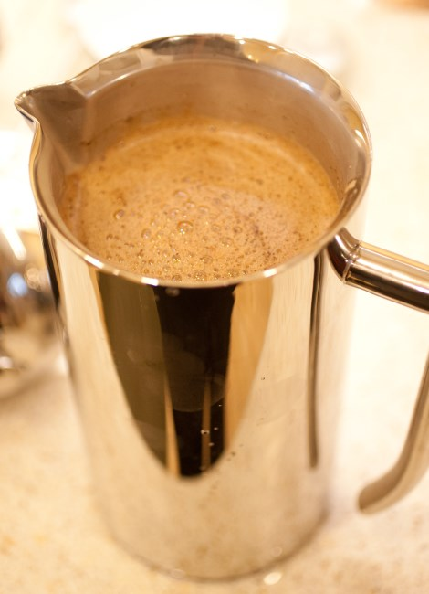
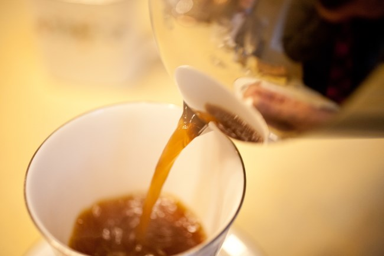
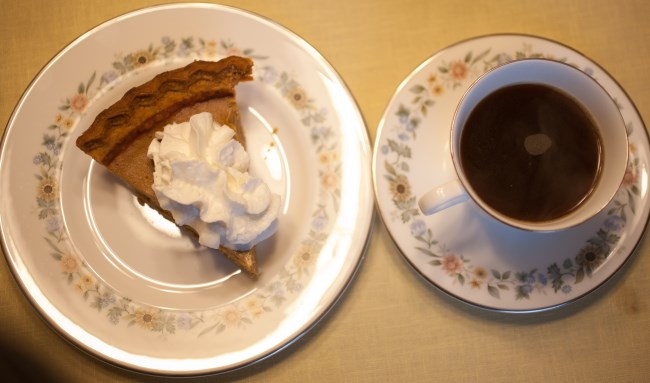

The Frieling French Press is a high-end stainless steel french press coffee brewer. There are a variety of sizes including 8, 17, 23, 36, and 44 ounces. For this article, a 44-ounce Frieling was used.

One of the pluses of this stainless steel press is that all of the internals are steel as well. Most, if not all, of the other steel French presses contain plastic on the inside (and, in some cases, rubber-like gasket material for sealing the side walls with the filter as you press). The press mechanism for the Frieling is just like a glass French press – all metal and the sides are sealed off simply by pressing the metal filter up against them.

The Frieling is also double-walled – this means that it is designed to hold in heat. It does this VERY well. The first time I used the press, I forgot that I was brewing it. I accidentally left it on the counter for 4 hours. When I came back, I took the opportunity to measure the temperature of the coffee and discovered that even after 4 hours, the coffee was still at a perfectly hot 132 degrees F. I wouldn’t recommend sitting on a French press for 4 hours, but it is great to be able to brew a large amount and know that I can enjoy a few cups over a period of time without having to rush.

_Frieling French Press_

I enjoyed the Frieling over Thanksgiving, where we all sat down to a nice family gathering. After the meal, I prepared coffee for the 4 of us. The beautiful construction of the press was perfect alongside the fine place settings at the table – this is a plus for anyone looking to have a nice high-quality brewer for big gatherings.

Aside from its ability to hold heat, one of the most impressive things about the Frieling that I found is the way the handle is designed, it is balanced perfectly. This Frieling I used was the 12 cup – 44 oz press. Now you can imagine, that a large metal press filled with 12 cups of water and coffee is likely to get heavy. It was not light, but it was so incredibly easy to pour that you wouldn’t think you were holding a gigantic pot of coffee.

One of the strange downsides I discovered is that the press filter fits VERY snuggly due to the internal all-metal construction. One must be extremely careful not to force the filter in too hard after filling up the press. The first time I did this, I was trying to put the press top on by pushing the filter in first – I had to apply pressure (due to the snug nature of the filter), and then it popped in suddenly and splashed a bunch of coffee out. I discovered how I probably should have been capping the press differently – you simply place the filter on top and then press down on the cap itself, which fits the filter in snuggly.

Also, because the filter is so snug, it takes a bit more pressure than usual to press the pot all the way down. I found at certain points that I actually had to apply a much higher level of pressure than I would have thought to press the pot fully. I don’t know if the tiny openings in the filter, along with the hard seal on the side, made it necessary to apply the pressure, but I was surprised. A simple fix for this was to just press slower. Eventually, you get through the press.

One more note about the filter—I believe, though I haven’t been able to confirm this 100%, that the metal mesh filter in the Frielings is finer than a typical French press. I do believe that the cups I enjoyed from this French press were a bit cleaner than I have experienced in standard glass French presses.

All in all, it’s a beautiful press pot that makes a fantastic cup of coffee that will stay hot. It is extremely well made and durable – the only part I could see having to replace ever would be the filtering mechanism (which is easily removable). The only real potential downside to this press pot is that it costs considerably more than a standard glass French press. However, if it fits in your price range, I honestly believe it’s worth it. This is a French press that will last for many, many years.

_This article first appeared in issue 13 of Extracted Magazine, which is available on iTunes._

### Resources

[Buying a French Press – Picking the Right One](/buying-a-french-press-picking-the-right-one/) – Our French Press purchasing guide.

[French Press Tabletop Coffee and Tea Maker with Bru Stop Technology Review](/table-top-press-pot-review/) – French Press review.

[Troubleshooting French Press Coffee](/troubleshooting-french-press-coffee/) – Tips for a better brew.

[French Press Tutorial](/press-pot-tutorial/) – Start here if you are new to the French Press.
