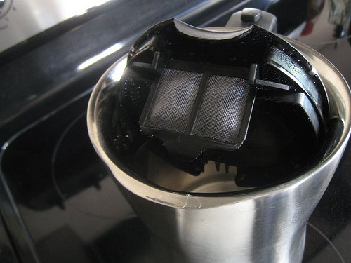

Recently, I decided to trade in my plastic electric kettle for a stainless steel one. I wanted an electric tea kettle with no exposed plastic parts. In the article “Avoiding Plastic—3 Stainless Steel Electric Kettle Options,” I highlighted three affordable stainless steel kettle options. I selected the Hamilton Beach 40898 Cool Touch Tea Kettle for my needs. Here is my review.

The lid is not attached when the Hamilton Beach Cool Touch Tea Kettle is shipped, so it was not intuitive for me to attach it. I misplaced the instructions and ended up calling the Hamilton Beach support line. I spoke to an apathetic lady who seemed to have no clue what product I was discussing. I repeated the name several times to her and got no help. Eventually, I figured out how to snap the lid onto the kettle.

To connect the lid, it must be vertical and set down so the right edge of the lid evenly dissects the center of the open space. Push it down until it snaps. Don’t be tempted to discard the lid. I attempted to boil water without a lid and discovered that the heating element did not turn off. **In order for the kettle to stop boiling water, the lid must be fastened and closed, or you will need to shut it off manually.**

  
*Hamilton Beach Cool Touch with open lid. This is how you want to pour. The lid needs to be completely vertical to fasten.*

The *Hamilton Beach Cool Touch Tea Kettle* does have a plastic lip where water can be poured. I use the word “could” because you can bypass the plastic by pushing the button and opening the lid fully while pouring. This prevents the water from making contact with the plastic. Just be careful not to have any exposed fingers over the lid area, or hot steam could burn you.

The *Cool Touch* has a nice feature that allows you to hide the excess power cord underneath the base. This will keep the cord from taking over your kitchen counter. See the photo below.

  
*Hiding excess cord underneath the heating element.*

The *Hamilton Beach Cool Touch Kettle* has a green light that indicates when it is powered on. Green makes more sense than [Bodum’s use of red](/extending-the-life-of-your-bodum-cordless-electric-kettle/).

  
*Green means Go or ON.*

How fast does this kettle heat water? **The Hamilton Beach Cool Touch Kettle brought 16 ounces of water to a rolling boil and powered off in just 2 minutes and 30 seconds.** This is the exact time I got from the Bodum plastic kettle. That is smoking fast. I usually stop it before it hits 2 minutes. It is louder than the Bodum plastic kettle, but I like that, as I am starting to use sound to indicate water temperature. I want hotter water for French press coffee and cooler water for green tea. The louder the kettle, the hotter the water.

**Calibrating the Water Temperature**

I don’t want the water to boil when I brew tea. I keep the lid open and drop in a long thermometer. This allows me to easily monitor the temperature and shut off the heating element exactly where I want. Over time, I have learned to watch the water closely to gauge temperature. Tiny bubbles are good for green tea, mid-sized bubbles for oolong tea, and above that, ideal for coffee, black tea, and puer tea.

Besides Hamilton Beach’s terrible phone support and the clumsy lid assembly, I love the *Hamilton Beach Cool Touch Tea Kettle*. Hopefully, you won’t have trouble installing the lid and never need to dial up the support line. I highly endorse this product.

The Hamilton Beach 40898 Cool-Touch Cordless 8 Cup Electric Kettle can heat up to 64 ounces.

### Resources

[Avoiding Plastic – 3 Stainless Steel electric Kettle Options](/avoiding-plastic-3-stainless-steel-electric-kettle-options/) – Overview of Adagio Teas 3, Breville SK500XL, and Hamilton Beach Cool Touch tea kettles.

[Extending the Life of Your Bodum Cordless Electric Kettle](/extending-the-life-of-your-bodum-cordless-electric-kettle/) – My trick for keeping your Bodum Cordless Kettle alive longer.
