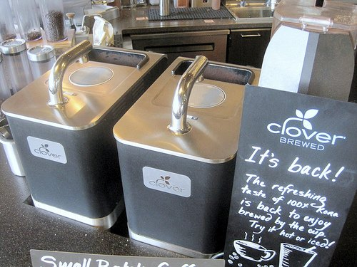
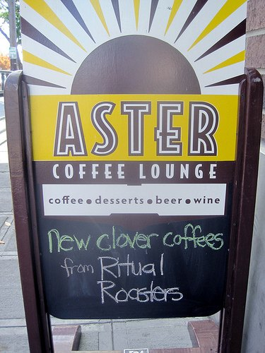

The exterior is quite unremarkable. After scouring the storefronts along West Randolph Street, I finally spy the “Intelligentsia” sign printed modestly across the slightly tinted front window. Entering slowly, I take stock of the famous Chicago specialty coffeehouse. Inside, it has a nice ambiance, but certainly nothing out of the ordinary: stainless steel, vaulted ceiling, and alternative music playing in the background. I admit I’m being somewhat critical, but my expectations of this leader in the micro-lot specialty coffee industry are high. I tell myself that it’s really about the coffee and shuffle up to the counter.

The wide view of the baristas is nice, and I’m sure that the shots are spectacular, but I’m a drip coffee connoisseur, and I can’t wait to taste a great specialty micro-lot brewed in the ultra-high-end Clover system.

I order a Cruz Del Sur from Peru and sit down to enjoy my 12-ounce masterpiece. Overall the coffee is light-bodied and elegant, not unlike many South Americans I’ve roasted at home. Certainly better than the local diner or at one of the Starbucks I passed on my way here. Yet, I’m not overwhelmed.

As I contemplate my next cup, I notice that there is a premium coffee offered on the Clover menu, at more than double the price of my current cup. The dilemma I’m stuck with is, of course, might a seven-dollar cup of brewed coffee be a little outrageous? Since I don’t get to Chicago all that often, I decide it’s worth the splurge.

  
*2 Clover Coffee Machines*

I asked the person at the counter if that Kenyan could really be twice as good as the cup I just had, but she just looked at me with a blank stare. She obviously thinks it can. So, with even more anticipation, I ordered the Kenya Ndaroni Auction Lot and carefully brought it back to my table, not wanting to spill a single drop of the precious liquid. My first hint of difference is the bouquet. The wet aroma just about knocks me off my feet with an explosion of honey and citrus. Now, my mouth watering with anticipation, I take a sip. The crisp wine-like taste jumps out at me: pinot gris style. It’s a luscious, thick, grapefruit flavor that resists the urge to descend into tangy sweetness.

The full-bodied mouthfeel reminds me not of overly sweet honey from a bottle, but honey right out of the comb that my Dad used to bring in from the hive; deeply rich, bittersweet, and much more complex. I am blown away. Maybe most impressive, the coffee holds its structure as it cools, not wilting as lesser coffees can do as the heat dissipates. The finish is clean and delicious, with tannins that dry out my mouth and make me want to sprint up to the counter for more. I savor each sip, and I am plenty happy with the ambiance and furnishings now.

  
*Aster Coffee in Seattle Offers Clover Coffee*

I lean back, happy to have finally tried the next tier up in coffee and found it indeed something special. For years I’ve roasted and brewed my own blends, and there have been precious few times when I’ve found a cup as good as or better than my own. But to a certain extent, I think I had gotten into a rut.

I don’t splurge on the twenty or forty dollars a pound beans because my run-of-the-mill six and eight dollars micro-lots taste just fine, thank you. But it had been quite a while since I’d been really blown away by an extraordinary cup. I don’t think I’d buy a seven-dollar cup of coffee every morning, but it sure is nice to know that just like that twenty-five-dollar bottle of wine, it is there for special occasions, and it is amazing.
