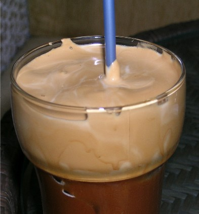
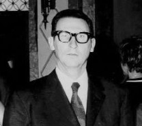
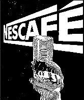

According to popular legend, the Greek-style frappe was invented in September 1957 at the annual Thessaloniki International Fair in the convention center of Greece’s second-largest city. Working at an exhibit for Andreas Dritsas, then the Greek distributor of Nestle products, sales representative Dimitrios Vakondios made an important discovery.

Reportedly, there was no hot water available. Maybe he merely desired cold refreshment. Either way, Vakondios grabbed a shaker meant for Nesquik, the Nestle cocoa drink, filled it instead with Nescafe instant coffee and a little cold water, and shook it vigorously. Not accounting for the burst of foam this action would generate, Vakondios achieved two results: The first outcome was the staining of his business suit; the second was the invention of the foamy concoction that would become something akin to the identity soft drink of Greece.

  
*Greek Frappe*

The hallmark of a Greek frappe is a foam so sensationally frothy that it resembles cream. Coffee foams, such as the crema atop espresso, are generally produced by the proteins in the coffee. These proteins act as surfactants (surface-active agents) that form a thin elastic membrane on the liquid’s surface area and entrap air.

The main advantage of instant coffee over brewed fresh coffee for foaming is that it can be prepared in a highly concentrated solution. When that solution is shaken, lots of proteins line the bubbles that form and help produce a thick, durable foam.

In both its powdered and granular forms, instant coffee is basically brewed coffee that has been dried to remove most of its water. The amount of water added back to it can be carefully controlled. A small quantity of water can be used to produce the foam. Then more water or milk can be added afterward to dilute some of the foam, filling the cup or glass beneath it with drinkable coffee liquid. A dense extract made with instant coffee and water in a weight-per-volume concentration as high as 6 percent provides an abundance of protein molecules to surround the bubbles as they form.

  
*Dimitrios Vakondios*

Where, when, and how this drink assumed the name frappe is uncertain. Soon after its invention, a form of this frothy cold coffee was promoted by Nestle at the Contemporary Home Exhibition at the Zappeion convention center in Athens. But a Nestle company promotional brochure from around that period, written in Greek, detailed a slightly different recipe:

> Put in a mixer 2 cups Nestle evaporated milk, 1 cup water, 2 teaspoons Nescafe, and 1 scoop vanilla ice cream. Mix a few seconds and serve*.*

This formula took after the French classic cafe frappe, made with ice cream, as much as the Greek one, which acquires its foam and fullness without ice cream. By 1963, ice cream was no longer a part of Nescafe’s frappe equation.

A print ad from that year carried a bold illustration of a glass with an exceedingly thick head of light-colored foam over a dark liquid. That this was what Greeks came to know as a milkless “*frappe horis gala”*, albeit a rather top-heavy one, there can be little doubt. The ad copy linked *“Nescafe”* and *“frappe”* and revealed these simple instructions for preparing a frappe coffee:

> All you have to do is beat Nescafe, sugar, and cold water.

  
*Nescafe Ad*

### Resources

[Greek Frappe Recipe](http://ineedcoffee.com/greek-frappe-recipe/) – The Greek Frappe recipe is here on INeedCoffee.

[11 Crazy Coffee Drinks You Won’t Find on a Starbucks Menu](http://ineedcoffee.com/11-crazy-coffee-drinks-you-wont-find-on-a-starbucks-menu/) – INeedCoffee article.

[Coffee Brewing Guide](http://ineedcoffee.com/coffee-brewing-guide/) – INeedCoffee’s collection of coffee brewing tutorials.