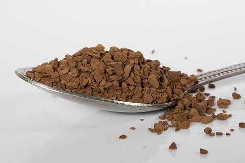

We all have seen and possibly used instant coffee at some point in our lives, but have you ever wondered where this dark, mysterious, water-soluble powder gained its popularity? Some might snub their noses at it today, but it has proven to us in the past that it is always ready when we need it most!

The earliest version of instant coffee is said to have been invented around 1771 in Britain. The first American product was developed in 1853, and an experimental version (in cake form) was field-tested during the Civil War. In 1890, David Strang of Invercargill, New Zealand, invented and patented instant coffee. ¹  In 1901, Sartori Kato invented the first successful technique for manufacturing a stable powdered product in Japan, which he used for making instant tea. ²

The first time instant coffee powder was mass-produced was in America around 1910 by George Constant Louis Washington (not related to President Washington). He accomplished a great feat and acquired a patent, but most perceived it as a novelty with a disagreeable taste. Around 1938, Nescafe became the most popular brand; by co-drying coffee extract along with an equal amount of soluble carbohydrate, they improved the taste. Currently, the best process for retaining the taste is freeze-drying, which came around in the 1960s.

  
*A teaspoon of Instant Coffee by [Andy Straw](https://www.flickr.com/photos/andystraw/)*

This novelty found its niche market in the military. Caffeine consumption on the battlefield provided a much-needed boost, and now this was made much easier with instant coffee. In World War I, some soldiers nicknamed it a “cup of George.” ³

> I am very happy despite the rats, the rain, the mud, the draughts \[sic\], the roar of the cannon and the scream of shells. It takes only a minute to light my little oil heater and make some George Washington Coffee… Every night I offer up a special petition to the health and well-being of \[Mr. Washington\].

\-American soldier, 1918 letter from the trenches

By World War II, instant coffee was incredibly popular among soldiers. G. Washington Coffee, Nescafe, and others had all emerged to meet the demand. One year, the entire production from the U.S. Nescafe plant (over one million cases) went solely to the military. 4

Today, instant coffee still has a force in the market. It is great in recipes like a quick mocha frosting for a cappuccino cookie. In the grocery store, you will see it in all the instant cappuccino drinks and blended ice drink powders, some of which are even used in coffee houses. Even the military still provides instant coffee powder for that much-needed caffeine boost. Always in an instant, it is there for you!

### Resources

[Next Generation Instant Coffee Reviews](/next-generation-instant-coffee-reviews/) – A review of two modern, higher-quality instant coffees.

1: [Instant Coffee](https://en.wikipedia.org/wiki/Instant_coffee) on Wikipedia.

2: [Instant Coffee](https://www.madehow.com/Volume-3/Instant-Coffee.html) on MadeHow.com

3: [George Washington (inventor)](https://en.wikipedia.org/wiki/George_Washington_%28inventor%29) on Wikipedia

4: [History of Instant Coffee](http://archive.is/H4TTR) on NestleUK (archived)
