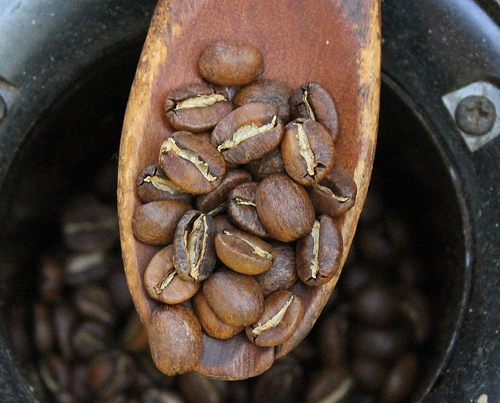
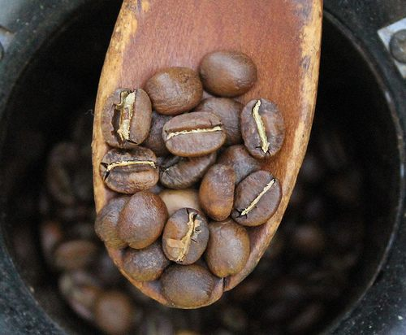
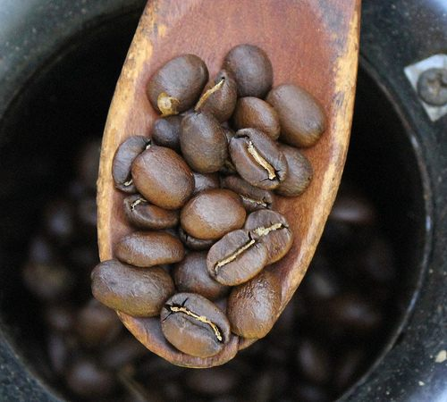
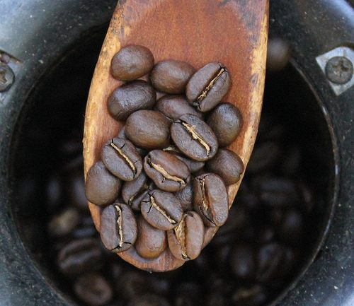
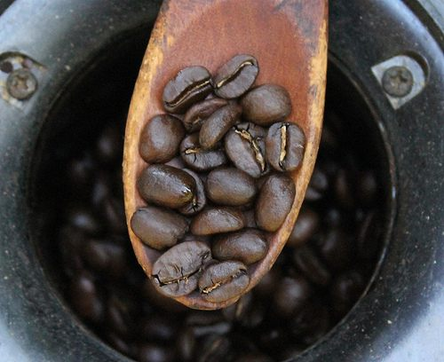
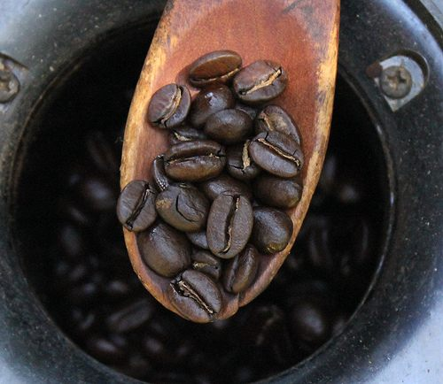
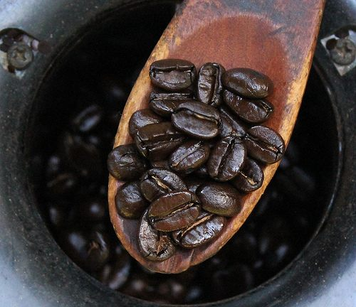
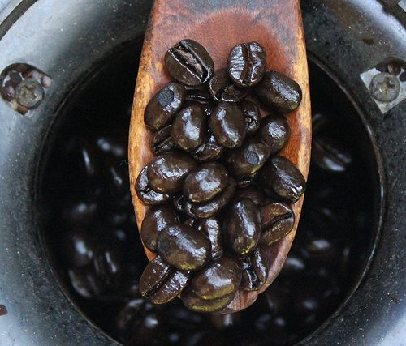

*This article was first published in July 2000 and was updated with new text and photos in August 2011.*

Professional coffee roasters often use a color chart by the *Speciality Coffee Association of America (S.C.A.A.)* to define their roast color levels. The “SCAA/Agtron Roast Color Classification System” chart includes high-resolution color tiles. The kit runs for $290 and can be purchased on their website. Most home roasters have better things to spend their money on, namely more coffee beans. But, like professional roasters, they also need to be able to articulate roast color levels to other roasters or for their roasting logs.

In the article [Coffee Roasts: Notes from a Non-Roaster](http://ineedcoffee.com/coffee-roasts-notes-from-a-non-roaster/), we learned using common terms can be problematic. What is dark to one person may be medium to another. What we need is a common color language that we can speak. And that is the motivation for this page. It is to help home coffee roasters and coffee drinkers communicate roast-level preferences based on photos.

### Shortcomings

Viewing distinct roast colors is not ideal for a computer monitor. Our monitors may differ in the number of colors viewable, and, likely, our brightness levels vary. So, the photos in the roast below may look slightly different from screen to screen. When this article was first published way back in 2000, the variations were much greater. It should be less of an issue in 2011. With that said, below is a *budget* coffee roast color chart. This is not a replacement for the SCAA Agtron chart. The SCAA chart is much more specific, and there are far more than eight different roast colors.

### Practical Uses

-   Home roasting logs or journals. It is important for duplicating blends.
-   When roasting for someone else. (Example: “Dad told me he likes his coffee roasted to Level 4.”)
-   Combining color information with time to detect faulty roasting equipment. (Example: It took 8 minutes to hit Level 2 using a ….)

### The Home Roaster Color Chart

**Level 1**

**Level 2**

**Level 3**

**Level 4**

**Level 5**

**Level 6**

**Level 7**

**Level 8**

### Personal Preferences

When I first began home roasting in 1998, I pretty much roasted everything to Level 7, and if I wasn’t paying attention, it went to Level 8. Over the years, my tastes have changed, and these days, I favor roasts between Level 4 and Level 5. You can also vary the Level based on the bean region or brewing method. Take notes and experiment.

### References

[Roasting Coffee in a Popcorn Popper](http://ineedcoffee.com/roasting-coffee-in-a-popcorn-popper/) – Tutorial on home roasting coffee using a popcorn popper.

[Coffee Roasts: Notes from a Non-Roaster](http://ineedcoffee.com/coffee-roasts-notes-from-a-non-roaster/) – A follow-up article on the language of discussing coffee roast colors.