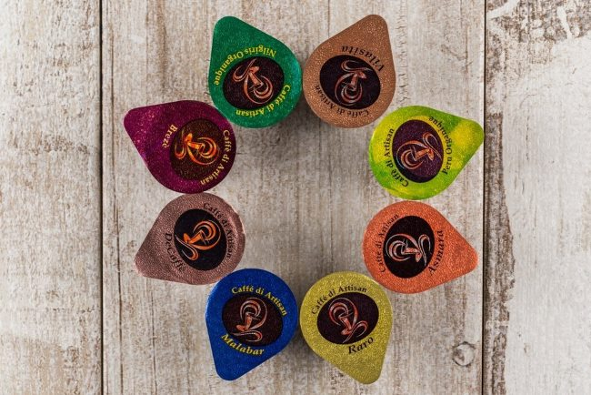

I have a friend who loves coffee but doesn’t make it at home. Well, I have several friends who fit that description. They spend a lot of money in coffee shops. For them, making coffee is too much work. Trying to convince them that using an [AeroPress](/aeropress-coffee-maker-tutorial/) or the [Bonavita Dripper](/step-step-bonavita-immersion-coffee-dripper-tutorial/) is easy is a lost cause. They want to be easy and self-identify as lazy.

This got me thinking about what coffee brewing methods are the easiest. They are not going to buy a grinder or anything that takes up counter space, reminding them they are lazy. It needs to be as easy as possible while tasting good enough to compete viably with the coffee shop.

I dug through the INeedCoffee archives to uncover the best coffee brewing methods for the lazy coffee drinker. Here they are.

### #1 New Generation Instant Coffee

Instant coffee has changed a lot in recent years. It has gotten a lot better. This market is no longer just for legacy bland-tasting blends. Sudden Coffee and Joe Coffee Company make flavorful coffees, including high-quality single-origin offerings such as instant coffee.

The new generation of instant coffee is not cheap, but you’ll save time and money compared to going to the coffee shop. Our article [Next Generation Instant Coffee Reviews](/camping-showdown-steeped-coffee-vs-bripe-coffee-pipe/) highlights two companies that make outstanding instant coffees.

### #2 Steeped Coffee

There are far fewer tea shops than coffee shops. One reason is likely that making tea at home is so easy that justifying a daily or multiple times per day habit will be more difficult. Steeped Coffee leveraged that fact and developed a coffee you brew in a tea bag style. Add hot water, steep it, and remove the coffee bag.

For more information, see our article Camping Showdown: Steeped Coffee vs. The Bripe Coffee Pipe. Just avoid the Bripe Coffee Pipe, which might be the worst coffee brewer ever.

### #3 Liquid Pod Coffee

Pod-brewers such as Keurig make brewing coffee easy, but they aren’t great. Plus, they take up counter space. There are also concerns about bacteria and mold if they are not regularly cleaned. Most people will clean their coffee gear, but this article is for the lazy coffee drinker. It needs to be easier.

Well, Caffè di Artisan solved the problem by creating concentrated coffee pod capsules. Now, you don’t even need a machine. And because you can put the coffee pods in a drawer, no counter space is needed. Caffè di Artisan makes coffees for all types of coffee drinkers. Add hot or cold water if you want an iced coffee experience.

*Caffè di Artisan Coffee Capsules  
*

### #4 Cold Brew Coffee

Even though cold-brew coffee might not initially seem like something a lazy coffee drinker would make, I included it on the list because if you make enough at one time, you may only need to brew cold-brew once a week.

Typically, I advise buying a decent grinder and grinding coffee just before you brew. However, cold brew is super forgiving. You could have it ground at the cafe or grocery store, take it home, and make excellent coffee with no real loss in flavor.

The lazy coffee drinker will want the simplest, easiest-to-clean cold brewer. I’m a fan of the one made by Alkani. In the summer, I might brew once a week. It is easy to clean, too. See The Alkani Cold Brew Coffee Maker—[Review and Tutorial](/alkani-cold-brew-coffee-maker-review-tutorial/) for guidance.

### Summary

Even the laziest coffee drinker can still make delicious coffee at home. The brewing methods listed above are easy to use, and only the Alkani Cold Brewer takes up counter space. I put that away between brews.
