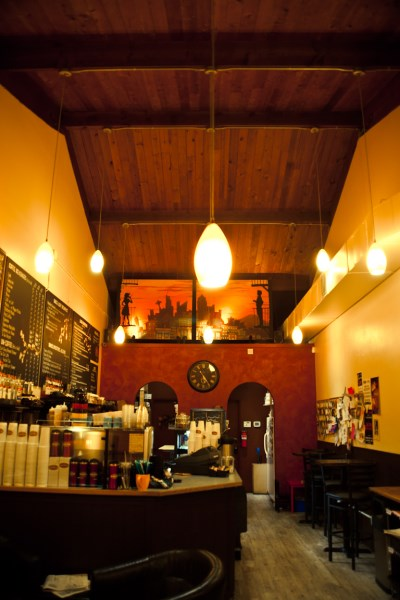
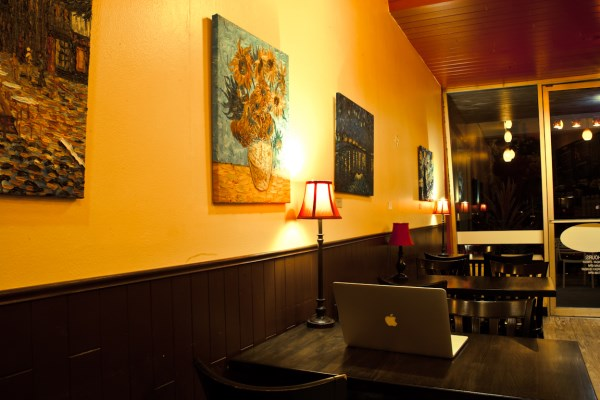
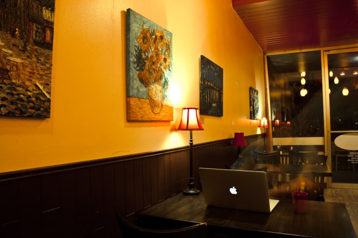
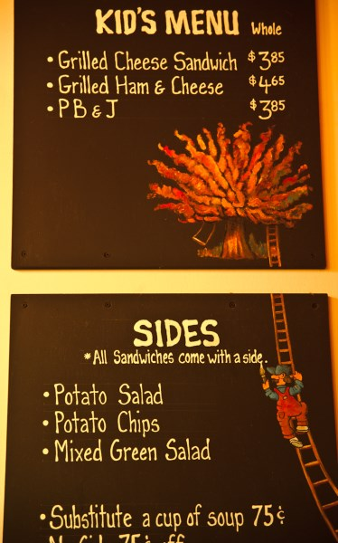
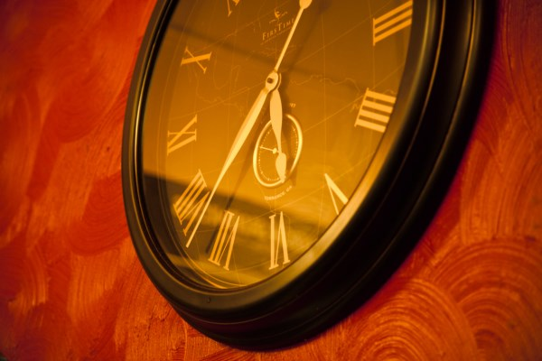
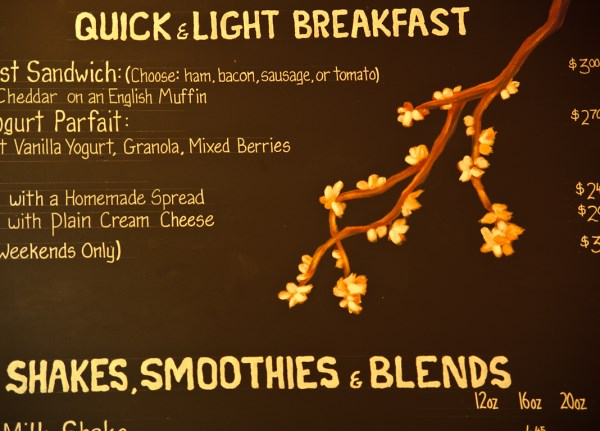
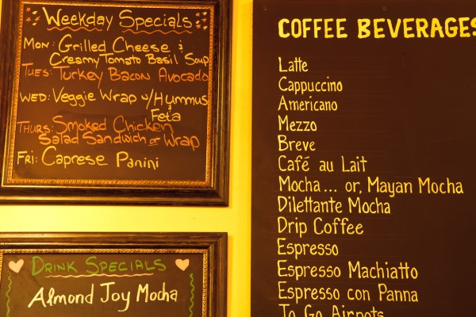
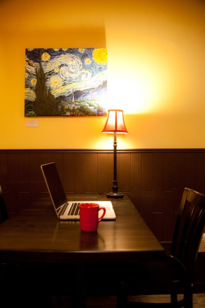

The door is a little clunky – it’s an unassuming glass/metal door – hanging from the inside is a leather strip with several large jingle bells attached. The all-glass front makes the entire space feel more open, which helps as it is a rather small cafe.

So walking in is always the same sensation – a brief clunking thud as I pull the door open followed by clanging jingles of the bells hitting the door, then the warmness of the inside and the rich smell of freshly ground coffee wraps around my head in a wordless greeting.

The interior of the cafe is warm all around – the walls are a light yellow or perhaps a warm yellowy white, with dark brown wood covering the bottom 4 feet or so of the walls down to the floor. The ceiling is a darker reddish wood, which contrasts perfectly with everything else – the back wall is also an interesting dark red (perhaps with a tinge of orange) with curiously odd swirling patterns. The ceiling is probably about 10 feet upon walking in, but just a few feet into the room, it cathedrals upwards as the room shotguns towards the back. It’s a relatively small cafe – but it doesn’t feel that way. The walls are adorned with paintings that are reproductions of Van Gogh paintings – appropriate for Van Gogh Coffeehouse. The colors of these paintings are absolutely perfect in combination with the walls, ceiling, floors, etc. The crowning piece is the artwork hanging above the counter in the back, featuring the silhouettes of two like coffee souls on elegant balconies looking towards each other with the city of Seattle in the background, framed by a rich orange sunset.

The front of the cafe space is all tables, with four very comfortable leather chairs sitting around an electric fireplace – complete with mantel and usual mantel adornments. During the holidays, there is typically something holiday-themed around the mantel. The rest of the year one can find a stack of books on Van Gogh – perfect. I love a cafe that embraces itself in this way. Even the light switch in the bathroom is painted to look like Starry Night – along with old decorative bottles displaying different Van Gogh artwork.

So when you walk in, there are tables to the right and left – I always come here to do some work. There’s a certain element to the atmosphere of this place – it is nice to be around other people, yet it doesn’t get so loud as to be distracting, in fact, it is very easy to completely sink myself into a comfortable focus – even with conversations going on around me. The music is usually subdued, which is nice. So when I walk in, I pick a table, set my bag down, and go get a cup of coffee.

Now I don’t know about you, but I got into coffee through the mocha/latte route. In fact, I think my first attempt to embrace “coffee” was through those bottled Starbucks Frappuccinos – you know, the ones that are more like just getting chocolate milk rather than an actual cup of coffee. But a gateway is a gateway. I actually went through college entirely never drinking coffee – thinking I hated it. I always drank tea (I still have a love of well-crafted tea in much the same way as I now love well-crafted coffee). It was after college, during my foray into the 9-5 business world, that I really developed an interest in coffee – though it was more about the escape I got out of it rather than the drink itself. At one point, I realized I was spending a ludicrously large amount of money on lattes at Starbucks and used that as an excuse to try straight-up drip coffee. In retrospect, Starbucks drip is not the best place in the world to try to develop an interest in the actual flavors of coffee and drinking coffee by itself – but that is for another article. The point is that I did become interested in different flavors of coffee by drinking straight-up black coffee – usually with cinnamon (I also had dietary reasons for not adding anything else to it).

The little sidebar is there to frame my simple but undeniable attraction to Van Gogh Coffeehouse – I walk in, I pick a table, I put my bag down and I go get a cup of coffee.

One of the best things about this cafe is the baristas – they love what they do, they always greet you with a smile, they remember who you are, they have great conversation, and they make some darn good coffee. Any number of elements in a local cafe can make or break the experience – but the two with the biggest impact for me are the baristas and the quality of the coffee (having visited so many cafes in Seattle and participated in the market, I’ve grown a tasteful knowledge of what coffee can taste like, and that has made me a bit more picky about what I drink).

I tend to get the same mug each time – one of the neat things about independent coffeehouses is that they tend to have their own unique style of cups. Since I always go to Van Gogh to do some work, I never get coffee in a paper cup. Their mugs, though, are on the smaller size – very sturdy, well-made hot coffee mugs – but narrower than the typical mug I’m used to anywhere else. They almost have a handcrafted feel to them, very smooth but with curious molding to the handle like it was shaped by a craftsman’s hands – or maybe I just like to imagine things. They hold just enough coffee for me to enjoy a hot cup over a 10-15 minute period without it getting unpalatably lukewarm. They have mugs in 4 different colors – mostly red and green, though they just got several new small mugs in yellow and one blue mug. I always get that blue mug if it’s available – I don’t know why but the blue mug feels right.

Now, one thing about Van Gogh’s coffee is that they serve it in a way that is somewhat counterintuitive to great coffee flavor. Typically, if you want the best flavor experience and the smoothest coffee with the least amount of bitterness, then you will brew fresh by the cup so that the coffee beans spend as little time as possible, from being roasted to being put in your cup. One of my favorite cafes (which will make an appearance in next month’s issue) is very adept at this – they get freshly roasted beans, grind them to order, and prepare a cup via Aeropress (a single serving vessel that produces an amazingly smooth cup of coffee that showcases the flavor of the beans in extraordinary fashion). Van Gogh does not do this – they prepare coffee in standard drip fashion and sit it out in air pots – the trick, they say, is to brew at a much lower temperature than you may think (ie, boiling water ruins the flavor as you burn your grounds). They brew with Zoka Coffee Roasters beans.

They are very good about a few details, though. Number one is that they do as much as they can to make sure the coffee in the pots is fresh – so they don’t typically brew several pots and let them sit around all day. They provide three different kinds of coffee – and as an extra, which I really love, they provide flavor details for each kind so you can both know exactly what you are getting and explore the flavor of your cup with those details in mind.

For example, they always have Decaf, which is described as \[smooth, sweet, nutty\], and a House Brew, which is described as \[smokey, dark chocolate, sweet\]. The third is a rotating premium coffee – today it is a Medium coffee from Nicaragua which is described as \[Almond, Butter, Lemongrass\].

Typically my experience with drip in cafes (Starbucks included) is that the flavor gets superseded by a watered-down taste, as well as typically an overly bitter sense and often the flavor of burned coffee. One of the ways to avoid this is using high-quality beans – which Van Gogh does – but they are also quite skilled at bringing out the flavors in these coffees through proper handling of grounds and water temperature.

So I’ll walk in, pick my table, sit down, and get my cup of coffee. Then I go back to my table, have a seat, and have a moment for myself. Their tables are very unique – they used to be rather mediocre/ugly-looking tables that had a tablecloth topped by a sheet of what I assume was Plexiglas. A few months ago, they replaced them with these beautiful-looking dark wood tables. They have a very smooth finish, but if you run the palms of your hands over the surface, you can still feel the ridges in the wood. So I’ll sit there, pause for a moment, then take the first sip of my coffee.

Now perhaps I am a bit different in my coffee drinking habits, but I’ve grown to enjoy the experience of trying to discover the flavors in my coffee. I start off by simply enjoying the aroma, then the first sip I let sit on my tongue and let it travel around my mouth for a few moments – ah…there’s the (Lemongrass)..and there’s the (Butter)…no bitterness. If you recall from earlier, I don’t put anything in my coffee (except sometimes cinnamon, but not as much these days). Part of the experience of the cafe is the coffee itself, and I like to experience it fully unhindered by other elements.

That isn’t to say that I don’t enjoy a latte or mocha from time to time – in fact, I think the lattes that the baristas at Van Gogh make are delicious – but when I go in on a typical day I have a desire to just sink myself into the coffee, experience the flavor, think about where it came from and then let that inspire me.

I remember when I first really got into coffee through Starbucks. One of the things that Starbucks does really well is making it clear what you are going to get – you know the experience that you are going to have. That’s one of the things that made getting into the drip coffee easier. Starbucks had such great descriptions of their different coffees – though not in the sense that they explained the different flavors to expect – I just remember enjoying the way that they label and display their coffee. Ultimately, coffee is far more an experience than a product. I think this is what kept me from visiting local cafes for such a long time. I know that after I got into coffee, I always thought to myself – I should check out some of the local cafes and roasters – it is Seattle, after all. But I always sidled back to what was familiar – to the experience that I could understand and anticipate.

It can be intimidating to step from the world of what you know, the world that you don’t. When I first started visiting the different independent cafes around the city, I would often have absolutely no clue what I wanted when I entered – and this I think often keeps a lot of people away from exploring these different experiences. It certainly doesn’t help if the barista gets frustrated at your lack of knowledge in what you desire – after all, it’s hard to desire what you don’t fully understand, and the world of coffee is far greater than that which is presented in a place like Starbucks.

It wasn’t until I met a particularly enthusiastic barista at one of my other favorite cafes. I recall going in, and he asked, “What would you like?’ and my answer was, “I have absolutely no idea! some coffee!’ He took the time to teach me several different things about coffee (the effect of water temperature, ground size, brew method, etc., and from that point on, I have been exploring deeper and deeper experiences.

So the next chance you get to check out that local cafe – just realize that there are a whole host of experiences to have and that you should embrace whatever uncertainty may be preventing you from finding those experiences.

I hope to continue sharing my own experiences of different cafes around here – simply so that I can show you the complete uniqueness that each of them presents, and how truly inspiring they can be.

_This article is courtesy of Extracted Magazine._

### Resources

[Van Gogh Coffeehouse](http://vangoghcoffeehouse.com/) – 8210 35th Ave NE, Seattle

[Vincent van Gogh](https://en.wikipedia.org/wiki/Vincent_van_Gogh) – Wikipedia page.
