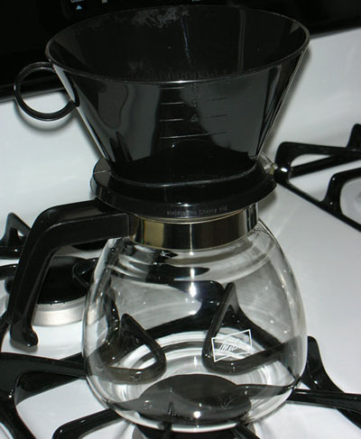
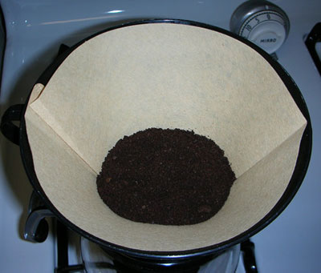
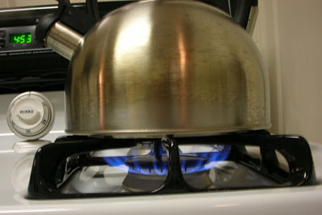
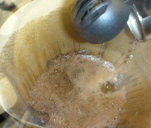
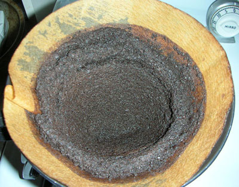
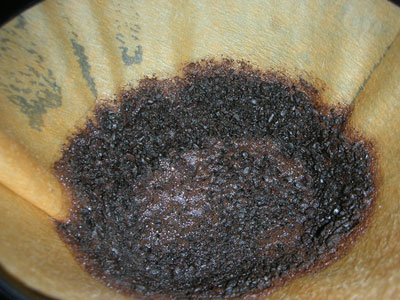
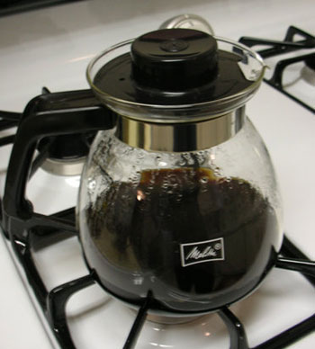
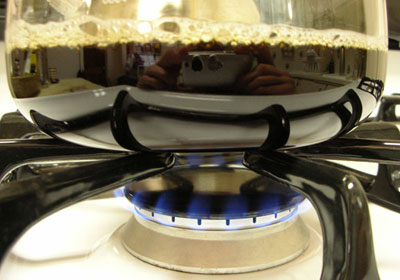

Writers need coffee. Since absinthe isn’t around anymore, it is about as good as we can do in terms of stimulating our synapses. But I digress.

I’ve been looking for the perfect coffee making system for at least twenty years. I’ve been through at least ten coffee pots of different make and design and found them all to come up short when it comes to brewing the perfect cup. But unlike some of my peers who will accept any kind of awful-tasting dishwater brew, I will not. There’s something about that perfect cuppa joe as you’re firing up the laptop that really gets the creative juices flowing. So, realizing this and realizing that I haven’t put out a new book in a couple of years, I came to the conclusion that my coffee-making has been terribly off for the last couple of years.

But I digress again. So the other day, I was in World Market looking for stuff unrelated to coffee when I saw this little jewel:

  
*Melitta Manual 6 cup Coffee Maker*

It’s a Melitta six-cup manual coffee brewing system. Since I had been contemplating a Chemex for quite some time, this thing intrigued me. Basically, it is the same setup: a cone-holding device on top, a carafe on the bottom and you add your own boiling water. Nice. I checked the price: On sale for $9.99. Even at the full price of $11.99, it beat the [Chemex](http://ineedcoffee.com/chemex-coffee-brewing-history-and-tutorial/) by thirty bucks.

Based on my research at sites like INEEDCOFFEE and by my own trials, I believe that the major problem with brewing coffee is controlling the temperature of the water. Of course, coffee quality and grind, water quality, etc. are all factors, I’ve taken care of these elements but still have crappy coffee. The problem is the temperature; electric pots either don’t get it right or their internal design ultimately fails and either makes the water too hot or too cold.

With this Melitta two-piece design, one boils their own water and can thus have total control over both the temperature of the water and the flow of the water through the coffee. The little extra time it takes to do this is no big deal to me; I found that it only adds a couple of actual minutes to the overall prep time.

The Melitta uses #6 cone filters:

  
*#6 Cone Coffee Filters*

Personally, I prefer white filters. I don’t know why, but the coffee seems to be smoother. The argument against white filters is that they are bleached in a process that creates dioxin, the most powerful carcinogen on the planet. Think Agent Orange and Love Canal. However, when faced with the choice between genetic mutations within my body or a good cup of coffee, I choose the coffee. In case you’re wondering why the filter in the photo is “natural,” it is simply because I can’t find the white ones anywhere. A side note: it appears the Chemex fold-type filters will fit in this device. I may try some out and give an update on their performance later on.

To use this system, follow the guidelines on this site for the Chemex pot. I boil the water in a conventional teapot:

  
*Kettle on Stove*

A note on teapots: if you can, get one with a spout longer than this one. This short type causes a lot of splatters as the water falls onto the grounds.

I hear that the optimum brew temperature is around 208 degrees Fahrenheit. Since it’s boiling at 212 at my current elevation, I simply turn off the gas and swish it around a bit.

Here I am “blooming” the coffee by saturating it with water for between 15 and 45 seconds. Note the bubbles as the coffee expands like foam. This is carbon dioxide escaping, which helps the grounds stay submerged in the water instead of floating during the brewing. Now, I don’t know if any of this is true or not, but it is kinda fun to watch the coffee foam up.

  
*Coffee blooming*

After the blooming, there are two different ways to do the full brew. First, you can just dump all the water in. The remaining grounds at the end will look like this:

  
*Coffee grounds after the pour*

Note the even distribution along the sides. The coffee is exposed to the water less and there are fewer grounds at the bottom. This makes for a weaker cup of coffee, but a smooth one. It’s also a much faster process; you can dump in the water and finish getting dressed.

Or, you can pour the water in slowly, carefully keeping the grounds concentrated near the bottom. Here’s what that looks like afterward:

  
*Coffee grounds after the slow pour*

This makes for a really strong cup of coffee and is my favorite method.

Either method is your choice; unlike an electric pot, you can custom tailor your brew in all aspects. As far as the carafe goes, it appears the cone-holder will fit nearly any carafe you can put under it. This would make a replacement of a broken one rather easy, and you shouldn’t have to pay the extorted high price of a proprietary carafe. One could even put this cone-holder on a thermal carafe. The carafe comes with a lid:

  
*Melitta Brewed Coffee*

But since I drink my coffee as soon as I brew it, I never use the thing.

My own little trick that should not be attempted by anyone sane is to do this:

  
*Quick coffee reheat (NOT ADVISED)*

A few-second blast of heat to the carafe bottom helps keep the coffee warm until you’re ready to pour. This carafe is not designed for direct heat, so don’t attempt this at home! And for Pete’s sake, don’t go walking away after turning on the heat; the carafe will explode.

The Melitta will only make a couple of American-sized cups of coffee at a time, but I see on their website that they have a 10-cup version, too. Playing with the pouring rate may get you another cup. You can also use #4 filters in it for single-cup brewing. Clean-up is bone-headedly simple. And there’s never any descaling needed; when your teapot gets a few deposits, you can just scrub them off.

Oh, and how’s the coffee? Perfect. Of course, you’ll have to experiment a bit just like you must do with all coffee makers.

The Melitta system is highly recommended for everyone who is interested in coffee quality and doesn’t mind a few extra minutes to get it. If you’re the type who likes to throw in a pod and hit a button, it isn’t for you.