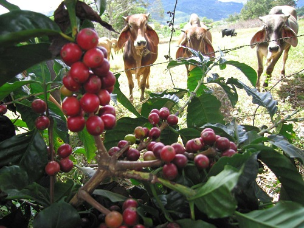
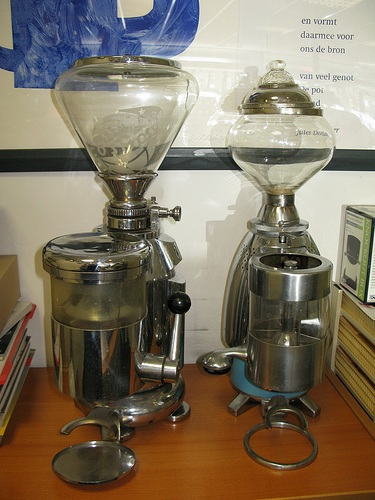

The next time you pass by your neighborhood coffee shop, try to remember that it wasn’t always this easy to get a great cup of “java.” Coffee was probably first discovered in Yemen, Somalia, or Ethiopia about 1000 years ago. With a flavor blending chocolate and charcoal flavors, along with an undeniable caffeinated kick, over the centuries, it has developed into the world’s most popular hot drink. If you’re ready to take on the challenge of preparing the world’s best cup of coffee for your friends and family, you’ll need good equipment and some deep background on the mighty bean.

Coffee plants are shrubs or small trees that thrive only in tropical or subtropical climates. There are more than 90 species of the coffee genus of plants, called Coffea. In East Africa, especially Ethiopia, coffee grows wild in its native habitat. Even today, during the spring, the shepherds of the local tribes usually take their animals, whether goats or sheep, into the uplands where the coffee plants are in full fruit.

The fruit of the plant is called a cherry in the coffee industry, and the cherries of many coffee trees are bright red or purple, making them an attractive temptation for both man and beast. But men are very cautious about tasting new foods, and the goats of Ethiopia are probably the first living things to enjoy the caffeine rush of the coffee plant.

The shepherds almost certainly took notice of their charges gamboling and frolicking around after eating a bunch of the cherries. Since the animals didn’t die, later on, a decision was made to test the strange new fruit. The results must have been interesting to watch because the flesh of raw cherries is bitter, and under the flesh is a layer of slime called mucilage, coating the seeds.

However, the seed in the center, which we call the coffee bean, definitely seemed to have something worth looking into. It must have taken a few years for the villagers of the African hills to arrive at the best formula for making coffee, but they developed the method that we still use today, essentially unchanged: First, remove all of the flesh and mucilage from the bean. Secondly, roast the beans. Thirdly, grind the coffee seeds into crumbs or powder. Then, pour hot water through the grounds, catching the brew while discarding the soaked, depleted, ground-up beans. And there is your basic cup of coffee.

  
*Cattle approach the Coffee plant*

Today, coffee lovers can select an incredible variety of coffee beans harvested from around the world, some with more or less body, more or less acidity, and some with no caffeine! If you would like to do your own roasting, you’ll find that uncooked coffee beans, called green coffee, are fairly easy to purchase online.

Several coffee fanatic websites eagerly describe how some home roasters have successfully used popcorn poppers to roast their bean to a perfect, toasty brown. For now, the majority of coffee drinkers are content to purchase whole beans and enjoy the immediacy of freshly ground coffee. If you are interested in roasting your own green coffee, you will have to decide if you will be cooking large or small batches of beans, and purchase your roasters appropriately.

The simplest method for making great coffee most widely available in the United States is to purchase whole beans roasted locally and then grind and brew them at home. Avoid commercially roasted beans from large retailers. The shelf life of whole beans is not more than six months, and large retailers frequently provide supermarkets and other mass suppliers with enough packages to last beyond this date. After you buy your freshly roasted whole beans, the next step is to purchase a coffee grinder that best suits your needs.

In the United States, simple coffee is still the most popular beverage made from the bean, whereas in Southern Europe, espresso can often dominate the kitchen. Coffee beans must be ground up in very different ways to prepare the two drinks. Espresso requires grounds that are almost powdery, while the average automatic brewer requires much less of what is called, the “fineness of the grind.” Most modern coffee grinders offer settings that allow you to adjust the fineness of the grind by tiny degrees. Less expensive grinders offer settings such as Espresso, French Press, and Standard Drip. If you plan to have any variety of brewing in your kitchen, avoid the grinders that offer only one setting, regardless of the price.

Coffee grinders use two methods for tearing up the coffee beans. One employs whirling blades, and the other uses what is called a “burr mill.” When blades are used by a grinder, they usually operate at very high speeds. The speed produces a lot of heat, and the heat can definitely alter the chemical composition of the beans and thus the flavor of the brew. These changes of flavor due to heating may be too slight for many consumers to notice, and the blades definitely offer the satisfaction of very quickly providing plenty of grounds with a precise degree of fineness.

If you need to make coffee quickly, then blades are perhaps the better choice. Given the luxury of time, both to measure the beans out and savor their flavor, the burr mill coffee grinder is almost always the better choice. Both types of grinders can be purchased with automatic levers to measure out doses for various amounts of espresso or coarse grounds.

  
*Two coffee grinders*

We can of course always have coffee brewed for us at the innumerable and delightful cafes that now dot the United States from sea to sea. What a pleasure it has been for travelers familiar with European cafe society to see the world of espresso, mocha, and cappuccino so thoroughly embraced by this country.

Is there any better way to extend a night of revelry than to enjoy an hour of talk over an espresso at midnight? Still, the pleasure of a simple homemade cup of good beans freshly ground can give every morning a sense of style and grace. To create this quality in your kitchen, however, you must decide what kind of coffee you want to make, and then purchase the right equipment for the job.

### References

[en.wikipedia.org/wiki/Coffee](https://en.wikipedia.org/wiki/Coffee)

thenibble.com (offline February 2018)