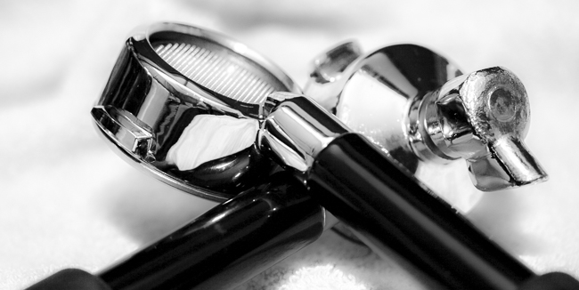
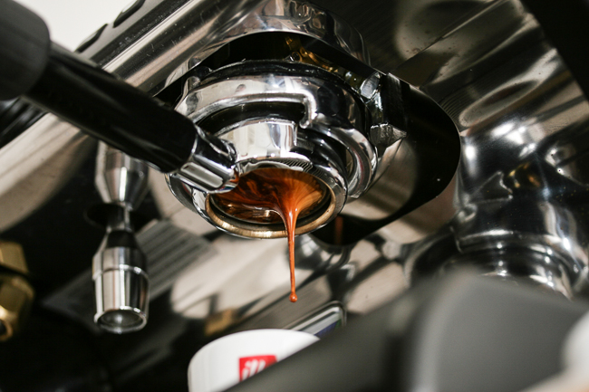
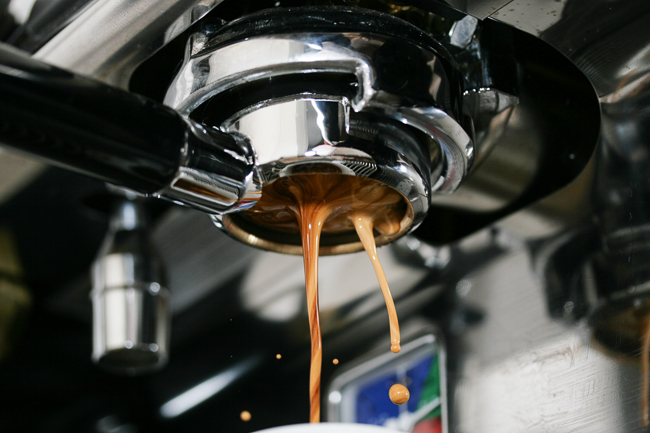
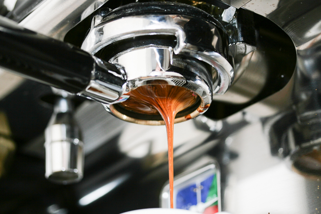
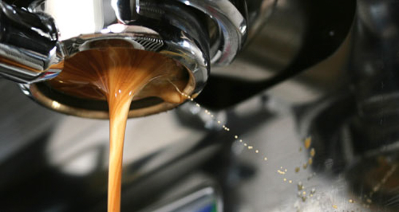
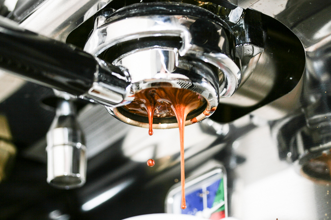
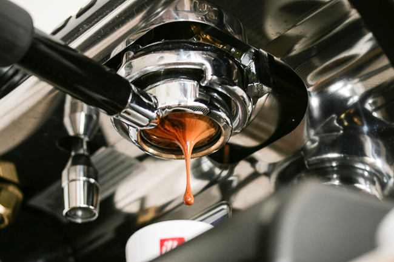

You may have been wondering if there are any cool new coffee toys to improve your Barista skills. Oh sure, there are the ubiquitous click tamper thingies, and of course, the ever-so sexy bathroom scale to measure your tamp pressure. One word – BORING! But if you want something that says, “I know Starbucks is evil, now Pimp my Espresso Machine!!!” then read on.

There is a relatively new phenomenon among coffee enthusiasts that is not only a great Barista training tool but is also beautiful. It is commonly referred to as a Bottomless Portafilter. Usually, a bottomless portafilter is “chopped”, or cut off, so that the entire bottom is visible and nakedly exposed for the peeping toms in all of us. This also allows the Barista in training to see the bottom of the portafilter basket, since this is where the coffee will start its journey into the little espresso cup. It will allow said Barista to see some other cool (and often beautiful) stuff whilst pulling a shot; more on that later.

  
*Bottomless Portafilter & Standard Portafilter*

The Naked Portafilter is a novel concept at first glance. But how can it help the aspiring barista? Well, the holy grail of all baristas is, of course, an espresso shot that not only looks good but tastes good too. The perfect extraction is a black-magic melange of the perfect grind, dose, and tamp. Let’s not even talk about the roasted beans, water temperature, machine pressure, or water pH. We will save your brain cells for another article – GEEK ALERT!

Ideally, every particle of the ground espresso should be of the same size, and when compressed or tamped into the portafilter basket, it should likewise have no differences in how tightly or loosely it is compressed from side to side or top to bottom. Although perfection in this regard is impossible, a Crotchless Portafilter can help identify things such as channeling, blonding, and tiger striping, among other things.

### Channeling

Channeling is when the water finds its way through cracks or small inconsistencies in the coffee “puck”. This means that the coffee gets an uneven extraction, producing an inferior shot of espresso. Common causes are an uneven tamp, or too much coffee (referred to as overdosing).

  
*Espresso with Side Channeling*

### Blonding

Blonding in the shot can happen when the coffee is being under-extracted, causing an off-taste. Although this is expected near the last part of the shot (and a cue to think about ending the shot), blonding should not occur during the majority of the shot.

  
*Blonding espresso shot, among other problems*

### Tiger Stripes

Tiger Stripes that are uniform are usually a good sign, as long as most of the stripes are medium to dark in color and the pour time is not too quick or slow; most agree a 2-ounce double should run about 22-30 seconds. Always let taste be your ultimate authority.

  
*Decent Tiger Striping. Can you pick out any problems?*

The Bottomless Portafilter can let the Barista see exactly what is happening under the hood. Channeling can be identified by “spurters” and “geysers”. This is where the espresso sprays out in small (or large) jet-like streams at varying angles.

### Multiple Streams

Also having multiple smaller streams coming straight down instead of one unified stream can also be a sign of channeling. Assuming your machine is perfectly level, even a unified stream that is off to one side can indicate side-channeling. A perfect extraction will not exhibit any of this behavior. And of course, the perfect-looking shot can tell the Barista that his technique is probably fine. Of course, we all know no matter how good the shot looks, it still has to taste good.

  
*Spurter Espresso with Blonding*

  
*Espresso with Multiple Streams*

### Perfect Shot

But when the perfect shot is captured in a photo, it is a beautiful thing – Espresso Porn, as many call it. The coffee drips somewhat slowly, evenly, just like honey, into the demitasse cup. The rich, even color bands are followed down as they converge into that perfectly centered columned stream of goodness. The result in the cup should be a thick and persistent head of “crema”, which is all of the good stuff in the coffee, and none of the bad.

  
*Outstanding looking espresso shot!*

Since espresso machine makers love to invent their own sizes, shapes, and molecular structures, check with your favorite espresso parts supplier for a Bottomless Portafilter that matches perfectly your machine. Then you can really laugh at those people who *Starbucks* would label baristas. They should really be called assembly-line automatons. Do they even know what a portafilter is anymore? I don’t think so.

### Resources

[Espresso Tamping Visual Tutorial](/espresso-tamping/) – Having a good tamp is a major factor in pulling excellent espresso shots.
