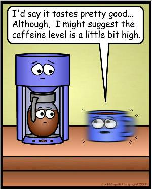
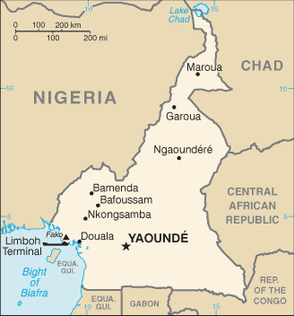

This weekend, several coffee websites were abuzz about the Coffea charrieriana (or Charrier Coffee), a coffee plant that naturally has no caffeine. This plant made the Top 10 species list by The International Institute For Species Exploration, and rightfully so. **A coffee plant that can produce coffee without caffeine is a breakthrough.**

Some people won’t understand the significance of this story. They might scoff that we already have methods for removing the caffeine from coffee beans. Yes, we do, but it comes with a cost. All that additional processing of coffee results in reduced flavor. Every coffee roaster knows this. So, instead of roasting to maximize flavor, the roaster will go darker and strive for more body. This is all fine and dandy if you always prefer darker roasts, but not great if you like tasting all the unique flavors found in the lighter roasts.

  
_High Caffeine Content by [Todd Zapoli](/by/todd-zapoli/). From [Inanimate Objects #21](/inanimate-objects-comics-21/)._

When I explain to people how exciting this could be, they look at me in disbelief. I am reminded that I typically down [4-5 doppio espressos a day](/caffeine-consumption-by-coffee-fanatics/), and I can handle caffeine just fine. True, I can handle that level of caffeine just fine. But perhaps I’d like to drink espresso later in the day without fear of disrupted sleep. Or maybe I want to drink 10 espressos a day! I’d also like a tasty way to detox from caffeine before leaving the Pacific Northwest for vacations.

  
_Cameroon – The location where the new caffeine-free species was discovered._

It will be interesting to see how many years it takes for this plant to spread around the globe. If decaffeinated coffee ever tastes as good as regular coffee, I may be drinking it all day long.

### Resources

IISE – Top 10 Species List (UPDATE 2023: page offline)

[Accelerated Caffeine Detox](/accelerated-caffeine-detox/) – A fast way to get your caffeine intake under control.

[Pre-Surgery Caffeine Detox](/pre-surgery-caffeine-detox/) – A specific approach to caffeine detox.
