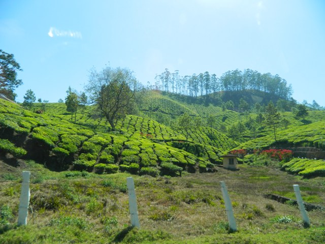
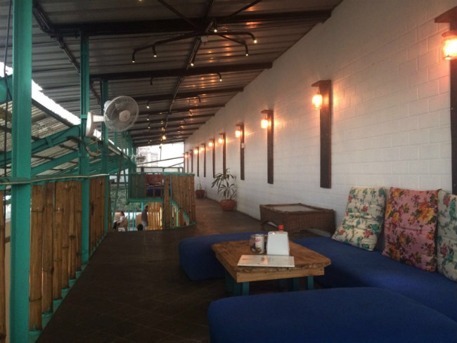
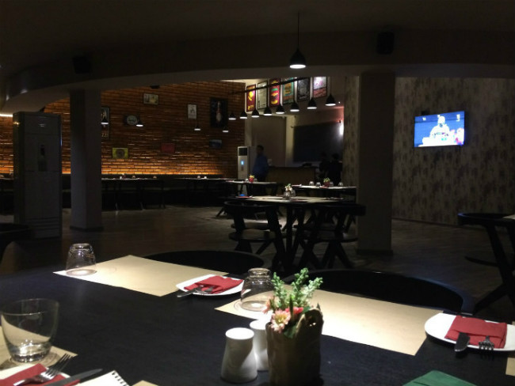
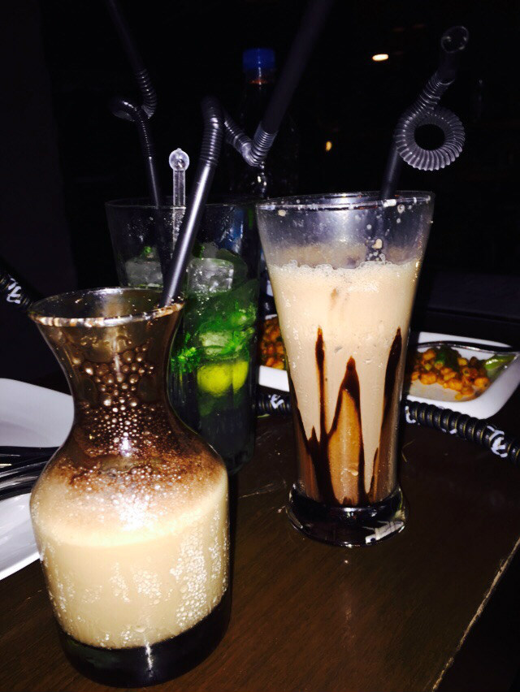
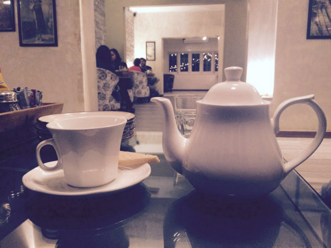
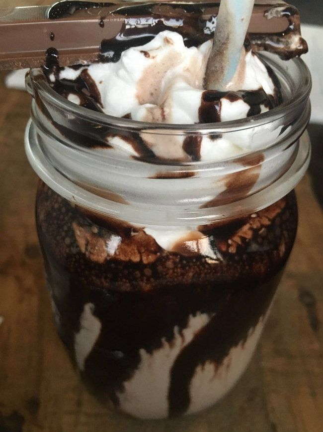

India has long been a grower of coffee beans – in fact, it is the sixth-largest coffee producer in the world. But in most of the country, most Indians prefer to start their day with tea, and traditionally, if you order coffee in a restaurant, you’re more likely to be served a sad cup of Nescafé than “real coffee.”

*Kerala, India*

### The Southern Tradition

The exception to this rule are parts of Southern India, namely Tamil Nadu and Karnataka, where coffee has been enjoyed for generations. This is the region where, so the story goes, Baba Budan smuggled in his seven coffee beans from Yemen in the 17th century while returning from a pilgrimage, beginning the cultivation of coffee in India.

For many people in these two states, coffee is the drink of choice. Street-side kaapi bars serve up delicious, frothy blends of filter coffee, hot milk, and of course sugar. Kaapi is the name of that Indian filtered coffee. There is a theatrical element to this tradition: “meter coffee” gets its name from the method of combining and frothing the hot drink by pouring it back and forth between one receptacle and another, often at an exaggerated height.

But the face of coffee consumption is changing in India. Just as Indian chai (or something like it) has become a staple in cafés in the West under the redundant name “chai tea latte,” European-style cafés are now popping up all over urban India. Not surprisingly, southern cities like Bangalore have embraced this new trend and boast dozens of cafés and eateries where friends can gather and socialize over a cup of coffee. The ambiance varies from squashy-couch comfort to artsy to upscale, depending on your preference and of course your budget.

This café culture has introduced coffee to many Indians for the first time, and even in traditional coffee-drinking regions has brought more variety to the drink. Baristas serve up espresso, cappuccino, filter coffee, and latte to people who had far fewer options before.

### Re-Importing Our Exports

In the past, even the restaurants that served filter coffee tended to import the beans from Europe, resulting in a brew that was anything but fresh. Because coffee was seen as an export crop only, an absurd situation arose in which high-quality Indian beans were sold to European companies such as Illy, who would process them and blend them with other beans. Restaurants and retailers in India would then import such products to serve or sell to their customers. As ground coffee entered the marketplace, some customers had no idea how to brew it and tried to dissolve the grounds in hot water as if they were making instant coffee.

These days, entrepreneurs are starting to change all of that. Several coffee house chains, home-grown and foreign, have popped up in cities all over India. Café Coffee Day got the ball rolling in 1996, and there are now over 1500 locations across the entire country. Chains like Barista and Brewberrys were not far behind, and more recently, international chains such as Costa and Starbucks have joined the scene.

*Private Cafe in Hyderabad*

### A New Urban Space

Young people were the first to jump on the café bandwagon. For the youth, a coffee house is not only a place to buy lattes and Frappuccinos®, but also a much-needed urban space. A café offers a neutral meeting place that allows friends and colleagues to get together in an appealing space that is neither a home nor a workplace.

The older generation has caught up fast with this new trend, and you can often see informal work meetings taking place in cafés. Not surprisingly, tourists are also big fans of cafés that offer them their caffeine fix in a cozy environment complete with Wi-Fi and air conditioning. These days, coffee shops are located in train stations, hospitals, airports, shopping malls, and other public spaces and institutions.

*Mocha*

### New Domestic Markets

For farmers, this recent domestic demand for coffee offers hope for expansion and increased profit. Companies such as TheIndianBean.com are buying and roasting Indian coffees, especially for the domestic market, appealing to India’s growing middle class. Their website also educates users about brewing techniques. Starbucks in India also uses 100 percent Indian-grown beans in its espresso-based drinks. In the past ten years, per capita consumption of coffee in India has increased by 40%.

Beginning in the 1990s, coffee growers stopped focusing just on maximizing yields and have worked to improve the quality of the beans. Both domestically and abroad, the results speak for themselves. India still exports almost 80 percent of the beans it produces, but local consumption is on the rise.

Café chains have also introduced consumers to coffees from around the world. Beans from South and Central America, as well as East Africa, are finding their way into the Indian market as coffee drinkers start to crave more variety. Cold coffee-based sodas and other drinks are now available canned and coffee-flavoured ice cream is becoming more commonplace. Across the board, coffee is becoming a more familiar flavour.

But if you’re a tea drinker, don’t worry! It doesn’t seem like India’s favorite drink is going to be displaced any time soon. Per capita, Indians still drink more than 8 times as much tea as coffee. Most of the coffee farmers in the country have never tasted coffee (with the exception of instant) but continue to start their day with a hot cup of tea as their parents and grandparents did before them. Coffee and the café scene are still a bit of an urban, middle-class niche.

*Tea*

### Old vs. New

How does this café culture compare with the traditional coffee bars of the Southern states? The two venues are really quite different: the traditional coffee bars offer standing room only, and the idea is to drink up and make room for the next customer. (Interestingly, traditional Italian coffee bars used a similar model.) With the new style of café, the space is as important a product as the coffee itself and a big reason for the success of these businesses. Cafés are much more expensive than kaapi bars, but for the price, you also get a valuable “living” space where you can meet with friends and colleagues. Perhaps the traditional coffee bars will find a way to adapt their delicious product to this style of venue, offering the best of both worlds.

Whether you prefer to sip your traditional kaapi standing at a street café in Karnataka, or take selfies with your friends in a trendy establishment in Mumbai, it seems that coffee culture is here to stay.

*Coffee shake topped with ice cream and chocolate syrup*

### Resources

[List of countries by coffee production](https://en.wikipedia.org/wiki/List_of_countries_by_coffee_production) – Wikipedia

[Coffee production in India](https://en.wikipedia.org/wiki/Coffee_production_in_India) – Wikipedia

[Coffee Board sees scope to improve per capita consumption](https://www.thehindubusinessline.com/economy/agri-business/coffee-board-sees-scope-to-improve-per-capita-consumption/article20713710.ece1) – Article on the growing coffee consumption in India.

[Is Coffee a Threat to Tea in India](http://web.archive.org/web/20121122012918/http://www.indiatimes.com/art-and-culture/is-coffee-a-threat-to-tea-in-india-44655.html) – 2012 article that states tea is eight times more popular than coffee in India.

[Indian filter coffee](https://en.wikipedia.org/wiki/Indian_filter_coffee) – Wikipedia
