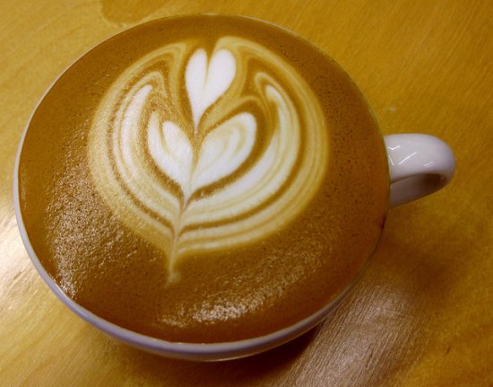

Andre plays classical guitar at the How You Bean, a coffeehouse in Boulder, Colorado. He plays for tips, but really he plays for Roxanne, Queen of Lattes, who works behind the counter.

It takes him a while to notice her. Andre is drawn to a well-defined type, olive-skinned girls with robust features and dark eyes. He spent his high school years with Maria Frenghetti, an exuberant Catholic beauty who chose graduation day to sacrifice their love on the pyres of religion and family.

His first night at the Bean, Roxanne barely registers. She is slim, red-haired, freckled, a quick entry to his Not-My-Type file (he does not do this consciously, but his filters are ruthlessly consistent). He plays for two hours, to small applause but several smiles, plus sixteen dollars in his guitar case.

  
*Perfect Latte by INeedCoffee*

“Say, Andre?” It’s the tall, red-haired barista. “Did you want your drink? You get a free drink.”

“Oh. Sure. How ’bout a double latte? I’ll pick it up after this last song.”

He plays an arrangement of “Purple Haze” by Jimi Hendrix. It’s a remarkable rendition, because it’s done to a steady baroque pulse, and you have to really pay attention to catch the tune. Andre savors the raised eyebrows and chuckles of recognition as they make their way around the room. He receives his first applause. An aging hippie yells, “Rock on!” Five more dollars migrate to the guitar case.

“That was great!” says the barista. “I’ll leave your drink on the table.”

“Thanks.” He gathers his tips, lowers his guitar into the case, then turns to find the most perfect latte he has ever seen.

It sits in a tall, narrow glass, like a clear two-inch pipe with a handle. The bottom layer is four inches of steamed milk; the middle an inch-wide stripe of espresso the color of charred wood. The top is two inches of milk foam, edging past the brim like a snow bank, one feathered dollop flipped over like a pompadour.

Only once has Andre seen such a thing – a caffe in Florence, on a tour of Italy after his first year in college. A woman who could be Maria Frenghetti’s mother laughs when he sips at the foam.

“No!” she says. “Presto!”

He’s not good with Italian, but he does know musical notation – and “presto” is “quickly.” So he swallows. The espresso bites into his tongue, then slips away in a wash of hot milk and foam. It’s like rough sex. In his mouth. He has trouble expressing this to his friends.

He has more trouble explaining this to the baristas of America, where efficiency has buried all other considerations. He refers to it by one filthy word: sploosh. Everything dumped in at once – a warmish, beige beverage. He tries to explain the Italian method with adjectives: “parfait,” “stripes,” “separated.” He turns to ad-hoc lessons: *Now pour the espresso down the back of the spoon, so it goes through the foam, but not into the milk.*

But life gets busy, and you shouldn’t have to give five minutes of instructions every time you want a latte. So he gives way to the sploosh majority, and he drinks from cardboard cups.

But now… this. He studies the perfect striations of brown and white, then tips the glass and drinks. *Presto.*

Andre plays there again the following week, and he finds himself slipping up, on a piece he has played since he was six. These are small flaws: releasing a chord too early, dropping a note from an arpeggio. No one notices. But it bothers him. He understands that perfection is not, logically speaking, attainable. But if you aren’t going to at least chase it, what’s the purpose?

He knows what it is. Too many of his focal points are occupied by the image of Roxanne’s latte. He takes an early break, and requests his free drink.

“Double latte?” she asks.

“Exactly the same.”

“Ah.” She smiles. “A connoisseur.” She clicks the grounds into a disc and slides it into the machine. Andre stands at the counter, watching.

“So what do you call it?” he asks. “Parfait? Striped?”

Roxanne twitches her lips in thought. “Pretty-style.”

“Pretty style.”

She laughs. “I know. Corny. But it’s the only expression everyone seems to understand.”

She pours the milk, then lays in the foam, till it comes to an inch from the top. Then she brings the shot cup to the edge of the glass.

“No!” says Andre. “You pour it freehand? No spoon?”

Roxanne smiles, keeping her eye on the hot brown trickle. “All you need… is the fine touch… of a neuro… surgeon.”

A dark line appears between milk and foam, and rises to a solid band, as if someone has painted it on the glass. She covers her entry spot with a cap of foam, then stands back to admire her work.

“You are a goddess of the caffeine arts,” says Andre, taking his prize.

That night, Andre crosses his front lawn, huffing steam into the cold air. He pauses and sets down his guitar case. A full moon is filtering the madrone, silvering its smooth limbs. Reminding Andre of Roxanne’s shoulders, bare and slender, turning away as the espresso bites into his tongue.

Roxanne realizes that her job is predominantly social. She also knows that her age and appearance fall into a certain type – tall, high-cheekboned, girl-next-door (Julia Roberts comes up) – and she is a magnet for heartbroken forty-year-olds.

But most of them want just a conversation, a smile. Just the fact that she remembers their names and favorite drinks brightens their faces. She is careful to draw boundaries, but time is her friend – always another customer, another chore to keep the encounter brief. And they all understand.

She is protective of her true affections – rarely gives them out – and is very clear on the type of man who buzzes her circuits. He is big, a barrel-chested guy who could squeeze her to a pulp. Not that she *wants* that, but just the idea of all that suppressed force… In the old high-school fantasy game, her picks would be Russell Crowe, a young Sean Connery, Brando in *Streetcar.*

Slight, effeminate Andre doesn’t stand a chance – until he starts playing. The deftness of his fingering captivates her. His choice of material – piano transcriptions from Poulenc and Satie – has her lifting in her shoes to listen. He also knows a good musical joke, smuggling a quote from “Hotel California” into a Granados tango. She’s the only one who notices.

There’s a reason for this. Roxanne is a piano student. Her teachers love her playing, and encourage her to give recitals. But her ears tell her differently. She knows that perfection is a ruthless master, but she wants to be at least somewhere in the same county before she exposes herself to an audience. She tells no one about her studies – not even her closest friends – and when she hears someone like Andre, her feelings are confirmed.

The thing with the lattes catches her off-guard. She never realized they were so exceptional – but then, she’s never had such a knowledgeable audience. It reminds her of the trip she took to Italy, where espresso is almost a religion. And it gives her hope. If her hands are really so adept, perhaps someday they will master Rachmaninoff.

Still, these feelings are self-centered and intellectual – not the same as attraction. Perhaps Andre’s lack of manliness is the price for his brilliant sensitivity.

They are working a bright, cold Sunday when Roxanne feels a sound at her shoulder, like a rustling newspaper. When she turns, a dark blur flings itself at her head. She ducks and lets out a girly shriek. The blur zips across the room and strikes the window with a sharp *thwack!*

*Oh, God,* she thinks. *It’s a bird.*

With lots of door traffic and lots of crumbs, this happens at least once a month, but she never gets used to it. The customers panic; the bird panic. The plate glass affords a deadly illusion.

The first impact renders this one semi-conscious. He settles on a windowsill, a dark brown sparrow blinking his eyes like a boxer on the mat. The customers buzz and chatter.

The music stops. Andre paces across the room, holding out his sportcoat like a shield. He brings it to the sill, trapping the sparrow underneath, then bunches the sides into a sack. He carries his package outside, wingflaps ticking the fabric, then settles his coat to the ground and whips it away like a magician’s cape. The bird shoots off for the nearest tree.

Andre watches him go, then re-enters to applause and whistles. He returns to his chair and says, “For my next trick, I will play the guitar!”

Roxanne feels a pleasant tingle running the roof of her mouth.

Roxanne’s closest friend is I-Chun, a Taiwanese tomboy who wears thin rectangular spectacles, several piercings and a white skunk-stripe through her jet-black hair. When she smells a clove cigarette, she knows that Roxanne is troubled, and retreats to the back alley to find out why.

“‘Zup, girlfriend?” She slides down the wall to sit next to her on the sidewalk.

Roxanne takes a long drag. The sharp spice numbs the end of her tongue.

“Guy.”

“‘Nother strappin’ lothario?”

“Nah. Guitarist.”

“That guy from NedRed? I didn’t think you went for longhairs.”

“Classical guitarist.”

I-Chun bugs out her eyes in that way she knows she’s good at.

“Geez!” says Roxanne. “No need to go all Academy Award on me.”

“You’re going a bit far afield, Roxy. But… what’s the problem?”

Roxanne squints her eyes and takes another drag. “Goddamn lattes. All he ever talks about.”

“Well, you are the Queen of…”

“Stop right there!” Roxanne waves a threatening finger. “There is more to yours truly than a… beverage. I am a luscious piece of feminine flesh, and I am about ready to hear that from someone besides myself.”

“You are a luscious piece of feminine flesh.”

“And the moment I go lezzie, you’re at the top of my list. But back to my point.”

“Do you have anything else in common?”

Roxanne hesitates. Is it time to tell I-Chun about pianos? “No,” she answers. “Not a thing.”

I-Chun takes the cigarette and steals a puff. “I got it,” she says. “Change the pattern of discourse. Fuck one up.”

“Fuck up a… latte?”

I-Chun makes a motion like a witch throwing two toads into a pot. “Sploosh! Give him the world’s doggiest latte.”

“Oh, not sploosh! Wouldn’t I be breaking some ethical code?”

“The hell with ethics! This is sex.”

“Or romance.”

“Whichever you want, honey.”

Andre places the glass on the counter like the first exhibit in a homicide case. Roxanne stops, mid-cappuccino, and pretends to look puzzled.

“Hi. What’s up?”

“Excuse the language, Roxanne, but what… is that?”

“What language?”

“Fill in the blanks.”

Roxanne shouts “Double cap!” to the coffeehouse, then returns to Andre. “Sorry. I was in a hurry. I can make another, if you like.”

“Well, yes! Geez, Roxanne, I didn’t think you were even capable of something like this.”

“Is that the only reason you like me?” She tries to make it a joke, but comes up short.

Andre thinks about it. “If I played really crappy, strummy guitar, would you still like me?”

“Yes!”

“But would you think less of me?”

She sighs, defeated. “Yes. Because your playing is lovely.”

“There! It’s no crime for me to appreciate the care and skill you put into your work.”

This is all well and logical, but it’s pissing her off. And there’s a customer at the register. Does he have no psychic power at all? Does she really have to put this into words?

“Name one other thing you like about me. You have five seconds.”

He leans into the counter. “You have the most elegant shoulders I have ever seen.”

Andre sits in his basement apartment, watching television. *That’s it. I’ve killed off a perfectly good gig. Why couldn’t I just say she had a nice smile?* Roxanne sits at her dining room table. She spies her reflection in the window. She turns sideways.

Andre is cordial, friendly, but no closer. He natters on about lattes as if he has been banned from talking about anything else.

“A spell,” says I-Chun.

Roxanne raises her eyebrows in that way she knows she’s good at. “You *are* kidding.”

I-Chun throws her hands up. “I’ve got nothin’ to work with. Why don’t you just ask him out?”

“No. I need him to ask me out.”

“Jesus! Hop a bus into the twenty-first century.”

“It’s not about that. It’s because I have no idea if he’s really interested. Oh, God. Do you suppose he’s gay?”

“Hah!” says I-Chun. “You supermodels are all alike. ‘If he doesn’t like me, he’s *got* to be gay.’ A spell, sister. That’s my last word.”

I-Chun heads back inside as Roxanne complains after her: “But I don’t know any spells!”

Two hours later, it’s time for Andre’s break. Roxanne fills the disc with espresso and looks around. Cardamom – the spice they use for Turkish coffee. She shakes it into the grounds and locks the disc into the machine. Under the hiss, she leans close to the shot cup and whispers, “Courage.”

She is stacking chairs on tables when Andre stops by, guitar case in hand.

“Was there something… different tonight?”

“Sure. I added some cardamom.”

“I like it,” he says.

“Good.”

A silence drifts in like a tule fog. Lots of room for someone to ask someone out on a date. Maybe they could meet for a cup of coffee.

“Well,” he says. “Gotta go!”

“Goodnight,” says Roxanne. She lifts another chair.

Andre sits on his couch, working through a new Scarlatti. *It’s getting worse! That look on her face. She’s so popular. It seems like half the town knows her. What’m I doing even thinking about it? Oh, Jesus, Andre – read the fucking music.*

Roxanne continues the cardamom, to no discernible effect. If anything, Andre seems more distant – even vaguely annoyed. Then he’s gone, replaced by a guy named Martin. Roxanne stops by on his break.

“Do you know Andre?”

“Sure,” says Martin. “He’s in my composition class. He sort of passed this gig on to me.”

“Did he say why?”

“Heavy class load, somethin’ like that.”

“Oh. Okay. Thanks.”

“Hey, thanks for the latte. It was screamin’.”

“Yeah. No problem.”

The next three months are winter. The short days and foul weather conspire to drive Roxanne into the ground. Even the snow, which used to excite her. Now it reminds her of lost chances, the dying earth – some connection she has failed to make. She spends hours in her rehearsal room playing Schubert sonatas and Chopin nocturnes, forcing the sad music into her veins so she can bleed it back out.

On the first day of March, she sits in a corner with her biology textbook. A shadow comes over her table like a stormcloud. The stormcloud is Andre.

“Andre! Where’ve you… It’s good to see you.”

“It’s good to see you. I’ve been kinda… busy. But today’s been a rough day, and I thought, What you really need is one of Roxanne’s perfect lattes. But I guess… you’re not on?”

“No. But I’ll make you one. Be right back.”

Roxanne sprinkles cardamom into the disc, whispers “Courage,” then stands there, staring into the cup.

*What the hell am I doing?*

She fills a glass with ice and pours in the espresso, then drinks it down at a shot. Shards of light bulbs tinkle into her brain stem. Then she makes a perfect latte.

“Here ya go, sailor.”

“Ah, perfection!” says Andre. “Thanks. I’ll leave you to your studies.”

“No,” says Roxanne. “There’s a price for this service. You will sit here while I pick your brain.”

Andre smiles and joins her. “Sure. Whatcha got?”

“Well, first – that transcription from Ravel. Where did you find that? You see, I’m studying piano, and I…”

Roxanne plays piano at the university in Boulder, Colorado. She plays for grades, but really she plays for Andre, King of Guitar, who listens from the front row.
