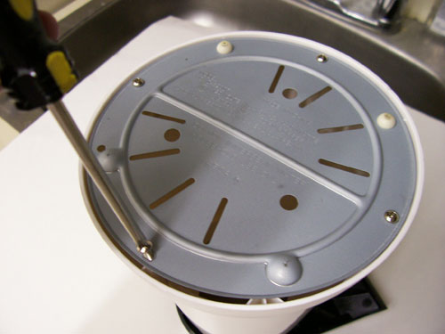
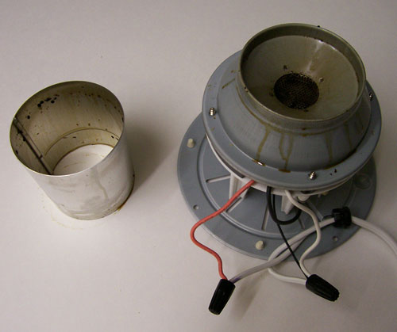
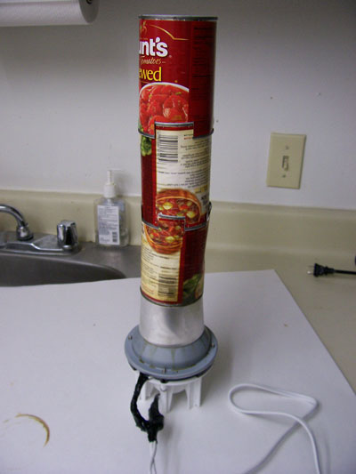

Unless you have an industrial capacity exhaust fan in your kitchen do not attempt to use this in your house. Air roasting beans produces quite a bit of smoke, so roast on your porch or at least outside. Yes, I’m talking about using an air popcorn popper. I will show you what to buy, how to modify it (optional), and how to use it.

The “Presto Poplite Gourmet Hot Air Popper” sells for less than $20. If you can’t find the Poplite, buy the cheapest air popper you can find. Used is OK, but don’t expect to use it for popcorn ever again.

I dismantled mine because I wanted more airflow around the base. It seemed to perform better and didn’t shut itself off due to overheating. It might happen to you, but just let it cool down and resume. Overloading the hopper can overheat the machine, too.

If you decide to modify, you will need the following:

1.  A Phillips head screwdriver
2.  A cordless drill or drill and small drill bits
3.  Some small screws
4.  Wire snips (maybe)
5.  Electrical tape

In any case, you will need:

1.  A can (tomato, soup- whatever) that fits into the Popper Hopper with both ends removed.
2.  A towel for when you roast
3.  A colander, sieve, steaming basket- you get the idea
4.  Extension cord- the longer, the better. Don’t go overboard with the hundred-footer- use common sense. The idea is to get away from your dwelling. You will thank me later.
5.  A stirrer of some sort (optional)
6.  Flashlight if you roast at night.

Skip this portion if you decide not to modify it, but read it anyway. Undo all screws to remove the entire plastic casing around the popper. You will end up with this:

  
*Remove screws from the base of the popper.*

To get the cord out you will either have to cut the thin wires (keeping careful note of what goes where) or **destroy the plastic casing** if there are not the plastic cone thingies connecting the wires together. These are called wire screws, and they join wires safely- just twist them off. Putting them back is the reverse.

Reconnect the wires and wrap them all together in electrical tape to keep everything neat, clean, and safe.

  
*Deconstructed Poplite*

Drill a little hole down each leg to put the metal base back on. This is where you will screw in the little screws to hold the base on. You can also skip this, but the popper will be more stable and less likely to tip over.

There is a tapered metal “sleeve” that forms the inside of the hopper. If you modified, you will have to place it upside down so that it fits over the lip it originally sat in. Drill two small holes through the sleeve into the lip- one on each side. Insert screw and tighten. This will prevent the sleeve from falling off at the worst possible moment- when you are pouring out your roasted beans- and dumping the contents on the ground.

Your open-ended can should fit snugly over the top of this sleeve, creating a chimney. If you don’t do this, when your beans get lighter, they will fly all over the place. I started with three cans originally but reduced it to one with experimentation. **If you didn’t modify it, you still need the can.**

  
*Soup can chimney*

You are ready now to roast. But you need to consider some things:

1.  Do not burn your house down or anyone else’s. Use common sense and roast away from wooden structures, i.e., 10 feet plus. There is little risk of this, but if you leave your roaster unattended, you are asking for trouble.
2.  The smoke is nasty, and there will be a lot of it as well as chaff blowing out. I keep doors and windows shut and the roaster away.
3.  Know your “cracks”. This will take some experimentation if you are a novice, but generally, the chaff begins to fly around the 1st crack, and a full-city (French?) is towards the end of the 2nd crack. There should be a lot of smoke and smell at this point. Some beans skip the first and slide into the second crack, so watch the beans for color changes. If you see smoke… you are almost there, depending on what you want. You might have passed up your desired roast. Anyway, the idea is to keep an ear and an eye on your beans at all times!
4.  This roaster roasts rapidly after the first roast, even in very cool weather.

Now you are ready to roast, and you have set up everything. You are prepared and have your tools at hand: the colander, the towel, and your beans. You are wearing clothes that you don’t mind smelling of coffee smoke. Plug the roaster into the extension cord and let it run for a few seconds to warm up.

Hopefully, your beans are in a large yogurt or Starbucks cup. Something you can squeeze slightly and easily pour the beans into the roaster. While looking into the roaster pour enough beans into the reservoir but not too much. 1/3 of a cup is about right.

The beans should be moving actively in the middle. After a few seconds, give the roaster a shake by grasping one of the legs. This should help dislodge any beans and help them move. I do this instead of stirring. I repeat the shake periodically as the roast progresses.

Listen for the cracks. Watch the chaff start to fly out the top. Give it a look to see what the color looks like as the roast progresses. See the beans begin to dance as they lose moisture. When a substantial column of smoke is coming out of the roaster, you should be well into the second crack; the beans look dark and oily.

If you are ready to stop (recommended) unplug the cord, grab your towel and lift off the can. Grab the roaster by a leg and pour the beans out into the colander giving it a rap to free up any beans that remain. At this point, I repeat the process. Once I have it going again, I swish the beans around to cool them and inspect the roast.

You may see some variation. Some beans may be lighter. The really light yellow-looking beans get tossed back in the roaster. As you pour in the next batch swish them into the 1st batch. I find that as I progress the residual heat evens out the color of the beans and the roast is fairly homogenous.

In fact, I think the variations give the flavor a deeper complexity than roasts that are perfectly monochromatic. I am likely to roast a pound of green beans at a time. I expect to see a 10 to 15 percent loss in weight during the roast, but the volume of the beans will double. I also have developed my own blends, and you will, too. A blend should have a base with 1 or 2 other varieties singing backup. Of course, this is your own choice, and you can mix and match however you want. I have a tendency to stick to a 2:1 ratio by weight (base: backup).

Green coffee beans can be found easily on eBay or elsewhere on the internet. I buy in bulk: 5 to 20 pounds. Again use your common sense and practice wise shopping habits. Do a little research. Think twice before buying that 50 lb bag of beans.

If you are reading this you already have passed into a realm far beyond most coffee drinkers. When I began to roast my beans it was as great of a conceptual leap forward as all of my other educational coffee experiences combined. I began to look at roasts and purveyors with a critical eye, knowing that I could outdo them at home for less money.

I realized that Starbucks is inconsistent with its roast as well as many other sellers of “gourmet” coffees. I still frequent these places but I do so with greater awareness. If you take these extra simple steps you too will experience coffee as it should be and your life as it pertains to that “good ol’cuppa joe” will never be the same again.

### Resources

[Hacking the Orville Redenbacher Hot Air Popper to Roast Coffee](/poplite-coffee-roaster/) – Detailed tutorial on modifying the PopLite popper.

[Roasting Coffee in a Popcorn Popper](/roasting-coffee-in-a-popcorn-popper/) – This is a general tutorial on how to roast coffee using a popcorn popper.

[Popper Roasting Tips](/popper-roasting-tips/) – General advice on improving your success with popcorn popper coffee roasting.
