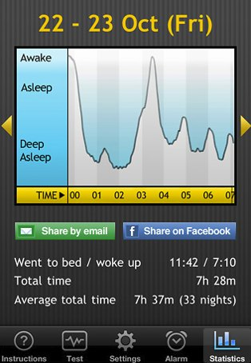
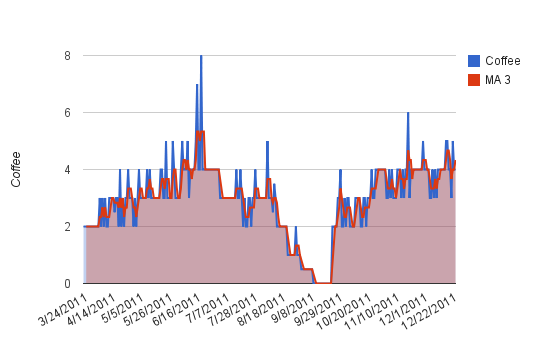

It seems like every month or so, someone sends me a link to some health study involving coffee. I used to read them, but I don’t anymore. People have been drinking coffee for a very long time. A simple observation will tell you we coffee drinkers are not dropping dead like smokers or outliving the non-coffee drinkers. In my opinion, the change in a person’s health outcome as a result of coffee is minor and highly personalized. And that effect can change over time.

We all know someone who can drink massive amounts of coffee all day long and sleep like a baby. We might also know someone who is so sensitive to coffee that a single cup could keep them awake all night long. I know a guy who stayed awake for almost three days after drinking several cups of green tea. What affects your sleep will directly affect your health outcome. When studies make blanket statements that coffee prevents this or that, they fail to look at the individual response to caffeine.

### Good Sleep for Good Health

Good sleep is essential for good health. As coffee drinkers, our goal is to consume coffee only until sleep quality is impaired. About 10 years ago, I drank an insane amount of coffee daily. From when I woke up until night, I’d slam mugs of [French press coffee](http://ineedcoffee.com/troubleshooting-french-press-coffee/). My adrenals were so exhausted by the end of the day that I would fall asleep immediately. But over time, I noticed that I was waking earlier and earlier. Despite still being tired, I’d be up making more coffee.

I came up with an experiment. I pushed my last coffee back to 6 p.m. My sleep improved. Then I moved my last coffee to 4 p.m., and it improved again. Then I moved it to 2 p.m. and saw no additional improvement. So, for a few years, I had my last cup of coffee between 2 p.m. and 4 p.m. It yielded me the best quality of sleep.

### Collect Data

A movement called The Quantified Self has emerged in the past few years. With spreadsheets and gadgets, tracking data about our lives and adjusting our behavior is now possible. Collect more data and then adjust again. From the Wired article *Know Thyself: Tracking Every Facet of Life, from Sleep to Mood to Pain, 24/7/365* by Gary Wolf:

> Numbers are making their way into the smallest crevices of our lives. We have pedometers in the soles of our shoes and phones that can post our location as we move around town. We can tweet what we eat into a database and subscribe to Web services that track our finances. There are sites and programs for monitoring mood, pain, blood sugar, blood pressure, heart rate, cognitive alacrity, menstruation, and prayers. Even sleep-a challenge to self-track, obviously, since you’re unconscious-is yielding to the skill of the widget maker. With an accelerometer and some decent algorithms, you will soon be able to record your sleep patterns with technology that costs less than $100.

That article was written in 2009. Today, there are 99-cent apps you can put on your iPod or iPhone that measure your sleep quality by how much the bed moves. The Sleep Cycle application even makes a nice graph.

  
*Sleep Cycle*

You can also use a wrist-based tracker such as the *Fitbit*.

### What To Track?

If we combine data about our sleep with data about our coffee intake, then we dial in the optimal level of coffee for us individually. So far, I haven’t used any of the iPhone applications. This article aimed to see what I could learn without going high-tech. So, I just used a simple spreadsheet. Some of the variables that I have tracked or am currently tracking include:

-   Date
-   Quantity of coffee
-   Sleep quality (1 to 5)
-   Time of last coffee
-   Daytime mood (1 to 5)
-   Did I consume chocolate?

I discovered that the more complicated you make the tracking, the less likely you’ll maintain the data.

### Studying My Data

One of my goals in 2011 was to reduce my coffee intake. Instead of going cold turkey, I gradually declined. Tracking my coffee intake allowed me to see my progress. The chart below shows my daily pattern of coffee intake. I also added a 3-day moving average to smooth out the lines for those days that weren’t typical.

  
*My coffee intake was from March 24, 2011 – December 24, 2011. The red line is a 3-day moving average.*

After my coffee detox, I wanted to learn more about the relationship between coffee intake and sleep quality. Every morning, when I woke up, I assigned a score of 1 to 5 for sleep quality. A score of 5 would be perfect sleep. Later, I started tracking the time of day when I had my last coffee. After almost three months of data collection, here are the average sleep quality scores I got.

Coffee Intake

Sleep Quality

2

3.23

3

**3.72**

4+

3.48

Then, I divided the data into two groups based on my last coffee intake.

Coffee Intake

Sleep Q (Last Coffee BEFORE 1 PM)

Sleep Q (Last Coffee AFTER 1 PM)

2

3.42

3.00

3

3.50

**3.76**

4+

3.25

3.52

So far, it appears that my sweet spot is three coffees a day, with the last coffee consumed after 1 p.m. Going forward, I plan on figuring out the optimal hour to consume my last coffee.

### Dialing in Your Sweet Spot

I believe that doing a few months weeks of tracking your coffee intake and sleep quality will tell you more about the benefits of coffee than any health study. Look at the data and dial the level that works best for you. Does your sleep suffer? How much? Only you can answer these questions.

### Quantified Self Caveat (October 2014)

The first version of this article was written in January 2012. Since then, I’ve learned a lot about self-tracking. Keep your experiment short. If you don’t see obvious patterns, then one probably doesn’t exist. Human data can be messy. Many other items can affect sleep quality, and coffee is just one.

### Resources

[Better Sleep for the Too Early Riser](https://criticalmas.org/2014/10/better-sleep-early-riser/) – My sleep tips.

[Know Thyself: Tracking Every Facet of Life, from Sleep to Mood to Pain, 24/7/365](https://web.archive.org/web/20160424183821/http://archive.wired.com/medtech/health/magazine/17-07/lbnp_knowthyself?currentPage=all) – Wired Article.

[Sleep Cycle](https://sleepcycle.com/) – Mobile app for tracking sleep.

[Some Quantified Self Honesty](https://criticalmas.org/2014/04/honesty-quantified-self/) – The downside to quantified self.