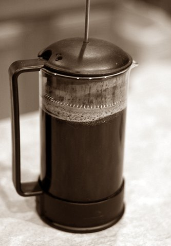

Remember your first day of school? It may have been quite an emotional event to be separated from your parents and surrounded by strangers for hours. This situation is very similar to the college student spoiled on quality coffee heading into his/her first office job. In college, a student is greeted by espresso carts throughout his/her campus experience. Now, this same student must leave the comfort of perfectly made lattes at the student union and join the working world.

The office environment will not be as kind as college. That student will come face to face with the office coffee pot and the gross sludge that has been sitting in there for hours. We learned how to get along at school without our moms and dads. Should we learn how to stay awake at the office without quality coffee? No!

### Don’t Succumb to Bad Coffee

You may say, “I need coffee to stay awake at this boring job; therefore, I must drink the break room swill.” Not so fast. I’ve dedicated my working career to discovering new and innovative ways to drink quality coffee in the office environment. Before I chronicle my journey of drinking quality coffee at work, let me first discourage you from drinking office swill. Breakroom coffee is typically cheap and low quality. Even if it has some fancy gourmet label, you may be drinking an “office-grade” version of that brand. The coffee may be old. It may be very old. A good scotch improves with age. Coffee doesn’t.

  
*Office coffee doesn’t need to be bad.* (Image credit: Office Space (1999)

Suppose the quality issue has been researched, and your company takes pride in its coffee purchase. The next question is, “Who made the coffee and when?”. Unless you made the coffee yourself, somebody else could muck it up. You’ve been to meetings with incompetent co-workers. Do you trust them to make your coffee correctly? I didn’t think so. Unless you want to stalk the break room waiting for an opportunity to make coffee for everyone else, you risk getting poorly made or old coffee.

### The Journey Part 1

My first office job was with an IBM company. There was no risk of me drinking bad coffee since there wasn’t a break room near my desk. They had a really strict policy against bringing in electrical appliances, but I had a stronger craving for espresso. Early one morning I snuck my countertop espresso machine to my office. Since I couldn’t place it on my desk, I placed it inside the bottom desk drawer. From there I pulled the cord through the back of the desk and plugged it in. **I had an operational espresso machine running from the bottom drawer of my desk**. The perfect coffee crime.

For several months, I made espresso from inside my desk. A few co-workers would slide by my desk with a cup of iced milk, and I would **quietly upgrade them to an iced latte**. Many people walked around the office smelling coffee, but only a select few members of the espresso club knew the secret.

### The Journey Part 2

After I left IBM and started working for Nielsen Media Research, there was no need for clandestine coffee. Nielsen was way more laid back. It was here that I set up a drip machine on my desk and started a coffee club. Every morning at 9 am and afternoon at 1 pm, I would brew up some quality coffee from a local roaster or one of my [home roast](/roast-your-own-coffee/) creations. Although I didn’t charge for coffee, a 50-cent donation to cover the cost of the beans was accepted. Of course, those that didn’t donate didn’t get invited back into the coffee club.

After a month or so, I had employees waiting in line as the coffee brewed. In fact, there was so much interest in my coffee that the club had a waiting list. As soon as one member didn’t show up at the moment it was brewed, that person was replaced by another. Running your own coffee club works if it doesn’t require too much effort to administer the club. When I left Nielsen, I donated my old drip pot to my former co-workers. The coffee club still operates out of my old cubicle.

### The Journey Part 3

The third and final part of my coffee journey is the [French press](/press-pot-tutorial/). With a French press, I don’t need to run a coffee club or operate electrical appliances at my desk. The only thing I need for the French press is hot water. Other employees use the hot water dispenser to make hot tea, and it works fine. Now, I can make a single mug of coffee whenever I want using my own beans. If you have a hot water dispenser, I highly encourage you to buy a French press for your desk and bring in your own supply of coffee every morning.

  
*Part 3 of the Office Coffee Journey was the French Press.*

### Conclusion

Just because you sold your soul to work for a company that doesn’t love coffee as much as you do, there is no reason to deny yourself good coffee in the workplace. Skip the break room sludge and take it upon yourself to bring in good coffee. What method you choose to brew is up to you and the surroundings. If you conclude there is no way to brew good coffee at your workplace, perhaps you should consider working for another employer.

### Resources

[Troubleshooting French Press Coffee](/troubleshooting-french-press-coffee/) – How to make better French press coffee.
