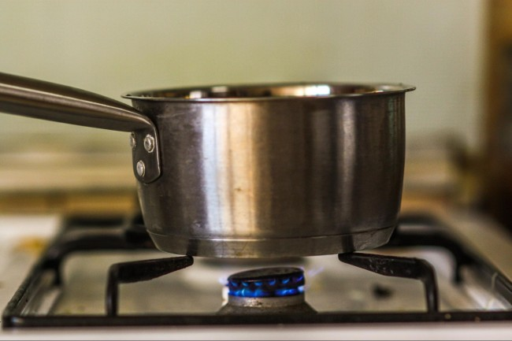
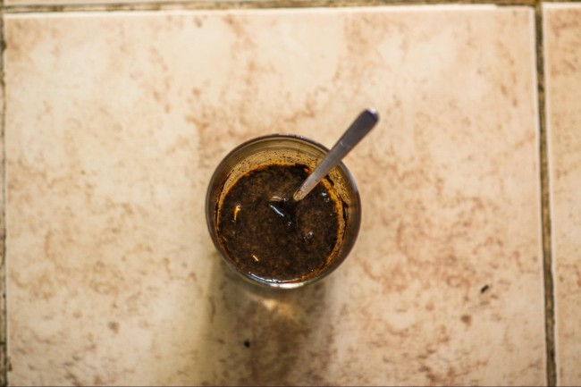
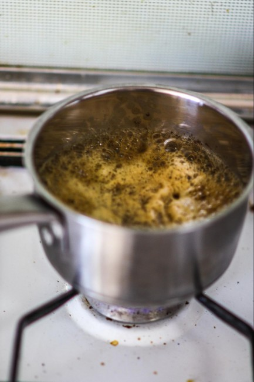
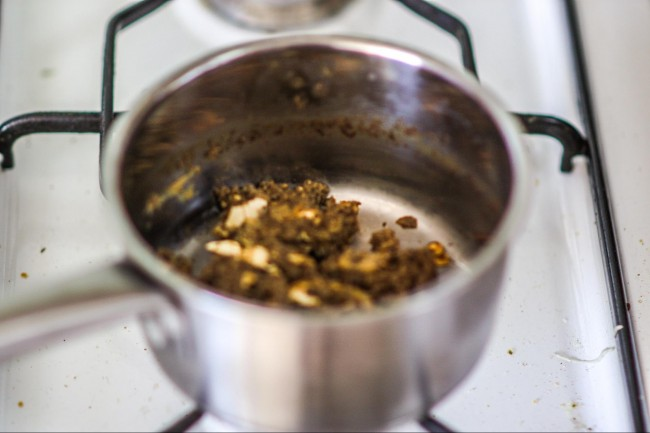
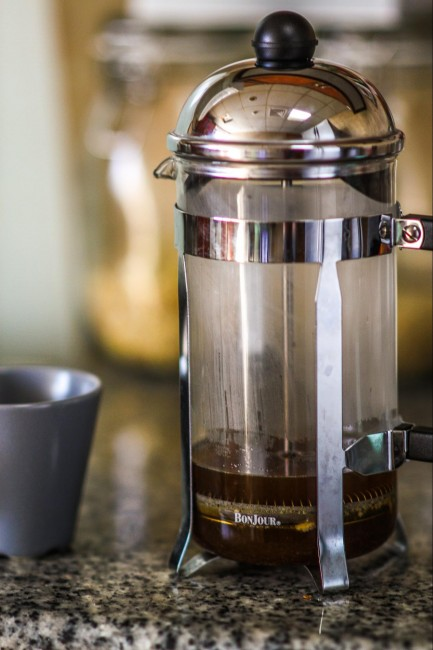

Between panoramic fjords, the world’s greatest saunas, and wild, cold-water salmon, the Nordic region of Europe should be a place you visit at some point in your life.

Barring an actual trip, you can still taste the locale by making and drinking the Swede’s unique take on java: egg coffee. Egg coffee is also known as Scandinavian coffee or Hungarian coffee.

Recently listed in the article [11 Crazy Coffee Drinks You Won’t Find on a Starbucks Menu](http://ineedcoffee.com/11-crazy-coffee-drinks-you-wont-find-on-a-starbucks-menu/) here on INeedCoffee, Swedish egg coffee is dead simple to make. The result is a non-bitter, surprisingly light, and incredibly smooth cup that combines the wonderful flavor of your favorite roast with a reminiscent aftertaste of toasted cheese (trust me, it sounds strange, but it works).

Ok, so to make this strange and delightful concoction, you are going to need the following:

-   1 fresh egg
-   1 to 1 ½ tbs of your preferred coffee, [coarsely ground](http://ineedcoffee.com/coffee-grind-chart/) (similar to what you would use for a French press)
-   1 cup of water
-   1 cup of ice-cold water (yes, that’s a total of 2 cups of water)
-   Sugar and milk to taste
-   Saucepan

All of this together will make a single serving of coffee; multiply accordingly for the number of cups you want.

*Necessary ingredients*

### #1 Boil the Water

Start boiling the first cup of water in a small pot.

*Boiling Water*

### #2 Crack the Egg and Stir

While the water is boiling, crack the egg (with the shell) into a cup and stir.

*Cracked egg*

### #3 Add the Ground Coffee

Add the ground coffee to the egg and stir some more.

*Coffee and egg, pre-mixing*

### #4 Add Egg-Coffee Slurry to Boiling Water

Once you have the egg-coffee slurry thoroughly mixed, add it to the boiling water.

*Coffee-egg slurry*

### #5 Boil for 5 Minutes

Let the mixture boil for 5 minutes, being careful not to overflow (because it will want to overflow).

*Boiling mixture*

### #6 End Boil and Add Cold Water

After boiling, remove the mixture from the heat and add the cup of ice-cold water. The egg and coffee clumps should sink to the bottom of the pot, allowing you to easily pour off the coffee and leave behind most of the undesired bits.

*Undesired bits*

### #7 Filter and Serve

Pour the liquid through a fine-mesh strainer or use a French press (like I did) to extract the coffee goodness.

*Coffee goodness*

There you have it—yet another new and fancy way to brew the world’s greatest drink. Sit back, enjoy, and, really, take a trip to Sweden some time. It’s worth it.

### Resources

[Coffee Brewing Guide](http://ineedcoffee.com/coffee-brewing-guide/) – Our collection of coffee brewing tutorials.

[The Coffee Avocado Shake Recipe](http://ineedcoffee.com/the-coffee-avocado-shake/) – A coffee drink recipe from the Philippines.

[Preparing Traditional Turkish Coffee](http://ineedcoffee.com/preparing-a-traditional-turkish-coffee/) – How to make Turkish Coffee.

*All photos are by the author Alex Freemon ([CC By 4.0](https://creativecommons.org/licenses/by/4.0/))*