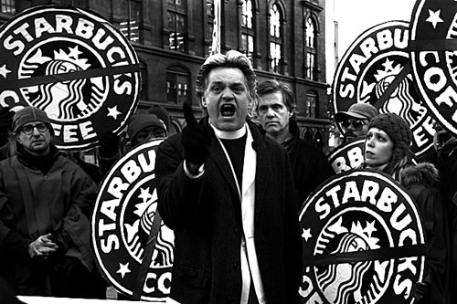
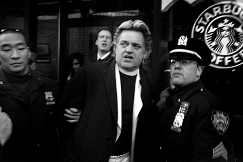
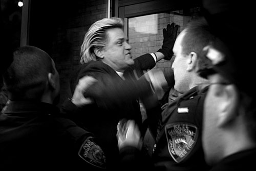

I am typing this out, trying to read this scrawled-in-jail writing – it’s Thursday morning already and I’m reading Thomas Merton and thinking about going to jail a third time, and not liking it, but wondering about it.

### Why am I Here in This Jail?

What am I doing in this jail? It’s amazing how quickly the iron bars make me question the whole thing. The Tombs. How does this hell-hole connect with Starbucks policies, with coffee trademarks, with a starving kid in East Africa? Maybe Bono is right. He’s not in jail. He’s in the news. Maybe I should shop more.

  
*Rev Billy Preaching Outside Starbucks* by [Fred Askew](http://www.fredaskew.com/).

Yeah, but not for Starbucks Coffee, that’s for sure. I’m in jail, but stealing the names of coffees from farm families who can’t feed their kids? – no, I won’t buy a Starbucks latte. I’ll repeat this to myself until it is obvious again. Watching that movie *Black Gold* really hit me hard – that scene where the 4-year-old boy is brought into the Starvation Center by his mother.

So maybe that’s why I’m in jail, to have nothing but the wall to stare at, with the blood smears and initials carved into the concrete with car keys. I can be my own projectionist here. I can screen Black Gold with my imagination – against this bruised blank wall, as the hours pass by. The young mother is standing there with me. I’m a techno-ghost, now in Ethiopia, standing next to her. The health people are studying her boy to see if he qualifies as officially starving. The belly is distended. The eyes are unhappy, the legs wobbly. But the height and weight ratio isn’t distressing enough. The formula for starvation is not established. Now I’m watching the mother carry the boy out of the compound, as the doctors and nurses try to look away. On The Tombs wall, her eyes circle in a penetrating gaze, looking over the African horizon.

  
*Reverend Billy Arrested* 

I remember how she glowered on the silver screen, when I watched the film up in the West Village, with a roomful of Fair Trade coffee activists, and probably a Starbucks spy or two. The mother was gazing out at her land, her famous volcanic Ethiopian hills, the birthplace of coffee. Her land was an impenetrable riddle. She walked as a mother, carrying this heavy boy with his big head flopping on her shoulder – she walked back into the land that had mothered her. But carrying the boy, she had a number clenched in her mind: the required time before she could return to prove her inability as a mother, and to prove the inability of the mothering of this Ethiopia, even as it ships its elite coffee, from “the birthplace of coffee,” as advertised by Starbucks with that wonderful advertising phrase, and sold at the premium price to the coffeephiles, with indigenous Sidamo graphics. It sells as high as $26 a pound.

The blow-by-blow description of these ironies… Well, Ironies Abound! In the modern world, painful ironies, recounted vividly, can count as high art, journalism, or some other ism. Irony can be enough. Or guilt can be enough, too. I’ve had all those middle-distance emotions. I’ve been satisfied with them. They have stopped me.

I can’t be in such an awful jail to deepen my artistic or liberal emotions. If that’s all this is then I should join Bono and simply go shopping. If that’s all this is I’ll end up crossing my legs in the afternoon, sitting in the Astor Place Starbucks, completely de-politicized, with that latte steaming in front of me.

What I have to do here, in The Tombs — I have to find out: what is the equivalent of the Boston Tea Party, of the Montgomery bus strike, of the Emma Goldman sweatshop sermons in Union Square? How can I change things by what we do with my body? What word would I shout in what direction? What seat do I sit in? What doorway do I stand in? I need to know. Because we have a riddle in our land too… We have the riddle of American Democracy. We are told that this is the place where change can begin. There is something that compassionate people can do that begins change and that change can travel in a growing change around the world, and reach a child and his mother.

  
*Rev Billy Frisked by Cops*

I stare at my land with the same gaze as that mother. Here is also a country that has become an impenetrable riddle. So rich and vast, and so hellbent on not sharing, on hoarding, on using the word freedom as violence against others. I stare at the wall of The Tombs, with thousands of citizens of color standing, sitting, laying on the floor, staring too, all of us forced into these underground rooms. The fluorescent lights are never off.

I know why I’m in The Tombs. I will have a thought – a creative jolt. I will unpack that thought and will come to an answer to the riddle, as Rosa Parks did, as did Cleve Jones and Cesar Chavez and that beautiful Ethiopian mother did. They are whispering to me that when I’m free, I can relax farther into being unafraid.

*Bill Talen, created the character of [Reverend Billy and the Church of Stop Shopping](https://revbilly.com/).*

*Photos by [Fred Askew](http://www.fredaskew.com/).*