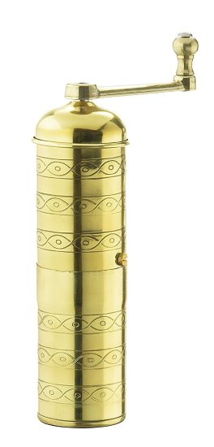
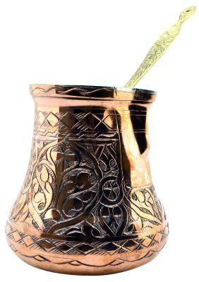

Turkish coffee is simple and romantic, the way it was first made as a coffee drink. Turkish coffee is not the kind of coffee you grab on the way to work. It is a coffee for quiet enjoyment. Turkish coffee is especially good for those who love… life!

Turkish coffee was invented as a drink during the 16th century in the Middle East–brewed in little pots called ibriks or cezves. From Egypt, it spread through the Middle East, and then into Europe and Russia. Today you’ll find Turkish coffee in Middle Eastern and Greek restaurants from New York to San Francisco.

### Grind and Pot Essential

Essential to making Turkish coffee, of course, is the pot, not the bean. Any bean can be prepared as Turkish Coffee. You simply need a good hand mill or commercial grinder that grinds to Turkish. Most grinders in America, even if they say Turkish, will not grind to the powdery fine texture needed for a good Turkish — finer than espresso. *(See [Coffee Grind Chart](http://ineedcoffee.com/coffee-grind-chart/) for visual explanation)*

A Turkish mill works the best.

*Turkish Mill by Zassenhaus  
*

Next, you need the pot.

  
*Turkish Ibrik (*

The ibrik was originally designed to brew coffee in the hot sand of the desert, but a stovetop will do fine. First, fill the ibrik 2/3 full with water, add sugar to taste (if you like your Turkish coffee sweet), and top it with a heaping teaspoon of finely ground coffee. The coffee seals the narrow top, creating an oven effect.

As the water begins to boil, it will foam up through the coffee. Let it foam up three times. Stir. Pour slowly into two small demitasse cups, and it’s ready to savor. Pay attention to the foaming. It is the skill part of the process. If you don’t, your ibrik will become volcanic, and you deposit your Turkish coffee on your stove…what a loss and what a mess.

### Coffee To Water Ratios

Small Ibrik: 1 demitasse cup

-   Water: 3 oz.
-   Sugar: One level teaspoon
-   Turkish Coffee: One heaping teaspoon
-   Salt: Pinch (for hard water only)

Large Ibrik: 2-3 demitasse cups

-   Water: 12 oz.
-   Sugar:  3 level teaspoons
-   Turkish Coffee: 3-4 heaping teaspoons
-   Salt: One pinch (for hard water only)

If your coffee boils in the ibrik, it means there is not enough coffee. There should be coffee foam at the top. For the larger ibriks, you should just experiment with varying coffee quantities using the above suggestions. Preparing Turkish coffee is more about your personal taste than reading directions on the box. Relax and enjoy the process. If you’ve got further questions, you might need to chat with the dishwasher.

### How to Pour Turkish Coffee

When pouring Turkish Coffee into your cups, pour the foam first and quickly, then slowly pour the rest, allowing the coffee grounds to settle at the bottom of the ibrik. For more than one serving, spoon a little foam into each demitasse before pouring the coffee.

### Variations/Conclusion

Authentic Turkish blends are different in different regions of the world; for instance, most middle eastern Turkish is spiced with cardamom and rose water; in Greece, chicory; in Libya, coriander is added. So, in fact, you can prepare Turkish at home with any available coffee bean; all you need is a cezve or ibrik. You can find those at Middle Eastern groceries in major cities or on the Net.

### Resources

[Preparing Traditional Turkish Coffee](http://ineedcoffee.com/preparing-a-traditional-turkish-coffee/) – INeedCoffee step-by-step guide to making Turkish coffee.

[Coffee Brewing Guide](http://ineedcoffee.com/coffee-brewing-guide/) – More coffee brewing tutorials.

*Title photo by [Keith Hardy](https://unsplash.com/@keithhardy2001).*