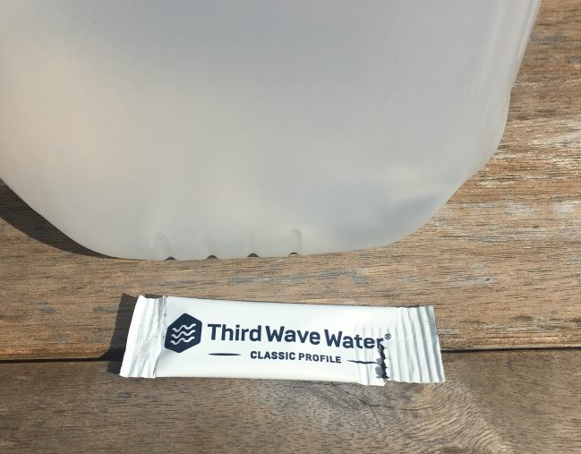

Around 2005, I took a tour of Stone Brewing in Escondido, California. During the tour, I learned that one of the first steps they take when making their ales is to strip all the minerals out of the water and then rebuild the water using a custom mineral blend. The custom blend was designed to mimic the water used in the Burton region of England, which has been known for producing outstanding ales for hundreds of years.

Stone knew what they were doing. They have won numerous awards, and many other microbreweries pay close attention to getting the right water profile for their beer recipes.

### But what about coffee?

For the longest time, the general advice has been a vague directive to use clean water and that the water should taste good by itself. In other words, don’t try to make good coffee with water you don’t like. This simple advice works, but it is not the end of the story.

Coffee can taste better or worse depending upon the mineral profile of the water used. In Italy, the roast profiles get darker as you go from the North to the South. In the Scandinavian countries, the mineral profile matches their light roasting profiles.

Chromatic Coffee in Santa Clara, California, has two water inputs for their espresso machine. Each water is custom-built via filtration to get the exact TDS (total dissolved solids) to match the roast profile of the two espressos. The lighter espresso gets water with less TDS. How is the taste? Unbelievable. I spent a year in the Bay Area, and they were the best. They pulled delicate flavors out of espresso that I didn’t even think was possible.

### Custom Water For Us

Roasters and cafes are tweaking their water profiles to improve the taste of their coffee. But what about the home brewer? Third Wave Water has tackled this problem by creating two custom mineral profiles: Classic and Espresso. Add a packet to a gallon of distilled water, and you should have a water profile that improves the taste of your coffee.

Third Wave Water adds magnesium for sweetness and calcium for a balanced body. They highlight the coffee’s acidity, but the profile has low alkalinity.

I asked Third Wave to explain the difference between the two mineral profiles. Here was their response:

> The primary difference between the Espresso and Classic profile is the buffer (potassium bicarbonate) added in the Espresso formula. This ingredient is added because espresso machines have a unique issue with high pressure and high temperature creating a higher probability of the minerals separating from the water. The Classic profile also uses a touch of sodium (10 mg/10 ounce cup of coffee) instead of the buffer ingredient providing a brighter cup of coffee for drip coffee machines, French Press, pour overs, etc.

### Testing Third Wave Water

Since Third Wave provides the ideal mineral content, you probably don’t want to add it directly to anything but distilled water. If you have a water filtration system that removes most of the minerals, you could give it a try. However, only a head-to-head test with the packet mixed with distilled water will let you know how much difference you can detect.

The first thing I did was compare my tap water, which I use to make coffee, to the Classic profile of the Third Wave Water mixed with distilled water. Water vs. water. If I couldn’t tell a difference with plain water, then it would be unlikely that I would once the coffee was brewed.

I live in Seattle, where the water quality is already close to ideal for coffee brewing. This partially explains why the coffee culture in the Pacific Northwest has outpaced other regions of the country. Because of this, I didn’t expect to notice as much of a difference as if living in a region with less-than-ideal water for coffee brewing.

To my pleasant surprise, the Third Wave Water was better. The word that best describes the difference is silky. The clean taste of the water lingered on the tongue just a bit longer than my tap water. My tap water is excellent, so for the Third Wave to noticeably improve upon that flavor was impressive.

I would later repeat these results with brewed coffee. I drink primarily lighter-roasted coffees, and I noticed that some of the delicate flavors were more pronounced. They stayed with me a bit longer than the coffee made with untreated water. The coffee seemed more balanced with the Third Wave Water.

### Conclusion

Third Wave Water is a great option for coffee lovers who want to improve their water profile for brewing. If you want to see how much of a difference an optimized mineral profile makes for coffee, give Third Wave Water a test for yourself.

### Resources

[Water Profiling: Chromatic Coffee](https://freshcup.com/water-profiling-chromatic-coffee/) – Fresh Cup article on Chromatic Coffee’s water setup.

[Coffee Brewing Guide](/coffee-brewing-guide/)—Once you have your water dialed in, follow a coffee brewing tutorial from our Coffee Brewing Guide to make delicious coffee.

*Disclosure: INeedCoffee received samples from Third Water Coffee for this review.*
