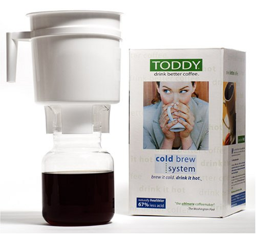

Summertime is the perfect time for iced coffee. How do you make it at home? There are two schools of thought. One is to make a near double-strength cup of hot coffee and then chill it with ice. This is pretty easy but not very quick, especially if you make drinks for others and yourself during a hot day. And who wants to sit inside brewing coffee when you could be out by the pool or playing volleyball? Not me.

The second and superior method is to make a coffee concentrate. This method is quick and easy. The most popular cold coffee concentrate brewing system is the Toddy Coffee Maker. Basically, you let the coffee steep at room temperature overnight while you are sleeping, and then it gets moved to the refrigerator. Once cold, you can pour yourself coffee whenever you desire. Add some ice and a splash of water or cream, and you’re done.

In the article [Cold Brew Coffee with the Toddy Coffee Maker](http://ineedcoffee.com/cold-brew-coffee-with-the-toddy-coffee-maker/), I listed a few reasons for using this coffee brewing method. They include:

1.  Less acid than other coffee brewing methods.
2.  33% less caffeine.
3.  Perfect for households where people drink coffee at different times of the day.
4.  Camping.
5.  **Iced coffee!**
6.  Power Outage. *(I wrote this after experiencing a San Diego summer blackout)*

### Brewing Overview For the Toddy Coffee Maker

Refer to the Toddy Coffee Brewing Tutorial for more details and photos on using the Toddy Coffee maker. Here is a brief overview of how easy it is to make coffee concentrate.

1.  Flip the Toddy Upside down and secure the stopper into the brewing container.
2.  Wet it and insert the circular filter into the bottom of the toddler.
3.  Add one pound of medium (drip) ground coffee into the brewer.
4.  Slowly and evenly add 4 cups of cold water. Do not stir.
5.  Wait 5 minutes, and then add five more cups of cold water. Again, do not stir.
6.  Cover with a plate or plastic wrap. This will keep insects or dust from falling into your coffee.
7.  Let the coffee brew for 10-12 hours at room temperature.
8.  Release coffee into the glass decanter.
9.  It can take 20-30 minutes for the coffee to drain.
10.  Place into the refrigerator.

That is it. Although I am a big fan of grinding my own beans, grinding a whole pound at once is time-consuming. This is one brewing method where I am OK with having your beans ground at the coffee roaster. Just make sure you start the brewing that evening.

### Making an Iced Toddy Coffee

The title of this article makes it clear that easy is essential to good iced coffee. Since you’ve made the concentrate already, making the Iced Toddy Coffee is straightforward

1.  Add ice to the glass
2.  Pour in coffee concentrate.
3.  Add water or milk to get your preferred level of strength.
4.  (optional) Add sweeteners.
5.  (optional) Top with a creamy alcoholic drink such as Baileys or Kahlua.

### Resources

[Cold Brew Coffee with the Toddy Coffee Maker](http://ineedcoffee.com/cold-brew-coffee-with-the-toddy-coffee-maker/) – Cold brewing coffee tutorial.