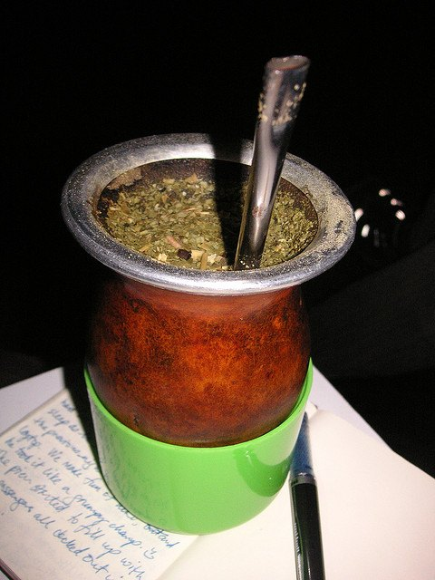
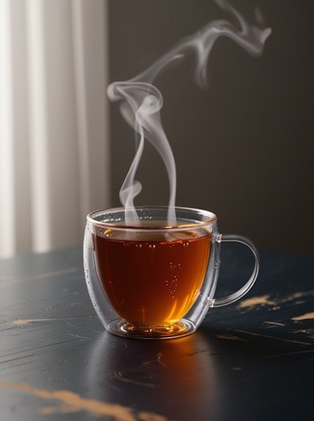

I’m something of a beverage fanatic. I just finished off a pot of Dragon Well green tea. I’ve got a freshly roasted batch of Puerto Rican coffee here. I will drink some tomorrow, even though I should probably let it sit longer. But even though my cupboard is largely dedicated to green tea and coffee, there’s a shelf dedicated to herbal teas. I think it’s fun to occasionally take a break from our preferred caffeinated beverages to explore some wildly different flavors. That’s why I’ve selected two herbal teas I think even the most dedicated coffee fiend will enjoy.

The history of these sorts of drinks is almost always the same — European settlers, finding importing coffee and tea to be prohibitively expensive, try a sip of what the natives are drinking, and the rest is history.

### Toasted Mate

Yerba mate is a holly plant that’s been in use for centuries in Latin America. It serves basically the same purpose as coffee in Latin American culture. Interestingly, not only does it contain a pretty high dose of caffeine, but it also contains other xanthines, theobromine, and theophylline, which are found in coffee, chocolate, and tea. Here’s an infusion that will give you the same kick you get from coffee. “But it tastes like grass!” you’re probably thinking right about now. That’s where toasted mate comes in.

Now, the leaves of a plant can’t undergo quite the same involved roasting process as coffee — not unless you want tea made of ash — but yerba mate branches can be smoked over an open fire to create “toasted” or “roasted” mate. The result is a dark drink that recaptures some of the smoky notes of coffee while adding its own twist. Yerba mate should be brewed like tea: steeped in near-boiling (not boiling!) water for 3 to 5 minutes.

  
*Yerba mate in a gourd by [Beatrice Murch](http://www.flickr.com/photos/blmurch/306252048/in/photostream/), used under the [Creative Commons license](https://creativecommons.org/licenses/by/2.0/deed.en)*

### Rooibos

Nothing quite comes close to having a shot of espresso or a cup of cappuccino with dessert. The flavor mixes perfectly with nearly anything — creme Brule, cake, bananas foster. But here’s the problem: you’ve got work in the morning, and you can’t afford to be wide awake for the next 5 hours. Instead of reaching for a cup of decaf (blech), why not try some red espresso?

Red espresso is a finely ground variant of rooibos, a legume of all things that is harvested in South Africa. Rooibos has a sweet and earthy flavor. Compared to coffee and tea, it has very few tannins and won’t become bitter, even for those of you who leave a brew standing for hours (you know who you are). Red espresso can make a rooibos equivalent of any coffee drink.

Whether you’re looking for something new or just need a caffeine-free coffee substitute, I hope you give these two unique drinks a try.

### Resources

[Herbal Tea Source](http://web.archive.org/web/20141217052242/http://herbalteasource.com/) – Web resource dedicated to herbal teas.

[Red Espresso is Espresso Style Rooibos](/red-espresso-is-espresso-style-rooibos/) – INeedCoffee article about making espresso with Red Rooibos.
